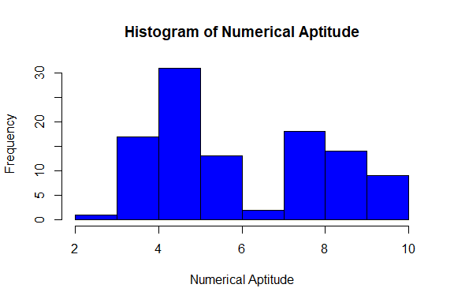
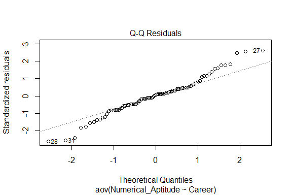
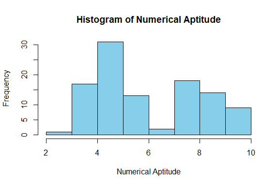
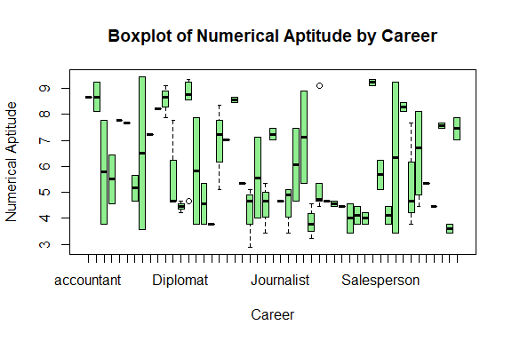
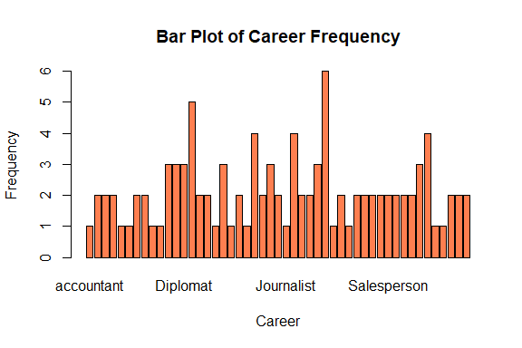
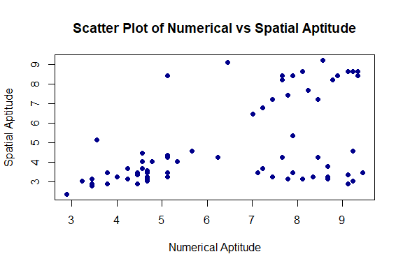
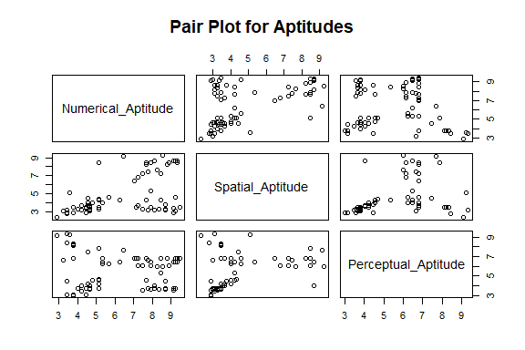
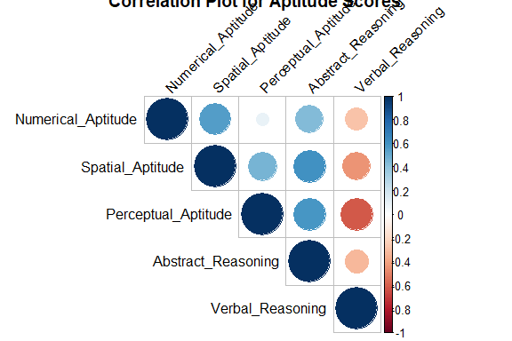
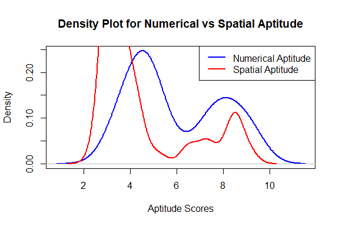
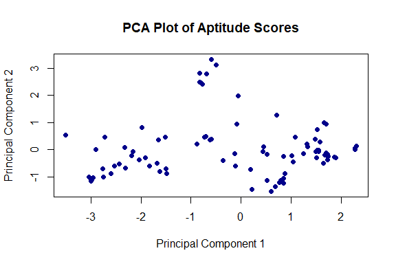

Career Prediction
================
Trevor Okinda
2024

- [Student Details](#student-details)
- [Setup Chunk](#setup-chunk)
  - [Source:](#source)
  - [Reference:](#reference)
- [Understanding the Dataset (Exploratory Data Analysis
  (EDA))](#understanding-the-dataset-exploratory-data-analysis-eda)
  - [Loading the Dataset](#loading-the-dataset)
  - [Measures of Frequency](#measures-of-frequency)
  - [Measures of Central Tendency](#measures-of-central-tendency)
  - [Measures of Distribution](#measures-of-distribution)
  - [Measures of Relationship](#measures-of-relationship)
  - [ANOVA](#anova)
  - [Plots](#plots)
- [Preprocessing & Data
  Transformation](#preprocessing--data-transformation)
  - [Missing Values](#missing-values)
- [Training Models](#training-models)
  - [Data Splitting](#data-splitting)
  - [Bootstrapping](#bootstrapping)

# Student Details

|                       |                   |
|-----------------------|-------------------|
| **Student ID Number** | 134780            |
| **Student Name**      | Trevor Okinda     |
| **BBIT 4.2 Group**    | C                 |
| **Project Name**      | Career Prediction |

# Setup Chunk

**Note:** the following KnitR options have been set as the global
defaults: <BR>
`knitr::opts_chunk$set(echo = TRUE, warning = FALSE, eval = TRUE, collapse = FALSE, tidy = TRUE)`.

More KnitR options are documented here
<https://bookdown.org/yihui/rmarkdown-cookbook/chunk-options.html> and
here <https://yihui.org/knitr/options/>.

### Source:

The dataset that was used can be downloaded here: *\<<a
href="https://www.kaggle.com/datasets/utkarshshrivastav07/career-prediction-dataset\"
class="uri">https://www.kaggle.com/datasets/utkarshshrivastav07/career-prediction-dataset\</a>\>*

### Reference:

*\<Shrivastav, U. (n.d.). Career Prediction Dataset \[Data set\].
Kaggle. <a
href="https://www.kaggle.com/datasets/utkarshshrivastav07/career-prediction-dataset\"
class="uri">https://www.kaggle.com/datasets/utkarshshrivastav07/career-prediction-dataset\</a>\>  
Refer to the APA 7th edition manual for rules on how to cite datasets:
<https://apastyle.apa.org/style-grammar-guidelines/references/examples/data-set-references>*

# Understanding the Dataset (Exploratory Data Analysis (EDA))

## Loading the Dataset

``` r
# Load the dataset with specified column classes
AptitudeData <- read.csv("Data_final.csv", colClasses = c(
  O_score = "numeric",  # Objective Score
  C_score = "numeric",  # Cognitive Score
  E_score = "numeric",  # Emotional Score
  A_score = "numeric",  # Analytical Score
  N_score = "numeric",  # Numerical Score
  Numerical_Aptitude = "numeric",  # Numerical Aptitude
  Spatial_Aptitude = "numeric",  # Spatial Aptitude
  Perceptual_Aptitude = "numeric",  # Perceptual Aptitude
  Abstract_Reasoning = "numeric",  # Abstract Reasoning
  Verbal_Reasoning = "numeric",  # Verbal Reasoning
  Career = "factor"  # Career (target variable)
))

# Display structure to verify data types
str(AptitudeData)
```

    ## 'data.frame':    105 obs. of  11 variables:
    ##  $ O_score            : num  5.45 8.78 6.12 9.12 6.45 8.45 4.01 8.78 8.78 6.78 ...
    ##  $ C_score            : num  8.67 5.67 6.78 8.78 7.56 7.01 8.23 7.89 7.45 6.45 ...
    ##  $ E_score            : num  3.45 4.56 9.34 4.23 5.67 5.34 6.67 5.67 5.34 8.45 ...
    ##  $ A_score            : num  5.34 6.45 7.56 5.67 9.12 5.45 9.34 6.01 8.45 7.67 ...
    ##  $ N_score            : num  4.23 4.23 5.01 4.56 4.23 4.56 5.12 4.67 6.01 4.56 ...
    ##  $ Numerical_Aptitude : num  9.23 5.12 6.23 7.89 5.34 6.45 4.56 8.45 4.56 3.45 ...
    ##  $ Spatial_Aptitude   : num  4.56 8.45 4.23 5.34 4.01 9.12 4.45 4.23 4.01 3.12 ...
    ##  $ Perceptual_Aptitude: num  6.78 7.89 6.45 6.45 6.23 7.67 7.45 5.34 4.23 9.34 ...
    ##  $ Abstract_Reasoning : num  7.89 6.34 6.67 9.34 5.78 8.89 5.78 9.23 6.67 3.67 ...
    ##  $ Verbal_Reasoning   : num  6.12 6.01 8.45 7.67 8.67 4.23 7.78 6.45 9.23 4.23 ...
    ##  $ Career             : Factor w/ 49 levels "accountant","Accountant",..: 2 39 39 11 45 4 4 42 35 35 ...

``` r
# Display first few rows to ensure data is loaded correctly
head(AptitudeData)
```

    ##   O_score C_score E_score A_score N_score Numerical_Aptitude Spatial_Aptitude
    ## 1    5.45    8.67    3.45    5.34    4.23               9.23             4.56
    ## 2    8.78    5.67    4.56    6.45    4.23               5.12             8.45
    ## 3    6.12    6.78    9.34    7.56    5.01               6.23             4.23
    ## 4    9.12    8.78    4.23    5.67    4.56               7.89             5.34
    ## 5    6.45    7.56    5.67    9.12    4.23               5.34             4.01
    ## 6    8.45    7.01    5.34    5.45    4.56               6.45             9.12
    ##   Perceptual_Aptitude Abstract_Reasoning Verbal_Reasoning       Career
    ## 1                6.78               7.89             6.12   Accountant
    ## 2                7.89               6.34             6.01  Salesperson
    ## 3                6.45               6.67             8.45  Salesperson
    ## 4                6.45               9.34             7.67 Data Analyst
    ## 5                6.23               5.78             8.67      Teacher
    ## 6                7.67               8.89             4.23    Architect

``` r
# View the dataset in a spreadsheet-like interface (optional)
View(AptitudeData)
```

## Measures of Frequency

``` r
# 1. Measures of Frequency

## Categorical Data (Frequency Table)
career_freq <- table(AptitudeData$Career)
print("Career Frequency Table:")
```

    ## [1] "Career Frequency Table:"

``` r
print(career_freq)
```

    ## 
    ##                  accountant                  Accountant 
    ##                           1                           2 
    ##               Airline Pilot                   Architect 
    ##                           2                           2 
    ##                  Astronomer                      Banker 
    ##                           1                           1 
    ##                   Biologist         Biomedical Engineer 
    ##                           2                           2 
    ##       Biomedical Researcher              Civil Engineer 
    ##                           1                           1 
    ##                Data Analyst      Database Administrator 
    ##                           3                           3 
    ##                    Diplomat         Electrical Engineer 
    ##                           3                           5 
    ##   Elementary School Teacher            Fashion Designer 
    ##                           2                           2 
    ##               Film Director           Financial Auditor 
    ##                           1                           3 
    ##          Forensic Scientist              Game Developer 
    ##                           1                           2 
    ##                   Geologist            Graphic Designer 
    ##                           1                           4 
    ##                HR Recruiter          IT Project Manager 
    ##                           2                           3 
    ##       IT Support Specialist                  Journalist 
    ##                           2                           1 
    ##                      Lawyer          Marriage Counselor 
    ##                           4                           2 
    ##         Mechanical Engineer                    Musician 
    ##                           2                           3 
    ##                       Nurse          Physical Therapist 
    ##                           6                           1 
    ##              Police Officer             Product Manager 
    ##                           2                           1 
    ##                Psychologist Public Relations Specialist 
    ##                           2                           2 
    ##           Real Estate Agent           Robotics Engineer 
    ##                           2                           2 
    ##                 Salesperson        Social Media Manager 
    ##                           2                           2 
    ##               Social Worker          Software Developer 
    ##                           2                           2 
    ##                Sports Coach               Tax Collector 
    ##                           3                           4 
    ##                     Teacher            Technical Writer 
    ##                           1                           1 
    ##               Urban Planner           Video Game Tester 
    ##                           2                           2 
    ##          Wildlife Biologist 
    ##                           2

``` r
# Proportion of each category
career_prop <- prop.table(career_freq)
print("Proportion of Career Categories:")
```

    ## [1] "Proportion of Career Categories:"

``` r
print(career_prop)
```

    ## 
    ##                  accountant                  Accountant 
    ##                  0.00952381                  0.01904762 
    ##               Airline Pilot                   Architect 
    ##                  0.01904762                  0.01904762 
    ##                  Astronomer                      Banker 
    ##                  0.00952381                  0.00952381 
    ##                   Biologist         Biomedical Engineer 
    ##                  0.01904762                  0.01904762 
    ##       Biomedical Researcher              Civil Engineer 
    ##                  0.00952381                  0.00952381 
    ##                Data Analyst      Database Administrator 
    ##                  0.02857143                  0.02857143 
    ##                    Diplomat         Electrical Engineer 
    ##                  0.02857143                  0.04761905 
    ##   Elementary School Teacher            Fashion Designer 
    ##                  0.01904762                  0.01904762 
    ##               Film Director           Financial Auditor 
    ##                  0.00952381                  0.02857143 
    ##          Forensic Scientist              Game Developer 
    ##                  0.00952381                  0.01904762 
    ##                   Geologist            Graphic Designer 
    ##                  0.00952381                  0.03809524 
    ##                HR Recruiter          IT Project Manager 
    ##                  0.01904762                  0.02857143 
    ##       IT Support Specialist                  Journalist 
    ##                  0.01904762                  0.00952381 
    ##                      Lawyer          Marriage Counselor 
    ##                  0.03809524                  0.01904762 
    ##         Mechanical Engineer                    Musician 
    ##                  0.01904762                  0.02857143 
    ##                       Nurse          Physical Therapist 
    ##                  0.05714286                  0.00952381 
    ##              Police Officer             Product Manager 
    ##                  0.01904762                  0.00952381 
    ##                Psychologist Public Relations Specialist 
    ##                  0.01904762                  0.01904762 
    ##           Real Estate Agent           Robotics Engineer 
    ##                  0.01904762                  0.01904762 
    ##                 Salesperson        Social Media Manager 
    ##                  0.01904762                  0.01904762 
    ##               Social Worker          Software Developer 
    ##                  0.01904762                  0.01904762 
    ##                Sports Coach               Tax Collector 
    ##                  0.02857143                  0.03809524 
    ##                     Teacher            Technical Writer 
    ##                  0.00952381                  0.00952381 
    ##               Urban Planner           Video Game Tester 
    ##                  0.01904762                  0.01904762 
    ##          Wildlife Biologist 
    ##                  0.01904762

``` r
## Numeric Data (Frequency Distribution - Histogram)
hist(AptitudeData$Numerical_Aptitude, 
     main = "Histogram of Numerical Aptitude", 
     xlab = "Numerical Aptitude", 
     col = "blue", 
     border = "black")
```

<!-- -->

## Measures of Central Tendency

``` r
# 2. Measures of Central Tendency

## Mean and Median
mean_value <- mean(AptitudeData$Numerical_Aptitude, na.rm = TRUE)
median_value <- median(AptitudeData$Numerical_Aptitude, na.rm = TRUE)

print(paste("Mean of Numerical Aptitude:", mean_value))
```

    ## [1] "Mean of Numerical Aptitude: 5.93961904761905"

``` r
print(paste("Median of Numerical Aptitude:", median_value))
```

    ## [1] "Median of Numerical Aptitude: 5.12"

``` r
## Mode (Custom function)
get_mode <- function(x) {
  uniq_x <- unique(x)
  uniq_x[which.max(tabulate(match(x, uniq_x)))]
}
mode_value <- get_mode(AptitudeData$Numerical_Aptitude)
print(paste("Mode of Numerical Aptitude:", mode_value))
```

    ## [1] "Mode of Numerical Aptitude: 4.67"

## Measures of Distribution

``` r
# 3. Measures of Distribution

## Range, Variance, and Standard Deviation
range_value <- range(AptitudeData$Numerical_Aptitude, na.rm = TRUE)
variance_value <- var(AptitudeData$Numerical_Aptitude, na.rm = TRUE)
sd_value <- sd(AptitudeData$Numerical_Aptitude, na.rm = TRUE)

print(paste("Range of Numerical Aptitude:", paste(range_value, collapse = " to ")))
```

    ## [1] "Range of Numerical Aptitude: 2.89 to 9.45"

``` r
print(paste("Variance of Numerical Aptitude:", variance_value))
```

    ## [1] "Variance of Numerical Aptitude: 3.83518254578755"

``` r
print(paste("Standard Deviation of Numerical Aptitude:", sd_value))
```

    ## [1] "Standard Deviation of Numerical Aptitude: 1.9583622100591"

``` r
## Skewness and Kurtosis (e1071 package)
library(e1071)

skew_value <- skewness(AptitudeData$Numerical_Aptitude, na.rm = TRUE)
kurtosis_value <- kurtosis(AptitudeData$Numerical_Aptitude, na.rm = TRUE)

print(paste("Skewness of Numerical Aptitude:", skew_value))
```

    ## [1] "Skewness of Numerical Aptitude: 0.378882743285202"

``` r
print(paste("Kurtosis of Numerical Aptitude:", kurtosis_value))
```

    ## [1] "Kurtosis of Numerical Aptitude: -1.37816467603913"

## Measures of Relationship

``` r
# 4. Measures of Relationship

## Correlation (for Numeric Data)
correlation_value <- cor(AptitudeData$Numerical_Aptitude, AptitudeData$Spatial_Aptitude, use = "complete.obs")
print(paste("Correlation between Numerical and Spatial Aptitude:", correlation_value))
```

    ## [1] "Correlation between Numerical and Spatial Aptitude: 0.553926468017617"

## ANOVA

``` r
# One-Way ANOVA: Testing if Numerical_Aptitude varies across different Careers
anova_result <- aov(Numerical_Aptitude ~ Career, data = AptitudeData)

# Display the ANOVA result
summary(anova_result)
```

    ##             Df Sum Sq Mean Sq F value  Pr(>F)   
    ## Career      48  256.1   5.335   2.093 0.00409 **
    ## Residuals   56  142.8   2.549                   
    ## ---
    ## Signif. codes:  0 '***' 0.001 '**' 0.01 '*' 0.05 '.' 0.1 ' ' 1

``` r
# Check Normality of Residuals (Shapiro-Wilk Test)
shapiro_test <- shapiro.test(residuals(anova_result))
print(shapiro_test)
```

    ## 
    ##  Shapiro-Wilk normality test
    ## 
    ## data:  residuals(anova_result)
    ## W = 0.96368, p-value = 0.005649

``` r
# Plot residuals to visually inspect normality
plot(anova_result, 2)
```

<!-- -->

``` r
# Levene's Test for Homogeneity of Variance
library(car)
```

    ## Loading required package: carData

``` r
levene_test <- leveneTest(Numerical_Aptitude ~ Career, data = AptitudeData)
print(levene_test)
```

    ## Levene's Test for Homogeneity of Variance (center = median)
    ##       Df F value Pr(>F)
    ## group 48   1.318 0.1594
    ##       56

``` r
# If ANOVA is significant, perform Tukey's HSD test for pairwise comparisons
tukey_result <- TukeyHSD(anova_result)
print(tukey_result)
```

    ##   Tukey multiple comparisons of means
    ##     95% family-wise confidence level
    ## 
    ## Fit: aov(formula = Numerical_Aptitude ~ Career, data = AptitudeData)
    ## 
    ## $Career
    ##                                                                diff         lwr
    ## Accountant-accountant                                  5.000000e-03  -8.2425824
    ## Airline Pilot-accountant                              -2.890000e+00 -11.1375824
    ## Architect-accountant                                  -3.165000e+00 -11.4125824
    ## Astronomer-accountant                                 -8.900000e-01 -10.4134878
    ## Banker-accountant                                     -1.000000e+00 -10.5234878
    ## Biologist-accountant                                  -3.500000e+00 -11.7475824
    ## Biomedical Engineer-accountant                        -2.165000e+00 -10.4125824
    ## Biomedical Researcher-accountant                      -1.440000e+00 -10.9634878
    ## Civil Engineer-accountant                             -4.400000e-01  -9.9634878
    ## Data Analyst-accountant                               -1.100000e-01  -7.8858952
    ## Database Administrator-accountant                     -2.963333e+00 -10.7392285
    ## Diplomat-accountant                                   -4.220000e+00 -11.9958952
    ## Electrical Engineer-accountant                        -5.540000e-01  -7.9308619
    ## Elementary School Teacher-accountant                  -2.835000e+00 -11.0825824
    ## Fashion Designer-accountant                           -4.110000e+00 -12.3575824
    ## Film Director-accountant                              -4.890000e+00 -14.4134878
    ## Financial Auditor-accountant                          -1.773333e+00  -9.5492285
    ## Forensic Scientist-accountant                         -1.660000e+00 -11.1834878
    ## Game Developer-accountant                             -1.100000e-01  -8.3575824
    ## Geologist-accountant                                  -3.330000e+00 -12.8534878
    ## Graphic Designer-accountant                           -4.332500e+00 -11.8614782
    ## HR Recruiter-accountant                               -3.105000e+00 -11.3525824
    ## IT Project Manager-accountant                         -4.183333e+00 -11.9592285
    ## IT Support Specialist-accountant                      -1.440000e+00  -9.6875824
    ## Journalist-accountant                                 -4.000000e+00 -13.5234878
    ## Lawyer-accountant                                     -4.080000e+00 -11.6089782
    ## Marriage Counselor-accountant                         -2.610000e+00 -10.8575824
    ## Mechanical Engineer-accountant                        -1.555000e+00  -9.8025824
    ## Musician-accountant                                   -4.813333e+00 -12.5892285
    ## Nurse-accountant                                      -3.165000e+00 -10.4386839
    ## Physical Therapist-accountant                         -4.000000e+00 -13.5234878
    ## Police Officer-accountant                             -4.110000e+00 -12.3575824
    ## Product Manager-accountant                            -4.220000e+00 -13.7434878
    ## Psychologist-accountant                               -4.665000e+00 -12.9125824
    ## Public Relations Specialist-accountant                -4.555000e+00 -12.8025824
    ## Real Estate Agent-accountant                          -4.665000e+00 -12.9125824
    ## Robotics Engineer-accountant                           5.600000e-01  -7.6875824
    ## Salesperson-accountant                                -2.995000e+00 -11.2425824
    ## Social Media Manager-accountant                       -4.555000e+00 -12.8025824
    ## Social Worker-accountant                              -2.330000e+00 -10.5775824
    ## Software Developer-accountant                         -3.850000e-01  -8.6325824
    ## Sports Coach-accountant                               -3.296667e+00 -11.0725619
    ## Tax Collector-accountant                              -2.162500e+00  -9.6914782
    ## Teacher-accountant                                    -3.330000e+00 -12.8534878
    ## Technical Writer-accountant                           -4.220000e+00 -13.7434878
    ## Urban Planner-accountant                              -1.110000e+00  -9.3575824
    ## Video Game Tester-accountant                          -5.055000e+00 -13.3025824
    ## Wildlife Biologist-accountant                         -1.220000e+00  -9.4675824
    ## Airline Pilot-Accountant                              -2.895000e+00  -9.6291228
    ## Architect-Accountant                                  -3.170000e+00  -9.9041228
    ## Astronomer-Accountant                                 -8.950000e-01  -9.1425824
    ## Banker-Accountant                                     -1.005000e+00  -9.2525824
    ## Biologist-Accountant                                  -3.505000e+00 -10.2391228
    ## Biomedical Engineer-Accountant                        -2.170000e+00  -8.9041228
    ## Biomedical Researcher-Accountant                      -1.445000e+00  -9.6925824
    ## Civil Engineer-Accountant                             -4.450000e-01  -8.6925824
    ## Data Analyst-Accountant                               -1.150000e-01  -6.2623849
    ## Database Administrator-Accountant                     -2.968333e+00  -9.1157183
    ## Diplomat-Accountant                                   -4.225000e+00 -10.3723849
    ## Electrical Engineer-Accountant                        -5.590000e-01  -6.1931714
    ## Elementary School Teacher-Accountant                  -2.840000e+00  -9.5741228
    ## Fashion Designer-Accountant                           -4.115000e+00 -10.8491228
    ## Film Director-Accountant                              -4.895000e+00 -13.1425824
    ## Financial Auditor-Accountant                          -1.778333e+00  -7.9257183
    ## Forensic Scientist-Accountant                         -1.665000e+00  -9.9125824
    ## Game Developer-Accountant                             -1.150000e-01  -6.8491228
    ## Geologist-Accountant                                  -3.335000e+00 -11.5825824
    ## Graphic Designer-Accountant                           -4.337500e+00 -10.1694214
    ## HR Recruiter-Accountant                               -3.110000e+00  -9.8441228
    ## IT Project Manager-Accountant                         -4.188333e+00 -10.3357183
    ## IT Support Specialist-Accountant                      -1.445000e+00  -8.1791228
    ## Journalist-Accountant                                 -4.005000e+00 -12.2525824
    ## Lawyer-Accountant                                     -4.085000e+00  -9.9169214
    ## Marriage Counselor-Accountant                         -2.615000e+00  -9.3491228
    ## Mechanical Engineer-Accountant                        -1.560000e+00  -8.2941228
    ## Musician-Accountant                                   -4.818333e+00 -10.9657183
    ## Nurse-Accountant                                      -3.170000e+00  -8.6683882
    ## Physical Therapist-Accountant                         -4.005000e+00 -12.2525824
    ## Police Officer-Accountant                             -4.115000e+00 -10.8491228
    ## Product Manager-Accountant                            -4.225000e+00 -12.4725824
    ## Psychologist-Accountant                               -4.670000e+00 -11.4041228
    ## Public Relations Specialist-Accountant                -4.560000e+00 -11.2941228
    ## Real Estate Agent-Accountant                          -4.670000e+00 -11.4041228
    ## Robotics Engineer-Accountant                           5.550000e-01  -6.1791228
    ## Salesperson-Accountant                                -3.000000e+00  -9.7341228
    ## Social Media Manager-Accountant                       -4.560000e+00 -11.2941228
    ## Social Worker-Accountant                              -2.335000e+00  -9.0691228
    ## Software Developer-Accountant                         -3.900000e-01  -7.1241228
    ## Sports Coach-Accountant                               -3.301667e+00  -9.4490516
    ## Tax Collector-Accountant                              -2.167500e+00  -7.9994214
    ## Teacher-Accountant                                    -3.335000e+00 -11.5825824
    ## Technical Writer-Accountant                           -4.225000e+00 -12.4725824
    ## Urban Planner-Accountant                              -1.115000e+00  -7.8491228
    ## Video Game Tester-Accountant                          -5.060000e+00 -11.7941228
    ## Wildlife Biologist-Accountant                         -1.225000e+00  -7.9591228
    ## Architect-Airline Pilot                               -2.750000e-01  -7.0091228
    ## Astronomer-Airline Pilot                               2.000000e+00  -6.2475824
    ## Banker-Airline Pilot                                   1.890000e+00  -6.3575824
    ## Biologist-Airline Pilot                               -6.100000e-01  -7.3441228
    ## Biomedical Engineer-Airline Pilot                      7.250000e-01  -6.0091228
    ## Biomedical Researcher-Airline Pilot                    1.450000e+00  -6.7975824
    ## Civil Engineer-Airline Pilot                           2.450000e+00  -5.7975824
    ## Data Analyst-Airline Pilot                             2.780000e+00  -3.3673849
    ## Database Administrator-Airline Pilot                  -7.333333e-02  -6.2207183
    ## Diplomat-Airline Pilot                                -1.330000e+00  -7.4773849
    ## Electrical Engineer-Airline Pilot                      2.336000e+00  -3.2981714
    ## Elementary School Teacher-Airline Pilot                5.500000e-02  -6.6791228
    ## Fashion Designer-Airline Pilot                        -1.220000e+00  -7.9541228
    ## Film Director-Airline Pilot                           -2.000000e+00 -10.2475824
    ## Financial Auditor-Airline Pilot                        1.116667e+00  -5.0307183
    ## Forensic Scientist-Airline Pilot                       1.230000e+00  -7.0175824
    ## Game Developer-Airline Pilot                           2.780000e+00  -3.9541228
    ## Geologist-Airline Pilot                               -4.400000e-01  -8.6875824
    ## Graphic Designer-Airline Pilot                        -1.442500e+00  -7.2744214
    ## HR Recruiter-Airline Pilot                            -2.150000e-01  -6.9491228
    ## IT Project Manager-Airline Pilot                      -1.293333e+00  -7.4407183
    ## IT Support Specialist-Airline Pilot                    1.450000e+00  -5.2841228
    ## Journalist-Airline Pilot                              -1.110000e+00  -9.3575824
    ## Lawyer-Airline Pilot                                  -1.190000e+00  -7.0219214
    ## Marriage Counselor-Airline Pilot                       2.800000e-01  -6.4541228
    ## Mechanical Engineer-Airline Pilot                      1.335000e+00  -5.3991228
    ## Musician-Airline Pilot                                -1.923333e+00  -8.0707183
    ## Nurse-Airline Pilot                                   -2.750000e-01  -5.7733882
    ## Physical Therapist-Airline Pilot                      -1.110000e+00  -9.3575824
    ## Police Officer-Airline Pilot                          -1.220000e+00  -7.9541228
    ## Product Manager-Airline Pilot                         -1.330000e+00  -9.5775824
    ## Psychologist-Airline Pilot                            -1.775000e+00  -8.5091228
    ## Public Relations Specialist-Airline Pilot             -1.665000e+00  -8.3991228
    ## Real Estate Agent-Airline Pilot                       -1.775000e+00  -8.5091228
    ## Robotics Engineer-Airline Pilot                        3.450000e+00  -3.2841228
    ## Salesperson-Airline Pilot                             -1.050000e-01  -6.8391228
    ## Social Media Manager-Airline Pilot                    -1.665000e+00  -8.3991228
    ## Social Worker-Airline Pilot                            5.600000e-01  -6.1741228
    ## Software Developer-Airline Pilot                       2.505000e+00  -4.2291228
    ## Sports Coach-Airline Pilot                            -4.066667e-01  -6.5540516
    ## Tax Collector-Airline Pilot                            7.275000e-01  -5.1044214
    ## Teacher-Airline Pilot                                 -4.400000e-01  -8.6875824
    ## Technical Writer-Airline Pilot                        -1.330000e+00  -9.5775824
    ## Urban Planner-Airline Pilot                            1.780000e+00  -4.9541228
    ## Video Game Tester-Airline Pilot                       -2.165000e+00  -8.8991228
    ## Wildlife Biologist-Airline Pilot                       1.670000e+00  -5.0641228
    ## Astronomer-Architect                                   2.275000e+00  -5.9725824
    ## Banker-Architect                                       2.165000e+00  -6.0825824
    ## Biologist-Architect                                   -3.350000e-01  -7.0691228
    ## Biomedical Engineer-Architect                          1.000000e+00  -5.7341228
    ## Biomedical Researcher-Architect                        1.725000e+00  -6.5225824
    ## Civil Engineer-Architect                               2.725000e+00  -5.5225824
    ## Data Analyst-Architect                                 3.055000e+00  -3.0923849
    ## Database Administrator-Architect                       2.016667e-01  -5.9457183
    ## Diplomat-Architect                                    -1.055000e+00  -7.2023849
    ## Electrical Engineer-Architect                          2.611000e+00  -3.0231714
    ## Elementary School Teacher-Architect                    3.300000e-01  -6.4041228
    ## Fashion Designer-Architect                            -9.450000e-01  -7.6791228
    ## Film Director-Architect                               -1.725000e+00  -9.9725824
    ## Financial Auditor-Architect                            1.391667e+00  -4.7557183
    ## Forensic Scientist-Architect                           1.505000e+00  -6.7425824
    ## Game Developer-Architect                               3.055000e+00  -3.6791228
    ## Geologist-Architect                                   -1.650000e-01  -8.4125824
    ## Graphic Designer-Architect                            -1.167500e+00  -6.9994214
    ## HR Recruiter-Architect                                 6.000000e-02  -6.6741228
    ## IT Project Manager-Architect                          -1.018333e+00  -7.1657183
    ## IT Support Specialist-Architect                        1.725000e+00  -5.0091228
    ## Journalist-Architect                                  -8.350000e-01  -9.0825824
    ## Lawyer-Architect                                      -9.150000e-01  -6.7469214
    ## Marriage Counselor-Architect                           5.550000e-01  -6.1791228
    ## Mechanical Engineer-Architect                          1.610000e+00  -5.1241228
    ## Musician-Architect                                    -1.648333e+00  -7.7957183
    ## Nurse-Architect                                       -2.664535e-15  -5.4983882
    ## Physical Therapist-Architect                          -8.350000e-01  -9.0825824
    ## Police Officer-Architect                              -9.450000e-01  -7.6791228
    ## Product Manager-Architect                             -1.055000e+00  -9.3025824
    ## Psychologist-Architect                                -1.500000e+00  -8.2341228
    ## Public Relations Specialist-Architect                 -1.390000e+00  -8.1241228
    ## Real Estate Agent-Architect                           -1.500000e+00  -8.2341228
    ## Robotics Engineer-Architect                            3.725000e+00  -3.0091228
    ## Salesperson-Architect                                  1.700000e-01  -6.5641228
    ## Social Media Manager-Architect                        -1.390000e+00  -8.1241228
    ## Social Worker-Architect                                8.350000e-01  -5.8991228
    ## Software Developer-Architect                           2.780000e+00  -3.9541228
    ## Sports Coach-Architect                                -1.316667e-01  -6.2790516
    ## Tax Collector-Architect                                1.002500e+00  -4.8294214
    ## Teacher-Architect                                     -1.650000e-01  -8.4125824
    ## Technical Writer-Architect                            -1.055000e+00  -9.3025824
    ## Urban Planner-Architect                                2.055000e+00  -4.6791228
    ## Video Game Tester-Architect                           -1.890000e+00  -8.6241228
    ## Wildlife Biologist-Architect                           1.945000e+00  -4.7891228
    ## Banker-Astronomer                                     -1.100000e-01  -9.6334878
    ## Biologist-Astronomer                                  -2.610000e+00 -10.8575824
    ## Biomedical Engineer-Astronomer                        -1.275000e+00  -9.5225824
    ## Biomedical Researcher-Astronomer                      -5.500000e-01 -10.0734878
    ## Civil Engineer-Astronomer                              4.500000e-01  -9.0734878
    ## Data Analyst-Astronomer                                7.800000e-01  -6.9958952
    ## Database Administrator-Astronomer                     -2.073333e+00  -9.8492285
    ## Diplomat-Astronomer                                   -3.330000e+00 -11.1058952
    ## Electrical Engineer-Astronomer                         3.360000e-01  -7.0408619
    ## Elementary School Teacher-Astronomer                  -1.945000e+00 -10.1925824
    ## Fashion Designer-Astronomer                           -3.220000e+00 -11.4675824
    ## Film Director-Astronomer                              -4.000000e+00 -13.5234878
    ## Financial Auditor-Astronomer                          -8.833333e-01  -8.6592285
    ## Forensic Scientist-Astronomer                         -7.700000e-01 -10.2934878
    ## Game Developer-Astronomer                              7.800000e-01  -7.4675824
    ## Geologist-Astronomer                                  -2.440000e+00 -11.9634878
    ## Graphic Designer-Astronomer                           -3.442500e+00 -10.9714782
    ## HR Recruiter-Astronomer                               -2.215000e+00 -10.4625824
    ## IT Project Manager-Astronomer                         -3.293333e+00 -11.0692285
    ## IT Support Specialist-Astronomer                      -5.500000e-01  -8.7975824
    ## Journalist-Astronomer                                 -3.110000e+00 -12.6334878
    ## Lawyer-Astronomer                                     -3.190000e+00 -10.7189782
    ## Marriage Counselor-Astronomer                         -1.720000e+00  -9.9675824
    ## Mechanical Engineer-Astronomer                        -6.650000e-01  -8.9125824
    ## Musician-Astronomer                                   -3.923333e+00 -11.6992285
    ## Nurse-Astronomer                                      -2.275000e+00  -9.5486839
    ## Physical Therapist-Astronomer                         -3.110000e+00 -12.6334878
    ## Police Officer-Astronomer                             -3.220000e+00 -11.4675824
    ## Product Manager-Astronomer                            -3.330000e+00 -12.8534878
    ## Psychologist-Astronomer                               -3.775000e+00 -12.0225824
    ## Public Relations Specialist-Astronomer                -3.665000e+00 -11.9125824
    ## Real Estate Agent-Astronomer                          -3.775000e+00 -12.0225824
    ## Robotics Engineer-Astronomer                           1.450000e+00  -6.7975824
    ## Salesperson-Astronomer                                -2.105000e+00 -10.3525824
    ## Social Media Manager-Astronomer                       -3.665000e+00 -11.9125824
    ## Social Worker-Astronomer                              -1.440000e+00  -9.6875824
    ## Software Developer-Astronomer                          5.050000e-01  -7.7425824
    ## Sports Coach-Astronomer                               -2.406667e+00 -10.1825619
    ## Tax Collector-Astronomer                              -1.272500e+00  -8.8014782
    ## Teacher-Astronomer                                    -2.440000e+00 -11.9634878
    ## Technical Writer-Astronomer                           -3.330000e+00 -12.8534878
    ## Urban Planner-Astronomer                              -2.200000e-01  -8.4675824
    ## Video Game Tester-Astronomer                          -4.165000e+00 -12.4125824
    ## Wildlife Biologist-Astronomer                         -3.300000e-01  -8.5775824
    ## Biologist-Banker                                      -2.500000e+00 -10.7475824
    ## Biomedical Engineer-Banker                            -1.165000e+00  -9.4125824
    ## Biomedical Researcher-Banker                          -4.400000e-01  -9.9634878
    ## Civil Engineer-Banker                                  5.600000e-01  -8.9634878
    ## Data Analyst-Banker                                    8.900000e-01  -6.8858952
    ## Database Administrator-Banker                         -1.963333e+00  -9.7392285
    ## Diplomat-Banker                                       -3.220000e+00 -10.9958952
    ## Electrical Engineer-Banker                             4.460000e-01  -6.9308619
    ## Elementary School Teacher-Banker                      -1.835000e+00 -10.0825824
    ## Fashion Designer-Banker                               -3.110000e+00 -11.3575824
    ## Film Director-Banker                                  -3.890000e+00 -13.4134878
    ## Financial Auditor-Banker                              -7.733333e-01  -8.5492285
    ## Forensic Scientist-Banker                             -6.600000e-01 -10.1834878
    ## Game Developer-Banker                                  8.900000e-01  -7.3575824
    ## Geologist-Banker                                      -2.330000e+00 -11.8534878
    ## Graphic Designer-Banker                               -3.332500e+00 -10.8614782
    ## HR Recruiter-Banker                                   -2.105000e+00 -10.3525824
    ## IT Project Manager-Banker                             -3.183333e+00 -10.9592285
    ## IT Support Specialist-Banker                          -4.400000e-01  -8.6875824
    ## Journalist-Banker                                     -3.000000e+00 -12.5234878
    ## Lawyer-Banker                                         -3.080000e+00 -10.6089782
    ## Marriage Counselor-Banker                             -1.610000e+00  -9.8575824
    ## Mechanical Engineer-Banker                            -5.550000e-01  -8.8025824
    ## Musician-Banker                                       -3.813333e+00 -11.5892285
    ## Nurse-Banker                                          -2.165000e+00  -9.4386839
    ## Physical Therapist-Banker                             -3.000000e+00 -12.5234878
    ## Police Officer-Banker                                 -3.110000e+00 -11.3575824
    ## Product Manager-Banker                                -3.220000e+00 -12.7434878
    ## Psychologist-Banker                                   -3.665000e+00 -11.9125824
    ## Public Relations Specialist-Banker                    -3.555000e+00 -11.8025824
    ## Real Estate Agent-Banker                              -3.665000e+00 -11.9125824
    ## Robotics Engineer-Banker                               1.560000e+00  -6.6875824
    ## Salesperson-Banker                                    -1.995000e+00 -10.2425824
    ## Social Media Manager-Banker                           -3.555000e+00 -11.8025824
    ## Social Worker-Banker                                  -1.330000e+00  -9.5775824
    ## Software Developer-Banker                              6.150000e-01  -7.6325824
    ## Sports Coach-Banker                                   -2.296667e+00 -10.0725619
    ## Tax Collector-Banker                                  -1.162500e+00  -8.6914782
    ## Teacher-Banker                                        -2.330000e+00 -11.8534878
    ## Technical Writer-Banker                               -3.220000e+00 -12.7434878
    ## Urban Planner-Banker                                  -1.100000e-01  -8.3575824
    ## Video Game Tester-Banker                              -4.055000e+00 -12.3025824
    ## Wildlife Biologist-Banker                             -2.200000e-01  -8.4675824
    ## Biomedical Engineer-Biologist                          1.335000e+00  -5.3991228
    ## Biomedical Researcher-Biologist                        2.060000e+00  -6.1875824
    ## Civil Engineer-Biologist                               3.060000e+00  -5.1875824
    ## Data Analyst-Biologist                                 3.390000e+00  -2.7573849
    ## Database Administrator-Biologist                       5.366667e-01  -5.6107183
    ## Diplomat-Biologist                                    -7.200000e-01  -6.8673849
    ## Electrical Engineer-Biologist                          2.946000e+00  -2.6881714
    ## Elementary School Teacher-Biologist                    6.650000e-01  -6.0691228
    ## Fashion Designer-Biologist                            -6.100000e-01  -7.3441228
    ## Film Director-Biologist                               -1.390000e+00  -9.6375824
    ## Financial Auditor-Biologist                            1.726667e+00  -4.4207183
    ## Forensic Scientist-Biologist                           1.840000e+00  -6.4075824
    ## Game Developer-Biologist                               3.390000e+00  -3.3441228
    ## Geologist-Biologist                                    1.700000e-01  -8.0775824
    ## Graphic Designer-Biologist                            -8.325000e-01  -6.6644214
    ## HR Recruiter-Biologist                                 3.950000e-01  -6.3391228
    ## IT Project Manager-Biologist                          -6.833333e-01  -6.8307183
    ## IT Support Specialist-Biologist                        2.060000e+00  -4.6741228
    ## Journalist-Biologist                                  -5.000000e-01  -8.7475824
    ## Lawyer-Biologist                                      -5.800000e-01  -6.4119214
    ## Marriage Counselor-Biologist                           8.900000e-01  -5.8441228
    ## Mechanical Engineer-Biologist                          1.945000e+00  -4.7891228
    ## Musician-Biologist                                    -1.313333e+00  -7.4607183
    ## Nurse-Biologist                                        3.350000e-01  -5.1633882
    ## Physical Therapist-Biologist                          -5.000000e-01  -8.7475824
    ## Police Officer-Biologist                              -6.100000e-01  -7.3441228
    ## Product Manager-Biologist                             -7.200000e-01  -8.9675824
    ## Psychologist-Biologist                                -1.165000e+00  -7.8991228
    ## Public Relations Specialist-Biologist                 -1.055000e+00  -7.7891228
    ## Real Estate Agent-Biologist                           -1.165000e+00  -7.8991228
    ## Robotics Engineer-Biologist                            4.060000e+00  -2.6741228
    ## Salesperson-Biologist                                  5.050000e-01  -6.2291228
    ## Social Media Manager-Biologist                        -1.055000e+00  -7.7891228
    ## Social Worker-Biologist                                1.170000e+00  -5.5641228
    ## Software Developer-Biologist                           3.115000e+00  -3.6191228
    ## Sports Coach-Biologist                                 2.033333e-01  -5.9440516
    ## Tax Collector-Biologist                                1.337500e+00  -4.4944214
    ## Teacher-Biologist                                      1.700000e-01  -8.0775824
    ## Technical Writer-Biologist                            -7.200000e-01  -8.9675824
    ## Urban Planner-Biologist                                2.390000e+00  -4.3441228
    ## Video Game Tester-Biologist                           -1.555000e+00  -8.2891228
    ## Wildlife Biologist-Biologist                           2.280000e+00  -4.4541228
    ## Biomedical Researcher-Biomedical Engineer              7.250000e-01  -7.5225824
    ## Civil Engineer-Biomedical Engineer                     1.725000e+00  -6.5225824
    ## Data Analyst-Biomedical Engineer                       2.055000e+00  -4.0923849
    ## Database Administrator-Biomedical Engineer            -7.983333e-01  -6.9457183
    ## Diplomat-Biomedical Engineer                          -2.055000e+00  -8.2023849
    ## Electrical Engineer-Biomedical Engineer                1.611000e+00  -4.0231714
    ## Elementary School Teacher-Biomedical Engineer         -6.700000e-01  -7.4041228
    ## Fashion Designer-Biomedical Engineer                  -1.945000e+00  -8.6791228
    ## Film Director-Biomedical Engineer                     -2.725000e+00 -10.9725824
    ## Financial Auditor-Biomedical Engineer                  3.916667e-01  -5.7557183
    ## Forensic Scientist-Biomedical Engineer                 5.050000e-01  -7.7425824
    ## Game Developer-Biomedical Engineer                     2.055000e+00  -4.6791228
    ## Geologist-Biomedical Engineer                         -1.165000e+00  -9.4125824
    ## Graphic Designer-Biomedical Engineer                  -2.167500e+00  -7.9994214
    ## HR Recruiter-Biomedical Engineer                      -9.400000e-01  -7.6741228
    ## IT Project Manager-Biomedical Engineer                -2.018333e+00  -8.1657183
    ## IT Support Specialist-Biomedical Engineer              7.250000e-01  -6.0091228
    ## Journalist-Biomedical Engineer                        -1.835000e+00 -10.0825824
    ## Lawyer-Biomedical Engineer                            -1.915000e+00  -7.7469214
    ## Marriage Counselor-Biomedical Engineer                -4.450000e-01  -7.1791228
    ## Mechanical Engineer-Biomedical Engineer                6.100000e-01  -6.1241228
    ## Musician-Biomedical Engineer                          -2.648333e+00  -8.7957183
    ## Nurse-Biomedical Engineer                             -1.000000e+00  -6.4983882
    ## Physical Therapist-Biomedical Engineer                -1.835000e+00 -10.0825824
    ## Police Officer-Biomedical Engineer                    -1.945000e+00  -8.6791228
    ## Product Manager-Biomedical Engineer                   -2.055000e+00 -10.3025824
    ## Psychologist-Biomedical Engineer                      -2.500000e+00  -9.2341228
    ## Public Relations Specialist-Biomedical Engineer       -2.390000e+00  -9.1241228
    ## Real Estate Agent-Biomedical Engineer                 -2.500000e+00  -9.2341228
    ## Robotics Engineer-Biomedical Engineer                  2.725000e+00  -4.0091228
    ## Salesperson-Biomedical Engineer                       -8.300000e-01  -7.5641228
    ## Social Media Manager-Biomedical Engineer              -2.390000e+00  -9.1241228
    ## Social Worker-Biomedical Engineer                     -1.650000e-01  -6.8991228
    ## Software Developer-Biomedical Engineer                 1.780000e+00  -4.9541228
    ## Sports Coach-Biomedical Engineer                      -1.131667e+00  -7.2790516
    ## Tax Collector-Biomedical Engineer                      2.500000e-03  -5.8294214
    ## Teacher-Biomedical Engineer                           -1.165000e+00  -9.4125824
    ## Technical Writer-Biomedical Engineer                  -2.055000e+00 -10.3025824
    ## Urban Planner-Biomedical Engineer                      1.055000e+00  -5.6791228
    ## Video Game Tester-Biomedical Engineer                 -2.890000e+00  -9.6241228
    ## Wildlife Biologist-Biomedical Engineer                 9.450000e-01  -5.7891228
    ## Civil Engineer-Biomedical Researcher                   1.000000e+00  -8.5234878
    ## Data Analyst-Biomedical Researcher                     1.330000e+00  -6.4458952
    ## Database Administrator-Biomedical Researcher          -1.523333e+00  -9.2992285
    ## Diplomat-Biomedical Researcher                        -2.780000e+00 -10.5558952
    ## Electrical Engineer-Biomedical Researcher              8.860000e-01  -6.4908619
    ## Elementary School Teacher-Biomedical Researcher       -1.395000e+00  -9.6425824
    ## Fashion Designer-Biomedical Researcher                -2.670000e+00 -10.9175824
    ## Film Director-Biomedical Researcher                   -3.450000e+00 -12.9734878
    ## Financial Auditor-Biomedical Researcher               -3.333333e-01  -8.1092285
    ## Forensic Scientist-Biomedical Researcher              -2.200000e-01  -9.7434878
    ## Game Developer-Biomedical Researcher                   1.330000e+00  -6.9175824
    ## Geologist-Biomedical Researcher                       -1.890000e+00 -11.4134878
    ## Graphic Designer-Biomedical Researcher                -2.892500e+00 -10.4214782
    ## HR Recruiter-Biomedical Researcher                    -1.665000e+00  -9.9125824
    ## IT Project Manager-Biomedical Researcher              -2.743333e+00 -10.5192285
    ## IT Support Specialist-Biomedical Researcher            0.000000e+00  -8.2475824
    ## Journalist-Biomedical Researcher                      -2.560000e+00 -12.0834878
    ## Lawyer-Biomedical Researcher                          -2.640000e+00 -10.1689782
    ## Marriage Counselor-Biomedical Researcher              -1.170000e+00  -9.4175824
    ## Mechanical Engineer-Biomedical Researcher             -1.150000e-01  -8.3625824
    ## Musician-Biomedical Researcher                        -3.373333e+00 -11.1492285
    ## Nurse-Biomedical Researcher                           -1.725000e+00  -8.9986839
    ## Physical Therapist-Biomedical Researcher              -2.560000e+00 -12.0834878
    ## Police Officer-Biomedical Researcher                  -2.670000e+00 -10.9175824
    ## Product Manager-Biomedical Researcher                 -2.780000e+00 -12.3034878
    ## Psychologist-Biomedical Researcher                    -3.225000e+00 -11.4725824
    ## Public Relations Specialist-Biomedical Researcher     -3.115000e+00 -11.3625824
    ## Real Estate Agent-Biomedical Researcher               -3.225000e+00 -11.4725824
    ## Robotics Engineer-Biomedical Researcher                2.000000e+00  -6.2475824
    ## Salesperson-Biomedical Researcher                     -1.555000e+00  -9.8025824
    ## Social Media Manager-Biomedical Researcher            -3.115000e+00 -11.3625824
    ## Social Worker-Biomedical Researcher                   -8.900000e-01  -9.1375824
    ## Software Developer-Biomedical Researcher               1.055000e+00  -7.1925824
    ## Sports Coach-Biomedical Researcher                    -1.856667e+00  -9.6325619
    ## Tax Collector-Biomedical Researcher                   -7.225000e-01  -8.2514782
    ## Teacher-Biomedical Researcher                         -1.890000e+00 -11.4134878
    ## Technical Writer-Biomedical Researcher                -2.780000e+00 -12.3034878
    ## Urban Planner-Biomedical Researcher                    3.300000e-01  -7.9175824
    ## Video Game Tester-Biomedical Researcher               -3.615000e+00 -11.8625824
    ## Wildlife Biologist-Biomedical Researcher               2.200000e-01  -8.0275824
    ## Data Analyst-Civil Engineer                            3.300000e-01  -7.4458952
    ## Database Administrator-Civil Engineer                 -2.523333e+00 -10.2992285
    ## Diplomat-Civil Engineer                               -3.780000e+00 -11.5558952
    ## Electrical Engineer-Civil Engineer                    -1.140000e-01  -7.4908619
    ## Elementary School Teacher-Civil Engineer              -2.395000e+00 -10.6425824
    ## Fashion Designer-Civil Engineer                       -3.670000e+00 -11.9175824
    ## Film Director-Civil Engineer                          -4.450000e+00 -13.9734878
    ## Financial Auditor-Civil Engineer                      -1.333333e+00  -9.1092285
    ## Forensic Scientist-Civil Engineer                     -1.220000e+00 -10.7434878
    ## Game Developer-Civil Engineer                          3.300000e-01  -7.9175824
    ## Geologist-Civil Engineer                              -2.890000e+00 -12.4134878
    ## Graphic Designer-Civil Engineer                       -3.892500e+00 -11.4214782
    ## HR Recruiter-Civil Engineer                           -2.665000e+00 -10.9125824
    ## IT Project Manager-Civil Engineer                     -3.743333e+00 -11.5192285
    ## IT Support Specialist-Civil Engineer                  -1.000000e+00  -9.2475824
    ## Journalist-Civil Engineer                             -3.560000e+00 -13.0834878
    ## Lawyer-Civil Engineer                                 -3.640000e+00 -11.1689782
    ## Marriage Counselor-Civil Engineer                     -2.170000e+00 -10.4175824
    ## Mechanical Engineer-Civil Engineer                    -1.115000e+00  -9.3625824
    ## Musician-Civil Engineer                               -4.373333e+00 -12.1492285
    ## Nurse-Civil Engineer                                  -2.725000e+00  -9.9986839
    ## Physical Therapist-Civil Engineer                     -3.560000e+00 -13.0834878
    ## Police Officer-Civil Engineer                         -3.670000e+00 -11.9175824
    ## Product Manager-Civil Engineer                        -3.780000e+00 -13.3034878
    ## Psychologist-Civil Engineer                           -4.225000e+00 -12.4725824
    ## Public Relations Specialist-Civil Engineer            -4.115000e+00 -12.3625824
    ## Real Estate Agent-Civil Engineer                      -4.225000e+00 -12.4725824
    ## Robotics Engineer-Civil Engineer                       1.000000e+00  -7.2475824
    ## Salesperson-Civil Engineer                            -2.555000e+00 -10.8025824
    ## Social Media Manager-Civil Engineer                   -4.115000e+00 -12.3625824
    ## Social Worker-Civil Engineer                          -1.890000e+00 -10.1375824
    ## Software Developer-Civil Engineer                      5.500000e-02  -8.1925824
    ## Sports Coach-Civil Engineer                           -2.856667e+00 -10.6325619
    ## Tax Collector-Civil Engineer                          -1.722500e+00  -9.2514782
    ## Teacher-Civil Engineer                                -2.890000e+00 -12.4134878
    ## Technical Writer-Civil Engineer                       -3.780000e+00 -13.3034878
    ## Urban Planner-Civil Engineer                          -6.700000e-01  -8.9175824
    ## Video Game Tester-Civil Engineer                      -4.615000e+00 -12.8625824
    ## Wildlife Biologist-Civil Engineer                     -7.800000e-01  -9.0275824
    ## Database Administrator-Data Analyst                   -2.853333e+00  -8.3517216
    ## Diplomat-Data Analyst                                 -4.110000e+00  -9.6083882
    ## Electrical Engineer-Data Analyst                      -4.440000e-01  -5.3619079
    ## Elementary School Teacher-Data Analyst                -2.725000e+00  -8.8723849
    ## Fashion Designer-Data Analyst                         -4.000000e+00 -10.1473849
    ## Film Director-Data Analyst                            -4.780000e+00 -12.5558952
    ## Financial Auditor-Data Analyst                        -1.663333e+00  -7.1617216
    ## Forensic Scientist-Data Analyst                       -1.550000e+00  -9.3258952
    ## Game Developer-Data Analyst                            1.065814e-14  -6.1473849
    ## Geologist-Data Analyst                                -3.220000e+00 -10.9958952
    ## Graphic Designer-Data Analyst                         -4.222500e+00  -9.3657712
    ## HR Recruiter-Data Analyst                             -2.995000e+00  -9.1423849
    ## IT Project Manager-Data Analyst                       -4.073333e+00  -9.5717216
    ## IT Support Specialist-Data Analyst                    -1.330000e+00  -7.4773849
    ## Journalist-Data Analyst                               -3.890000e+00 -11.6658952
    ## Lawyer-Data Analyst                                   -3.970000e+00  -9.1132712
    ## Marriage Counselor-Data Analyst                       -2.500000e+00  -8.6473849
    ## Mechanical Engineer-Data Analyst                      -1.445000e+00  -7.5923849
    ## Musician-Data Analyst                                 -4.703333e+00 -10.2017216
    ## Nurse-Data Analyst                                    -3.055000e+00  -7.8167439
    ## Physical Therapist-Data Analyst                       -3.890000e+00 -11.6658952
    ## Police Officer-Data Analyst                           -4.000000e+00 -10.1473849
    ## Product Manager-Data Analyst                          -4.110000e+00 -11.8858952
    ## Psychologist-Data Analyst                             -4.555000e+00 -10.7023849
    ## Public Relations Specialist-Data Analyst              -4.445000e+00 -10.5923849
    ## Real Estate Agent-Data Analyst                        -4.555000e+00 -10.7023849
    ## Robotics Engineer-Data Analyst                         6.700000e-01  -5.4773849
    ## Salesperson-Data Analyst                              -2.885000e+00  -9.0323849
    ## Social Media Manager-Data Analyst                     -4.445000e+00 -10.5923849
    ## Social Worker-Data Analyst                            -2.220000e+00  -8.3673849
    ## Software Developer-Data Analyst                       -2.750000e-01  -6.4223849
    ## Sports Coach-Data Analyst                             -3.186667e+00  -8.6850549
    ## Tax Collector-Data Analyst                            -2.052500e+00  -7.1957712
    ## Teacher-Data Analyst                                  -3.220000e+00 -10.9958952
    ## Technical Writer-Data Analyst                         -4.110000e+00 -11.8858952
    ## Urban Planner-Data Analyst                            -1.000000e+00  -7.1473849
    ## Video Game Tester-Data Analyst                        -4.945000e+00 -11.0923849
    ## Wildlife Biologist-Data Analyst                       -1.110000e+00  -7.2573849
    ## Diplomat-Database Administrator                       -1.256667e+00  -6.7550549
    ## Electrical Engineer-Database Administrator             2.409333e+00  -2.5085746
    ## Elementary School Teacher-Database Administrator       1.283333e-01  -6.0190516
    ## Fashion Designer-Database Administrator               -1.146667e+00  -7.2940516
    ## Film Director-Database Administrator                  -1.926667e+00  -9.7025619
    ## Financial Auditor-Database Administrator               1.190000e+00  -4.3083882
    ## Forensic Scientist-Database Administrator              1.303333e+00  -6.4725619
    ## Game Developer-Database Administrator                  2.853333e+00  -3.2940516
    ## Geologist-Database Administrator                      -3.666667e-01  -8.1425619
    ## Graphic Designer-Database Administrator               -1.369167e+00  -6.5124379
    ## HR Recruiter-Database Administrator                   -1.416667e-01  -6.2890516
    ## IT Project Manager-Database Administrator             -1.220000e+00  -6.7183882
    ## IT Support Specialist-Database Administrator           1.523333e+00  -4.6240516
    ## Journalist-Database Administrator                     -1.036667e+00  -8.8125619
    ## Lawyer-Database Administrator                         -1.116667e+00  -6.2599379
    ## Marriage Counselor-Database Administrator              3.533333e-01  -5.7940516
    ## Mechanical Engineer-Database Administrator             1.408333e+00  -4.7390516
    ## Musician-Database Administrator                       -1.850000e+00  -7.3483882
    ## Nurse-Database Administrator                          -2.016667e-01  -4.9634106
    ## Physical Therapist-Database Administrator             -1.036667e+00  -8.8125619
    ## Police Officer-Database Administrator                 -1.146667e+00  -7.2940516
    ## Product Manager-Database Administrator                -1.256667e+00  -9.0325619
    ## Psychologist-Database Administrator                   -1.701667e+00  -7.8490516
    ## Public Relations Specialist-Database Administrator    -1.591667e+00  -7.7390516
    ## Real Estate Agent-Database Administrator              -1.701667e+00  -7.8490516
    ## Robotics Engineer-Database Administrator               3.523333e+00  -2.6240516
    ## Salesperson-Database Administrator                    -3.166667e-02  -6.1790516
    ## Social Media Manager-Database Administrator           -1.591667e+00  -7.7390516
    ## Social Worker-Database Administrator                   6.333333e-01  -5.5140516
    ## Software Developer-Database Administrator              2.578333e+00  -3.5690516
    ## Sports Coach-Database Administrator                   -3.333333e-01  -5.8317216
    ## Tax Collector-Database Administrator                   8.008333e-01  -4.3424379
    ## Teacher-Database Administrator                        -3.666667e-01  -8.1425619
    ## Technical Writer-Database Administrator               -1.256667e+00  -9.0325619
    ## Urban Planner-Database Administrator                   1.853333e+00  -4.2940516
    ## Video Game Tester-Database Administrator              -2.091667e+00  -8.2390516
    ## Wildlife Biologist-Database Administrator              1.743333e+00  -4.4040516
    ## Electrical Engineer-Diplomat                           3.666000e+00  -1.2519079
    ## Elementary School Teacher-Diplomat                     1.385000e+00  -4.7623849
    ## Fashion Designer-Diplomat                              1.100000e-01  -6.0373849
    ## Film Director-Diplomat                                -6.700000e-01  -8.4458952
    ## Financial Auditor-Diplomat                             2.446667e+00  -3.0517216
    ## Forensic Scientist-Diplomat                            2.560000e+00  -5.2158952
    ## Game Developer-Diplomat                                4.110000e+00  -2.0373849
    ## Geologist-Diplomat                                     8.900000e-01  -6.8858952
    ## Graphic Designer-Diplomat                             -1.125000e-01  -5.2557712
    ## HR Recruiter-Diplomat                                  1.115000e+00  -5.0323849
    ## IT Project Manager-Diplomat                            3.666667e-02  -5.4617216
    ## IT Support Specialist-Diplomat                         2.780000e+00  -3.3673849
    ## Journalist-Diplomat                                    2.200000e-01  -7.5558952
    ## Lawyer-Diplomat                                        1.400000e-01  -5.0032712
    ## Marriage Counselor-Diplomat                            1.610000e+00  -4.5373849
    ## Mechanical Engineer-Diplomat                           2.665000e+00  -3.4823849
    ## Musician-Diplomat                                     -5.933333e-01  -6.0917216
    ## Nurse-Diplomat                                         1.055000e+00  -3.7067439
    ## Physical Therapist-Diplomat                            2.200000e-01  -7.5558952
    ## Police Officer-Diplomat                                1.100000e-01  -6.0373849
    ## Product Manager-Diplomat                              -1.776357e-15  -7.7758952
    ## Psychologist-Diplomat                                 -4.450000e-01  -6.5923849
    ## Public Relations Specialist-Diplomat                  -3.350000e-01  -6.4823849
    ## Real Estate Agent-Diplomat                            -4.450000e-01  -6.5923849
    ## Robotics Engineer-Diplomat                             4.780000e+00  -1.3673849
    ## Salesperson-Diplomat                                   1.225000e+00  -4.9223849
    ## Social Media Manager-Diplomat                         -3.350000e-01  -6.4823849
    ## Social Worker-Diplomat                                 1.890000e+00  -4.2573849
    ## Software Developer-Diplomat                            3.835000e+00  -2.3123849
    ## Sports Coach-Diplomat                                  9.233333e-01  -4.5750549
    ## Tax Collector-Diplomat                                 2.057500e+00  -3.0857712
    ## Teacher-Diplomat                                       8.900000e-01  -6.8858952
    ## Technical Writer-Diplomat                              0.000000e+00  -7.7758952
    ## Urban Planner-Diplomat                                 3.110000e+00  -3.0373849
    ## Video Game Tester-Diplomat                            -8.350000e-01  -6.9823849
    ## Wildlife Biologist-Diplomat                            3.000000e+00  -3.1473849
    ## Elementary School Teacher-Electrical Engineer         -2.281000e+00  -7.9151714
    ## Fashion Designer-Electrical Engineer                  -3.556000e+00  -9.1901714
    ## Film Director-Electrical Engineer                     -4.336000e+00 -11.7128619
    ## Financial Auditor-Electrical Engineer                 -1.219333e+00  -6.1372413
    ## Forensic Scientist-Electrical Engineer                -1.106000e+00  -8.4828619
    ## Game Developer-Electrical Engineer                     4.440000e-01  -5.1901714
    ## Geologist-Electrical Engineer                         -2.776000e+00 -10.1528619
    ## Graphic Designer-Electrical Engineer                  -3.778500e+00  -8.2958869
    ## HR Recruiter-Electrical Engineer                      -2.551000e+00  -8.1851714
    ## IT Project Manager-Electrical Engineer                -3.629333e+00  -8.5472413
    ## IT Support Specialist-Electrical Engineer             -8.860000e-01  -6.5201714
    ## Journalist-Electrical Engineer                        -3.446000e+00 -10.8228619
    ## Lawyer-Electrical Engineer                            -3.526000e+00  -8.0433869
    ## Marriage Counselor-Electrical Engineer                -2.056000e+00  -7.6901714
    ## Mechanical Engineer-Electrical Engineer               -1.001000e+00  -6.6351714
    ## Musician-Electrical Engineer                          -4.259333e+00  -9.1772413
    ## Nurse-Electrical Engineer                             -2.611000e+00  -6.6887139
    ## Physical Therapist-Electrical Engineer                -3.446000e+00 -10.8228619
    ## Police Officer-Electrical Engineer                    -3.556000e+00  -9.1901714
    ## Product Manager-Electrical Engineer                   -3.666000e+00 -11.0428619
    ## Psychologist-Electrical Engineer                      -4.111000e+00  -9.7451714
    ## Public Relations Specialist-Electrical Engineer       -4.001000e+00  -9.6351714
    ## Real Estate Agent-Electrical Engineer                 -4.111000e+00  -9.7451714
    ## Robotics Engineer-Electrical Engineer                  1.114000e+00  -4.5201714
    ## Salesperson-Electrical Engineer                       -2.441000e+00  -8.0751714
    ## Social Media Manager-Electrical Engineer              -4.001000e+00  -9.6351714
    ## Social Worker-Electrical Engineer                     -1.776000e+00  -7.4101714
    ## Software Developer-Electrical Engineer                 1.690000e-01  -5.4651714
    ## Sports Coach-Electrical Engineer                      -2.742667e+00  -7.6605746
    ## Tax Collector-Electrical Engineer                     -1.608500e+00  -6.1258869
    ## Teacher-Electrical Engineer                           -2.776000e+00 -10.1528619
    ## Technical Writer-Electrical Engineer                  -3.666000e+00 -11.0428619
    ## Urban Planner-Electrical Engineer                     -5.560000e-01  -6.1901714
    ## Video Game Tester-Electrical Engineer                 -4.501000e+00 -10.1351714
    ## Wildlife Biologist-Electrical Engineer                -6.660000e-01  -6.3001714
    ## Fashion Designer-Elementary School Teacher            -1.275000e+00  -8.0091228
    ## Film Director-Elementary School Teacher               -2.055000e+00 -10.3025824
    ## Financial Auditor-Elementary School Teacher            1.061667e+00  -5.0857183
    ## Forensic Scientist-Elementary School Teacher           1.175000e+00  -7.0725824
    ## Game Developer-Elementary School Teacher               2.725000e+00  -4.0091228
    ## Geologist-Elementary School Teacher                   -4.950000e-01  -8.7425824
    ## Graphic Designer-Elementary School Teacher            -1.497500e+00  -7.3294214
    ## HR Recruiter-Elementary School Teacher                -2.700000e-01  -7.0041228
    ## IT Project Manager-Elementary School Teacher          -1.348333e+00  -7.4957183
    ## IT Support Specialist-Elementary School Teacher        1.395000e+00  -5.3391228
    ## Journalist-Elementary School Teacher                  -1.165000e+00  -9.4125824
    ## Lawyer-Elementary School Teacher                      -1.245000e+00  -7.0769214
    ## Marriage Counselor-Elementary School Teacher           2.250000e-01  -6.5091228
    ## Mechanical Engineer-Elementary School Teacher          1.280000e+00  -5.4541228
    ## Musician-Elementary School Teacher                    -1.978333e+00  -8.1257183
    ## Nurse-Elementary School Teacher                       -3.300000e-01  -5.8283882
    ## Physical Therapist-Elementary School Teacher          -1.165000e+00  -9.4125824
    ## Police Officer-Elementary School Teacher              -1.275000e+00  -8.0091228
    ## Product Manager-Elementary School Teacher             -1.385000e+00  -9.6325824
    ## Psychologist-Elementary School Teacher                -1.830000e+00  -8.5641228
    ## Public Relations Specialist-Elementary School Teacher -1.720000e+00  -8.4541228
    ## Real Estate Agent-Elementary School Teacher           -1.830000e+00  -8.5641228
    ## Robotics Engineer-Elementary School Teacher            3.395000e+00  -3.3391228
    ## Salesperson-Elementary School Teacher                 -1.600000e-01  -6.8941228
    ## Social Media Manager-Elementary School Teacher        -1.720000e+00  -8.4541228
    ## Social Worker-Elementary School Teacher                5.050000e-01  -6.2291228
    ## Software Developer-Elementary School Teacher           2.450000e+00  -4.2841228
    ## Sports Coach-Elementary School Teacher                -4.616667e-01  -6.6090516
    ## Tax Collector-Elementary School Teacher                6.725000e-01  -5.1594214
    ## Teacher-Elementary School Teacher                     -4.950000e-01  -8.7425824
    ## Technical Writer-Elementary School Teacher            -1.385000e+00  -9.6325824
    ## Urban Planner-Elementary School Teacher                1.725000e+00  -5.0091228
    ## Video Game Tester-Elementary School Teacher           -2.220000e+00  -8.9541228
    ## Wildlife Biologist-Elementary School Teacher           1.615000e+00  -5.1191228
    ## Film Director-Fashion Designer                        -7.800000e-01  -9.0275824
    ## Financial Auditor-Fashion Designer                     2.336667e+00  -3.8107183
    ## Forensic Scientist-Fashion Designer                    2.450000e+00  -5.7975824
    ## Game Developer-Fashion Designer                        4.000000e+00  -2.7341228
    ## Geologist-Fashion Designer                             7.800000e-01  -7.4675824
    ## Graphic Designer-Fashion Designer                     -2.225000e-01  -6.0544214
    ## HR Recruiter-Fashion Designer                          1.005000e+00  -5.7291228
    ## IT Project Manager-Fashion Designer                   -7.333333e-02  -6.2207183
    ## IT Support Specialist-Fashion Designer                 2.670000e+00  -4.0641228
    ## Journalist-Fashion Designer                            1.100000e-01  -8.1375824
    ## Lawyer-Fashion Designer                                3.000000e-02  -5.8019214
    ## Marriage Counselor-Fashion Designer                    1.500000e+00  -5.2341228
    ## Mechanical Engineer-Fashion Designer                   2.555000e+00  -4.1791228
    ## Musician-Fashion Designer                             -7.033333e-01  -6.8507183
    ## Nurse-Fashion Designer                                 9.450000e-01  -4.5533882
    ## Physical Therapist-Fashion Designer                    1.100000e-01  -8.1375824
    ## Police Officer-Fashion Designer                        1.776357e-15  -6.7341228
    ## Product Manager-Fashion Designer                      -1.100000e-01  -8.3575824
    ## Psychologist-Fashion Designer                         -5.550000e-01  -7.2891228
    ## Public Relations Specialist-Fashion Designer          -4.450000e-01  -7.1791228
    ## Real Estate Agent-Fashion Designer                    -5.550000e-01  -7.2891228
    ## Robotics Engineer-Fashion Designer                     4.670000e+00  -2.0641228
    ## Salesperson-Fashion Designer                           1.115000e+00  -5.6191228
    ## Social Media Manager-Fashion Designer                 -4.450000e-01  -7.1791228
    ## Social Worker-Fashion Designer                         1.780000e+00  -4.9541228
    ## Software Developer-Fashion Designer                    3.725000e+00  -3.0091228
    ## Sports Coach-Fashion Designer                          8.133333e-01  -5.3340516
    ## Tax Collector-Fashion Designer                         1.947500e+00  -3.8844214
    ## Teacher-Fashion Designer                               7.800000e-01  -7.4675824
    ## Technical Writer-Fashion Designer                     -1.100000e-01  -8.3575824
    ## Urban Planner-Fashion Designer                         3.000000e+00  -3.7341228
    ## Video Game Tester-Fashion Designer                    -9.450000e-01  -7.6791228
    ## Wildlife Biologist-Fashion Designer                    2.890000e+00  -3.8441228
    ## Financial Auditor-Film Director                        3.116667e+00  -4.6592285
    ## Forensic Scientist-Film Director                       3.230000e+00  -6.2934878
    ## Game Developer-Film Director                           4.780000e+00  -3.4675824
    ## Geologist-Film Director                                1.560000e+00  -7.9634878
    ## Graphic Designer-Film Director                         5.575000e-01  -6.9714782
    ## HR Recruiter-Film Director                             1.785000e+00  -6.4625824
    ## IT Project Manager-Film Director                       7.066667e-01  -7.0692285
    ## IT Support Specialist-Film Director                    3.450000e+00  -4.7975824
    ## Journalist-Film Director                               8.900000e-01  -8.6334878
    ## Lawyer-Film Director                                   8.100000e-01  -6.7189782
    ## Marriage Counselor-Film Director                       2.280000e+00  -5.9675824
    ## Mechanical Engineer-Film Director                      3.335000e+00  -4.9125824
    ## Musician-Film Director                                 7.666667e-02  -7.6992285
    ## Nurse-Film Director                                    1.725000e+00  -5.5486839
    ## Physical Therapist-Film Director                       8.900000e-01  -8.6334878
    ## Police Officer-Film Director                           7.800000e-01  -7.4675824
    ## Product Manager-Film Director                          6.700000e-01  -8.8534878
    ## Psychologist-Film Director                             2.250000e-01  -8.0225824
    ## Public Relations Specialist-Film Director              3.350000e-01  -7.9125824
    ## Real Estate Agent-Film Director                        2.250000e-01  -8.0225824
    ## Robotics Engineer-Film Director                        5.450000e+00  -2.7975824
    ## Salesperson-Film Director                              1.895000e+00  -6.3525824
    ## Social Media Manager-Film Director                     3.350000e-01  -7.9125824
    ## Social Worker-Film Director                            2.560000e+00  -5.6875824
    ## Software Developer-Film Director                       4.505000e+00  -3.7425824
    ## Sports Coach-Film Director                             1.593333e+00  -6.1825619
    ## Tax Collector-Film Director                            2.727500e+00  -4.8014782
    ## Teacher-Film Director                                  1.560000e+00  -7.9634878
    ## Technical Writer-Film Director                         6.700000e-01  -8.8534878
    ## Urban Planner-Film Director                            3.780000e+00  -4.4675824
    ## Video Game Tester-Film Director                       -1.650000e-01  -8.4125824
    ## Wildlife Biologist-Film Director                       3.670000e+00  -4.5775824
    ## Forensic Scientist-Financial Auditor                   1.133333e-01  -7.6625619
    ## Game Developer-Financial Auditor                       1.663333e+00  -4.4840516
    ## Geologist-Financial Auditor                           -1.556667e+00  -9.3325619
    ## Graphic Designer-Financial Auditor                    -2.559167e+00  -7.7024379
    ## HR Recruiter-Financial Auditor                        -1.331667e+00  -7.4790516
    ## IT Project Manager-Financial Auditor                  -2.410000e+00  -7.9083882
    ## IT Support Specialist-Financial Auditor                3.333333e-01  -5.8140516
    ## Journalist-Financial Auditor                          -2.226667e+00 -10.0025619
    ## Lawyer-Financial Auditor                              -2.306667e+00  -7.4499379
    ## Marriage Counselor-Financial Auditor                  -8.366667e-01  -6.9840516
    ## Mechanical Engineer-Financial Auditor                  2.183333e-01  -5.9290516
    ## Musician-Financial Auditor                            -3.040000e+00  -8.5383882
    ## Nurse-Financial Auditor                               -1.391667e+00  -6.1534106
    ## Physical Therapist-Financial Auditor                  -2.226667e+00 -10.0025619
    ## Police Officer-Financial Auditor                      -2.336667e+00  -8.4840516
    ## Product Manager-Financial Auditor                     -2.446667e+00 -10.2225619
    ## Psychologist-Financial Auditor                        -2.891667e+00  -9.0390516
    ## Public Relations Specialist-Financial Auditor         -2.781667e+00  -8.9290516
    ## Real Estate Agent-Financial Auditor                   -2.891667e+00  -9.0390516
    ## Robotics Engineer-Financial Auditor                    2.333333e+00  -3.8140516
    ## Salesperson-Financial Auditor                         -1.221667e+00  -7.3690516
    ## Social Media Manager-Financial Auditor                -2.781667e+00  -8.9290516
    ## Social Worker-Financial Auditor                       -5.566667e-01  -6.7040516
    ## Software Developer-Financial Auditor                   1.388333e+00  -4.7590516
    ## Sports Coach-Financial Auditor                        -1.523333e+00  -7.0217216
    ## Tax Collector-Financial Auditor                       -3.891667e-01  -5.5324379
    ## Teacher-Financial Auditor                             -1.556667e+00  -9.3325619
    ## Technical Writer-Financial Auditor                    -2.446667e+00 -10.2225619
    ## Urban Planner-Financial Auditor                        6.633333e-01  -5.4840516
    ## Video Game Tester-Financial Auditor                   -3.281667e+00  -9.4290516
    ## Wildlife Biologist-Financial Auditor                   5.533333e-01  -5.5940516
    ## Game Developer-Forensic Scientist                      1.550000e+00  -6.6975824
    ## Geologist-Forensic Scientist                          -1.670000e+00 -11.1934878
    ## Graphic Designer-Forensic Scientist                   -2.672500e+00 -10.2014782
    ## HR Recruiter-Forensic Scientist                       -1.445000e+00  -9.6925824
    ## IT Project Manager-Forensic Scientist                 -2.523333e+00 -10.2992285
    ## IT Support Specialist-Forensic Scientist               2.200000e-01  -8.0275824
    ## Journalist-Forensic Scientist                         -2.340000e+00 -11.8634878
    ## Lawyer-Forensic Scientist                             -2.420000e+00  -9.9489782
    ## Marriage Counselor-Forensic Scientist                 -9.500000e-01  -9.1975824
    ## Mechanical Engineer-Forensic Scientist                 1.050000e-01  -8.1425824
    ## Musician-Forensic Scientist                           -3.153333e+00 -10.9292285
    ## Nurse-Forensic Scientist                              -1.505000e+00  -8.7786839
    ## Physical Therapist-Forensic Scientist                 -2.340000e+00 -11.8634878
    ## Police Officer-Forensic Scientist                     -2.450000e+00 -10.6975824
    ## Product Manager-Forensic Scientist                    -2.560000e+00 -12.0834878
    ## Psychologist-Forensic Scientist                       -3.005000e+00 -11.2525824
    ## Public Relations Specialist-Forensic Scientist        -2.895000e+00 -11.1425824
    ## Real Estate Agent-Forensic Scientist                  -3.005000e+00 -11.2525824
    ## Robotics Engineer-Forensic Scientist                   2.220000e+00  -6.0275824
    ## Salesperson-Forensic Scientist                        -1.335000e+00  -9.5825824
    ## Social Media Manager-Forensic Scientist               -2.895000e+00 -11.1425824
    ## Social Worker-Forensic Scientist                      -6.700000e-01  -8.9175824
    ## Software Developer-Forensic Scientist                  1.275000e+00  -6.9725824
    ## Sports Coach-Forensic Scientist                       -1.636667e+00  -9.4125619
    ## Tax Collector-Forensic Scientist                      -5.025000e-01  -8.0314782
    ## Teacher-Forensic Scientist                            -1.670000e+00 -11.1934878
    ## Technical Writer-Forensic Scientist                   -2.560000e+00 -12.0834878
    ## Urban Planner-Forensic Scientist                       5.500000e-01  -7.6975824
    ## Video Game Tester-Forensic Scientist                  -3.395000e+00 -11.6425824
    ## Wildlife Biologist-Forensic Scientist                  4.400000e-01  -7.8075824
    ## Geologist-Game Developer                              -3.220000e+00 -11.4675824
    ## Graphic Designer-Game Developer                       -4.222500e+00 -10.0544214
    ## HR Recruiter-Game Developer                           -2.995000e+00  -9.7291228
    ## IT Project Manager-Game Developer                     -4.073333e+00 -10.2207183
    ## IT Support Specialist-Game Developer                  -1.330000e+00  -8.0641228
    ## Journalist-Game Developer                             -3.890000e+00 -12.1375824
    ## Lawyer-Game Developer                                 -3.970000e+00  -9.8019214
    ## Marriage Counselor-Game Developer                     -2.500000e+00  -9.2341228
    ## Mechanical Engineer-Game Developer                    -1.445000e+00  -8.1791228
    ## Musician-Game Developer                               -4.703333e+00 -10.8507183
    ## Nurse-Game Developer                                  -3.055000e+00  -8.5533882
    ## Physical Therapist-Game Developer                     -3.890000e+00 -12.1375824
    ## Police Officer-Game Developer                         -4.000000e+00 -10.7341228
    ## Product Manager-Game Developer                        -4.110000e+00 -12.3575824
    ## Psychologist-Game Developer                           -4.555000e+00 -11.2891228
    ## Public Relations Specialist-Game Developer            -4.445000e+00 -11.1791228
    ## Real Estate Agent-Game Developer                      -4.555000e+00 -11.2891228
    ## Robotics Engineer-Game Developer                       6.700000e-01  -6.0641228
    ## Salesperson-Game Developer                            -2.885000e+00  -9.6191228
    ## Social Media Manager-Game Developer                   -4.445000e+00 -11.1791228
    ## Social Worker-Game Developer                          -2.220000e+00  -8.9541228
    ## Software Developer-Game Developer                     -2.750000e-01  -7.0091228
    ## Sports Coach-Game Developer                           -3.186667e+00  -9.3340516
    ## Tax Collector-Game Developer                          -2.052500e+00  -7.8844214
    ## Teacher-Game Developer                                -3.220000e+00 -11.4675824
    ## Technical Writer-Game Developer                       -4.110000e+00 -12.3575824
    ## Urban Planner-Game Developer                          -1.000000e+00  -7.7341228
    ## Video Game Tester-Game Developer                      -4.945000e+00 -11.6791228
    ## Wildlife Biologist-Game Developer                     -1.110000e+00  -7.8441228
    ## Graphic Designer-Geologist                            -1.002500e+00  -8.5314782
    ## HR Recruiter-Geologist                                 2.250000e-01  -8.0225824
    ## IT Project Manager-Geologist                          -8.533333e-01  -8.6292285
    ## IT Support Specialist-Geologist                        1.890000e+00  -6.3575824
    ## Journalist-Geologist                                  -6.700000e-01 -10.1934878
    ## Lawyer-Geologist                                      -7.500000e-01  -8.2789782
    ## Marriage Counselor-Geologist                           7.200000e-01  -7.5275824
    ## Mechanical Engineer-Geologist                          1.775000e+00  -6.4725824
    ## Musician-Geologist                                    -1.483333e+00  -9.2592285
    ## Nurse-Geologist                                        1.650000e-01  -7.1086839
    ## Physical Therapist-Geologist                          -6.700000e-01 -10.1934878
    ## Police Officer-Geologist                              -7.800000e-01  -9.0275824
    ## Product Manager-Geologist                             -8.900000e-01 -10.4134878
    ## Psychologist-Geologist                                -1.335000e+00  -9.5825824
    ## Public Relations Specialist-Geologist                 -1.225000e+00  -9.4725824
    ## Real Estate Agent-Geologist                           -1.335000e+00  -9.5825824
    ## Robotics Engineer-Geologist                            3.890000e+00  -4.3575824
    ## Salesperson-Geologist                                  3.350000e-01  -7.9125824
    ## Social Media Manager-Geologist                        -1.225000e+00  -9.4725824
    ## Social Worker-Geologist                                1.000000e+00  -7.2475824
    ## Software Developer-Geologist                           2.945000e+00  -5.3025824
    ## Sports Coach-Geologist                                 3.333333e-02  -7.7425619
    ## Tax Collector-Geologist                                1.167500e+00  -6.3614782
    ## Teacher-Geologist                                     -7.105427e-15  -9.5234878
    ## Technical Writer-Geologist                            -8.900000e-01 -10.4134878
    ## Urban Planner-Geologist                                2.220000e+00  -6.0275824
    ## Video Game Tester-Geologist                           -1.725000e+00  -9.9725824
    ## Wildlife Biologist-Geologist                           2.110000e+00  -6.1375824
    ## HR Recruiter-Graphic Designer                          1.227500e+00  -4.6044214
    ## IT Project Manager-Graphic Designer                    1.491667e-01  -4.9941046
    ## IT Support Specialist-Graphic Designer                 2.892500e+00  -2.9394214
    ## Journalist-Graphic Designer                            3.325000e-01  -7.1964782
    ## Lawyer-Graphic Designer                                2.525000e-01  -4.5092439
    ## Marriage Counselor-Graphic Designer                    1.722500e+00  -4.1094214
    ## Mechanical Engineer-Graphic Designer                   2.777500e+00  -3.0544214
    ## Musician-Graphic Designer                             -4.808333e-01  -5.6241046
    ## Nurse-Graphic Designer                                 1.167500e+00  -3.1793576
    ## Physical Therapist-Graphic Designer                    3.325000e-01  -7.1964782
    ## Police Officer-Graphic Designer                        2.225000e-01  -5.6094214
    ## Product Manager-Graphic Designer                       1.125000e-01  -7.4164782
    ## Psychologist-Graphic Designer                         -3.325000e-01  -6.1644214
    ## Public Relations Specialist-Graphic Designer          -2.225000e-01  -6.0544214
    ## Real Estate Agent-Graphic Designer                    -3.325000e-01  -6.1644214
    ## Robotics Engineer-Graphic Designer                     4.892500e+00  -0.9394214
    ## Salesperson-Graphic Designer                           1.337500e+00  -4.4944214
    ## Social Media Manager-Graphic Designer                 -2.225000e-01  -6.0544214
    ## Social Worker-Graphic Designer                         2.002500e+00  -3.8294214
    ## Software Developer-Graphic Designer                    3.947500e+00  -1.8844214
    ## Sports Coach-Graphic Designer                          1.035833e+00  -4.1074379
    ## Tax Collector-Graphic Designer                         2.170000e+00  -2.5917439
    ## Teacher-Graphic Designer                               1.002500e+00  -6.5264782
    ## Technical Writer-Graphic Designer                      1.125000e-01  -7.4164782
    ## Urban Planner-Graphic Designer                         3.222500e+00  -2.6094214
    ## Video Game Tester-Graphic Designer                    -7.225000e-01  -6.5544214
    ## Wildlife Biologist-Graphic Designer                    3.112500e+00  -2.7194214
    ## IT Project Manager-HR Recruiter                       -1.078333e+00  -7.2257183
    ## IT Support Specialist-HR Recruiter                     1.665000e+00  -5.0691228
    ## Journalist-HR Recruiter                               -8.950000e-01  -9.1425824
    ## Lawyer-HR Recruiter                                   -9.750000e-01  -6.8069214
    ## Marriage Counselor-HR Recruiter                        4.950000e-01  -6.2391228
    ## Mechanical Engineer-HR Recruiter                       1.550000e+00  -5.1841228
    ## Musician-HR Recruiter                                 -1.708333e+00  -7.8557183
    ## Nurse-HR Recruiter                                    -6.000000e-02  -5.5583882
    ## Physical Therapist-HR Recruiter                       -8.950000e-01  -9.1425824
    ## Police Officer-HR Recruiter                           -1.005000e+00  -7.7391228
    ## Product Manager-HR Recruiter                          -1.115000e+00  -9.3625824
    ## Psychologist-HR Recruiter                             -1.560000e+00  -8.2941228
    ## Public Relations Specialist-HR Recruiter              -1.450000e+00  -8.1841228
    ## Real Estate Agent-HR Recruiter                        -1.560000e+00  -8.2941228
    ## Robotics Engineer-HR Recruiter                         3.665000e+00  -3.0691228
    ## Salesperson-HR Recruiter                               1.100000e-01  -6.6241228
    ## Social Media Manager-HR Recruiter                     -1.450000e+00  -8.1841228
    ## Social Worker-HR Recruiter                             7.750000e-01  -5.9591228
    ## Software Developer-HR Recruiter                        2.720000e+00  -4.0141228
    ## Sports Coach-HR Recruiter                             -1.916667e-01  -6.3390516
    ## Tax Collector-HR Recruiter                             9.425000e-01  -4.8894214
    ## Teacher-HR Recruiter                                  -2.250000e-01  -8.4725824
    ## Technical Writer-HR Recruiter                         -1.115000e+00  -9.3625824
    ## Urban Planner-HR Recruiter                             1.995000e+00  -4.7391228
    ## Video Game Tester-HR Recruiter                        -1.950000e+00  -8.6841228
    ## Wildlife Biologist-HR Recruiter                        1.885000e+00  -4.8491228
    ## IT Support Specialist-IT Project Manager               2.743333e+00  -3.4040516
    ## Journalist-IT Project Manager                          1.833333e-01  -7.5925619
    ## Lawyer-IT Project Manager                              1.033333e-01  -5.0399379
    ## Marriage Counselor-IT Project Manager                  1.573333e+00  -4.5740516
    ## Mechanical Engineer-IT Project Manager                 2.628333e+00  -3.5190516
    ## Musician-IT Project Manager                           -6.300000e-01  -6.1283882
    ## Nurse-IT Project Manager                               1.018333e+00  -3.7434106
    ## Physical Therapist-IT Project Manager                  1.833333e-01  -7.5925619
    ## Police Officer-IT Project Manager                      7.333333e-02  -6.0740516
    ## Product Manager-IT Project Manager                    -3.666667e-02  -7.8125619
    ## Psychologist-IT Project Manager                       -4.816667e-01  -6.6290516
    ## Public Relations Specialist-IT Project Manager        -3.716667e-01  -6.5190516
    ## Real Estate Agent-IT Project Manager                  -4.816667e-01  -6.6290516
    ## Robotics Engineer-IT Project Manager                   4.743333e+00  -1.4040516
    ## Salesperson-IT Project Manager                         1.188333e+00  -4.9590516
    ## Social Media Manager-IT Project Manager               -3.716667e-01  -6.5190516
    ## Social Worker-IT Project Manager                       1.853333e+00  -4.2940516
    ## Software Developer-IT Project Manager                  3.798333e+00  -2.3490516
    ## Sports Coach-IT Project Manager                        8.866667e-01  -4.6117216
    ## Tax Collector-IT Project Manager                       2.020833e+00  -3.1224379
    ## Teacher-IT Project Manager                             8.533333e-01  -6.9225619
    ## Technical Writer-IT Project Manager                   -3.666667e-02  -7.8125619
    ## Urban Planner-IT Project Manager                       3.073333e+00  -3.0740516
    ## Video Game Tester-IT Project Manager                  -8.716667e-01  -7.0190516
    ## Wildlife Biologist-IT Project Manager                  2.963333e+00  -3.1840516
    ## Journalist-IT Support Specialist                      -2.560000e+00 -10.8075824
    ## Lawyer-IT Support Specialist                          -2.640000e+00  -8.4719214
    ## Marriage Counselor-IT Support Specialist              -1.170000e+00  -7.9041228
    ## Mechanical Engineer-IT Support Specialist             -1.150000e-01  -6.8491228
    ## Musician-IT Support Specialist                        -3.373333e+00  -9.5207183
    ## Nurse-IT Support Specialist                           -1.725000e+00  -7.2233882
    ## Physical Therapist-IT Support Specialist              -2.560000e+00 -10.8075824
    ## Police Officer-IT Support Specialist                  -2.670000e+00  -9.4041228
    ## Product Manager-IT Support Specialist                 -2.780000e+00 -11.0275824
    ## Psychologist-IT Support Specialist                    -3.225000e+00  -9.9591228
    ## Public Relations Specialist-IT Support Specialist     -3.115000e+00  -9.8491228
    ## Real Estate Agent-IT Support Specialist               -3.225000e+00  -9.9591228
    ## Robotics Engineer-IT Support Specialist                2.000000e+00  -4.7341228
    ## Salesperson-IT Support Specialist                     -1.555000e+00  -8.2891228
    ## Social Media Manager-IT Support Specialist            -3.115000e+00  -9.8491228
    ## Social Worker-IT Support Specialist                   -8.900000e-01  -7.6241228
    ## Software Developer-IT Support Specialist               1.055000e+00  -5.6791228
    ## Sports Coach-IT Support Specialist                    -1.856667e+00  -8.0040516
    ## Tax Collector-IT Support Specialist                   -7.225000e-01  -6.5544214
    ## Teacher-IT Support Specialist                         -1.890000e+00 -10.1375824
    ## Technical Writer-IT Support Specialist                -2.780000e+00 -11.0275824
    ## Urban Planner-IT Support Specialist                    3.300000e-01  -6.4041228
    ## Video Game Tester-IT Support Specialist               -3.615000e+00 -10.3491228
    ## Wildlife Biologist-IT Support Specialist               2.200000e-01  -6.5141228
    ## Lawyer-Journalist                                     -8.000000e-02  -7.6089782
    ## Marriage Counselor-Journalist                          1.390000e+00  -6.8575824
    ## Mechanical Engineer-Journalist                         2.445000e+00  -5.8025824
    ## Musician-Journalist                                   -8.133333e-01  -8.5892285
    ## Nurse-Journalist                                       8.350000e-01  -6.4386839
    ## Physical Therapist-Journalist                          0.000000e+00  -9.5234878
    ## Police Officer-Journalist                             -1.100000e-01  -8.3575824
    ## Product Manager-Journalist                            -2.200000e-01  -9.7434878
    ## Psychologist-Journalist                               -6.650000e-01  -8.9125824
    ## Public Relations Specialist-Journalist                -5.550000e-01  -8.8025824
    ## Real Estate Agent-Journalist                          -6.650000e-01  -8.9125824
    ## Robotics Engineer-Journalist                           4.560000e+00  -3.6875824
    ## Salesperson-Journalist                                 1.005000e+00  -7.2425824
    ## Social Media Manager-Journalist                       -5.550000e-01  -8.8025824
    ## Social Worker-Journalist                               1.670000e+00  -6.5775824
    ## Software Developer-Journalist                          3.615000e+00  -4.6325824
    ## Sports Coach-Journalist                                7.033333e-01  -7.0725619
    ## Tax Collector-Journalist                               1.837500e+00  -5.6914782
    ## Teacher-Journalist                                     6.700000e-01  -8.8534878
    ## Technical Writer-Journalist                           -2.200000e-01  -9.7434878
    ## Urban Planner-Journalist                               2.890000e+00  -5.3575824
    ## Video Game Tester-Journalist                          -1.055000e+00  -9.3025824
    ## Wildlife Biologist-Journalist                          2.780000e+00  -5.4675824
    ## Marriage Counselor-Lawyer                              1.470000e+00  -4.3619214
    ## Mechanical Engineer-Lawyer                             2.525000e+00  -3.3069214
    ## Musician-Lawyer                                       -7.333333e-01  -5.8766046
    ## Nurse-Lawyer                                           9.150000e-01  -3.4318576
    ## Physical Therapist-Lawyer                              8.000000e-02  -7.4489782
    ## Police Officer-Lawyer                                 -3.000000e-02  -5.8619214
    ## Product Manager-Lawyer                                -1.400000e-01  -7.6689782
    ## Psychologist-Lawyer                                   -5.850000e-01  -6.4169214
    ## Public Relations Specialist-Lawyer                    -4.750000e-01  -6.3069214
    ## Real Estate Agent-Lawyer                              -5.850000e-01  -6.4169214
    ## Robotics Engineer-Lawyer                               4.640000e+00  -1.1919214
    ## Salesperson-Lawyer                                     1.085000e+00  -4.7469214
    ## Social Media Manager-Lawyer                           -4.750000e-01  -6.3069214
    ## Social Worker-Lawyer                                   1.750000e+00  -4.0819214
    ## Software Developer-Lawyer                              3.695000e+00  -2.1369214
    ## Sports Coach-Lawyer                                    7.833333e-01  -4.3599379
    ## Tax Collector-Lawyer                                   1.917500e+00  -2.8442439
    ## Teacher-Lawyer                                         7.500000e-01  -6.7789782
    ## Technical Writer-Lawyer                               -1.400000e-01  -7.6689782
    ## Urban Planner-Lawyer                                   2.970000e+00  -2.8619214
    ## Video Game Tester-Lawyer                              -9.750000e-01  -6.8069214
    ## Wildlife Biologist-Lawyer                              2.860000e+00  -2.9719214
    ## Mechanical Engineer-Marriage Counselor                 1.055000e+00  -5.6791228
    ## Musician-Marriage Counselor                           -2.203333e+00  -8.3507183
    ## Nurse-Marriage Counselor                              -5.550000e-01  -6.0533882
    ## Physical Therapist-Marriage Counselor                 -1.390000e+00  -9.6375824
    ## Police Officer-Marriage Counselor                     -1.500000e+00  -8.2341228
    ## Product Manager-Marriage Counselor                    -1.610000e+00  -9.8575824
    ## Psychologist-Marriage Counselor                       -2.055000e+00  -8.7891228
    ## Public Relations Specialist-Marriage Counselor        -1.945000e+00  -8.6791228
    ## Real Estate Agent-Marriage Counselor                  -2.055000e+00  -8.7891228
    ## Robotics Engineer-Marriage Counselor                   3.170000e+00  -3.5641228
    ## Salesperson-Marriage Counselor                        -3.850000e-01  -7.1191228
    ## Social Media Manager-Marriage Counselor               -1.945000e+00  -8.6791228
    ## Social Worker-Marriage Counselor                       2.800000e-01  -6.4541228
    ## Software Developer-Marriage Counselor                  2.225000e+00  -4.5091228
    ## Sports Coach-Marriage Counselor                       -6.866667e-01  -6.8340516
    ## Tax Collector-Marriage Counselor                       4.475000e-01  -5.3844214
    ## Teacher-Marriage Counselor                            -7.200000e-01  -8.9675824
    ## Technical Writer-Marriage Counselor                   -1.610000e+00  -9.8575824
    ## Urban Planner-Marriage Counselor                       1.500000e+00  -5.2341228
    ## Video Game Tester-Marriage Counselor                  -2.445000e+00  -9.1791228
    ## Wildlife Biologist-Marriage Counselor                  1.390000e+00  -5.3441228
    ## Musician-Mechanical Engineer                          -3.258333e+00  -9.4057183
    ## Nurse-Mechanical Engineer                             -1.610000e+00  -7.1083882
    ## Physical Therapist-Mechanical Engineer                -2.445000e+00 -10.6925824
    ## Police Officer-Mechanical Engineer                    -2.555000e+00  -9.2891228
    ## Product Manager-Mechanical Engineer                   -2.665000e+00 -10.9125824
    ## Psychologist-Mechanical Engineer                      -3.110000e+00  -9.8441228
    ## Public Relations Specialist-Mechanical Engineer       -3.000000e+00  -9.7341228
    ## Real Estate Agent-Mechanical Engineer                 -3.110000e+00  -9.8441228
    ## Robotics Engineer-Mechanical Engineer                  2.115000e+00  -4.6191228
    ## Salesperson-Mechanical Engineer                       -1.440000e+00  -8.1741228
    ## Social Media Manager-Mechanical Engineer              -3.000000e+00  -9.7341228
    ## Social Worker-Mechanical Engineer                     -7.750000e-01  -7.5091228
    ## Software Developer-Mechanical Engineer                 1.170000e+00  -5.5641228
    ## Sports Coach-Mechanical Engineer                      -1.741667e+00  -7.8890516
    ## Tax Collector-Mechanical Engineer                     -6.075000e-01  -6.4394214
    ## Teacher-Mechanical Engineer                           -1.775000e+00 -10.0225824
    ## Technical Writer-Mechanical Engineer                  -2.665000e+00 -10.9125824
    ## Urban Planner-Mechanical Engineer                      4.450000e-01  -6.2891228
    ## Video Game Tester-Mechanical Engineer                 -3.500000e+00 -10.2341228
    ## Wildlife Biologist-Mechanical Engineer                 3.350000e-01  -6.3991228
    ## Nurse-Musician                                         1.648333e+00  -3.1134106
    ## Physical Therapist-Musician                            8.133333e-01  -6.9625619
    ## Police Officer-Musician                                7.033333e-01  -5.4440516
    ## Product Manager-Musician                               5.933333e-01  -7.1825619
    ## Psychologist-Musician                                  1.483333e-01  -5.9990516
    ## Public Relations Specialist-Musician                   2.583333e-01  -5.8890516
    ## Real Estate Agent-Musician                             1.483333e-01  -5.9990516
    ## Robotics Engineer-Musician                             5.373333e+00  -0.7740516
    ## Salesperson-Musician                                   1.818333e+00  -4.3290516
    ## Social Media Manager-Musician                          2.583333e-01  -5.8890516
    ## Social Worker-Musician                                 2.483333e+00  -3.6640516
    ## Software Developer-Musician                            4.428333e+00  -1.7190516
    ## Sports Coach-Musician                                  1.516667e+00  -3.9817216
    ## Tax Collector-Musician                                 2.650833e+00  -2.4924379
    ## Teacher-Musician                                       1.483333e+00  -6.2925619
    ## Technical Writer-Musician                              5.933333e-01  -7.1825619
    ## Urban Planner-Musician                                 3.703333e+00  -2.4440516
    ## Video Game Tester-Musician                            -2.416667e-01  -6.3890516
    ## Wildlife Biologist-Musician                            3.593333e+00  -2.5540516
    ## Physical Therapist-Nurse                              -8.350000e-01  -8.1086839
    ## Police Officer-Nurse                                  -9.450000e-01  -6.4433882
    ## Product Manager-Nurse                                 -1.055000e+00  -8.3286839
    ## Psychologist-Nurse                                    -1.500000e+00  -6.9983882
    ## Public Relations Specialist-Nurse                     -1.390000e+00  -6.8883882
    ## Real Estate Agent-Nurse                               -1.500000e+00  -6.9983882
    ## Robotics Engineer-Nurse                                3.725000e+00  -1.7733882
    ## Salesperson-Nurse                                      1.700000e-01  -5.3283882
    ## Social Media Manager-Nurse                            -1.390000e+00  -6.8883882
    ## Social Worker-Nurse                                    8.350000e-01  -4.6633882
    ## Software Developer-Nurse                               2.780000e+00  -2.7183882
    ## Sports Coach-Nurse                                    -1.316667e-01  -4.8934106
    ## Tax Collector-Nurse                                    1.002500e+00  -3.3443576
    ## Teacher-Nurse                                         -1.650000e-01  -7.4386839
    ## Technical Writer-Nurse                                -1.055000e+00  -8.3286839
    ## Urban Planner-Nurse                                    2.055000e+00  -3.4433882
    ## Video Game Tester-Nurse                               -1.890000e+00  -7.3883882
    ## Wildlife Biologist-Nurse                               1.945000e+00  -3.5533882
    ## Police Officer-Physical Therapist                     -1.100000e-01  -8.3575824
    ## Product Manager-Physical Therapist                    -2.200000e-01  -9.7434878
    ## Psychologist-Physical Therapist                       -6.650000e-01  -8.9125824
    ## Public Relations Specialist-Physical Therapist        -5.550000e-01  -8.8025824
    ## Real Estate Agent-Physical Therapist                  -6.650000e-01  -8.9125824
    ## Robotics Engineer-Physical Therapist                   4.560000e+00  -3.6875824
    ## Salesperson-Physical Therapist                         1.005000e+00  -7.2425824
    ## Social Media Manager-Physical Therapist               -5.550000e-01  -8.8025824
    ## Social Worker-Physical Therapist                       1.670000e+00  -6.5775824
    ## Software Developer-Physical Therapist                  3.615000e+00  -4.6325824
    ## Sports Coach-Physical Therapist                        7.033333e-01  -7.0725619
    ## Tax Collector-Physical Therapist                       1.837500e+00  -5.6914782
    ## Teacher-Physical Therapist                             6.700000e-01  -8.8534878
    ## Technical Writer-Physical Therapist                   -2.200000e-01  -9.7434878
    ## Urban Planner-Physical Therapist                       2.890000e+00  -5.3575824
    ## Video Game Tester-Physical Therapist                  -1.055000e+00  -9.3025824
    ## Wildlife Biologist-Physical Therapist                  2.780000e+00  -5.4675824
    ## Product Manager-Police Officer                        -1.100000e-01  -8.3575824
    ## Psychologist-Police Officer                           -5.550000e-01  -7.2891228
    ## Public Relations Specialist-Police Officer            -4.450000e-01  -7.1791228
    ## Real Estate Agent-Police Officer                      -5.550000e-01  -7.2891228
    ## Robotics Engineer-Police Officer                       4.670000e+00  -2.0641228
    ## Salesperson-Police Officer                             1.115000e+00  -5.6191228
    ## Social Media Manager-Police Officer                   -4.450000e-01  -7.1791228
    ## Social Worker-Police Officer                           1.780000e+00  -4.9541228
    ## Software Developer-Police Officer                      3.725000e+00  -3.0091228
    ## Sports Coach-Police Officer                            8.133333e-01  -5.3340516
    ## Tax Collector-Police Officer                           1.947500e+00  -3.8844214
    ## Teacher-Police Officer                                 7.800000e-01  -7.4675824
    ## Technical Writer-Police Officer                       -1.100000e-01  -8.3575824
    ## Urban Planner-Police Officer                           3.000000e+00  -3.7341228
    ## Video Game Tester-Police Officer                      -9.450000e-01  -7.6791228
    ## Wildlife Biologist-Police Officer                      2.890000e+00  -3.8441228
    ## Psychologist-Product Manager                          -4.450000e-01  -8.6925824
    ## Public Relations Specialist-Product Manager           -3.350000e-01  -8.5825824
    ## Real Estate Agent-Product Manager                     -4.450000e-01  -8.6925824
    ## Robotics Engineer-Product Manager                      4.780000e+00  -3.4675824
    ## Salesperson-Product Manager                            1.225000e+00  -7.0225824
    ## Social Media Manager-Product Manager                  -3.350000e-01  -8.5825824
    ## Social Worker-Product Manager                          1.890000e+00  -6.3575824
    ## Software Developer-Product Manager                     3.835000e+00  -4.4125824
    ## Sports Coach-Product Manager                           9.233333e-01  -6.8525619
    ## Tax Collector-Product Manager                          2.057500e+00  -5.4714782
    ## Teacher-Product Manager                                8.900000e-01  -8.6334878
    ## Technical Writer-Product Manager                       1.776357e-15  -9.5234878
    ## Urban Planner-Product Manager                          3.110000e+00  -5.1375824
    ## Video Game Tester-Product Manager                     -8.350000e-01  -9.0825824
    ## Wildlife Biologist-Product Manager                     3.000000e+00  -5.2475824
    ## Public Relations Specialist-Psychologist               1.100000e-01  -6.6241228
    ## Real Estate Agent-Psychologist                        -1.776357e-15  -6.7341228
    ## Robotics Engineer-Psychologist                         5.225000e+00  -1.5091228
    ## Salesperson-Psychologist                               1.670000e+00  -5.0641228
    ## Social Media Manager-Psychologist                      1.100000e-01  -6.6241228
    ## Social Worker-Psychologist                             2.335000e+00  -4.3991228
    ## Software Developer-Psychologist                        4.280000e+00  -2.4541228
    ## Sports Coach-Psychologist                              1.368333e+00  -4.7790516
    ## Tax Collector-Psychologist                             2.502500e+00  -3.3294214
    ## Teacher-Psychologist                                   1.335000e+00  -6.9125824
    ## Technical Writer-Psychologist                          4.450000e-01  -7.8025824
    ## Urban Planner-Psychologist                             3.555000e+00  -3.1791228
    ## Video Game Tester-Psychologist                        -3.900000e-01  -7.1241228
    ## Wildlife Biologist-Psychologist                        3.445000e+00  -3.2891228
    ## Real Estate Agent-Public Relations Specialist         -1.100000e-01  -6.8441228
    ## Robotics Engineer-Public Relations Specialist          5.115000e+00  -1.6191228
    ## Salesperson-Public Relations Specialist                1.560000e+00  -5.1741228
    ## Social Media Manager-Public Relations Specialist       1.776357e-15  -6.7341228
    ## Social Worker-Public Relations Specialist              2.225000e+00  -4.5091228
    ## Software Developer-Public Relations Specialist         4.170000e+00  -2.5641228
    ## Sports Coach-Public Relations Specialist               1.258333e+00  -4.8890516
    ## Tax Collector-Public Relations Specialist              2.392500e+00  -3.4394214
    ## Teacher-Public Relations Specialist                    1.225000e+00  -7.0225824
    ## Technical Writer-Public Relations Specialist           3.350000e-01  -7.9125824
    ## Urban Planner-Public Relations Specialist              3.445000e+00  -3.2891228
    ## Video Game Tester-Public Relations Specialist         -5.000000e-01  -7.2341228
    ## Wildlife Biologist-Public Relations Specialist         3.335000e+00  -3.3991228
    ## Robotics Engineer-Real Estate Agent                    5.225000e+00  -1.5091228
    ## Salesperson-Real Estate Agent                          1.670000e+00  -5.0641228
    ## Social Media Manager-Real Estate Agent                 1.100000e-01  -6.6241228
    ## Social Worker-Real Estate Agent                        2.335000e+00  -4.3991228
    ## Software Developer-Real Estate Agent                   4.280000e+00  -2.4541228
    ## Sports Coach-Real Estate Agent                         1.368333e+00  -4.7790516
    ## Tax Collector-Real Estate Agent                        2.502500e+00  -3.3294214
    ## Teacher-Real Estate Agent                              1.335000e+00  -6.9125824
    ## Technical Writer-Real Estate Agent                     4.450000e-01  -7.8025824
    ## Urban Planner-Real Estate Agent                        3.555000e+00  -3.1791228
    ## Video Game Tester-Real Estate Agent                   -3.900000e-01  -7.1241228
    ## Wildlife Biologist-Real Estate Agent                   3.445000e+00  -3.2891228
    ## Salesperson-Robotics Engineer                         -3.555000e+00 -10.2891228
    ## Social Media Manager-Robotics Engineer                -5.115000e+00 -11.8491228
    ## Social Worker-Robotics Engineer                       -2.890000e+00  -9.6241228
    ## Software Developer-Robotics Engineer                  -9.450000e-01  -7.6791228
    ## Sports Coach-Robotics Engineer                        -3.856667e+00 -10.0040516
    ## Tax Collector-Robotics Engineer                       -2.722500e+00  -8.5544214
    ## Teacher-Robotics Engineer                             -3.890000e+00 -12.1375824
    ## Technical Writer-Robotics Engineer                    -4.780000e+00 -13.0275824
    ## Urban Planner-Robotics Engineer                       -1.670000e+00  -8.4041228
    ## Video Game Tester-Robotics Engineer                   -5.615000e+00 -12.3491228
    ## Wildlife Biologist-Robotics Engineer                  -1.780000e+00  -8.5141228
    ## Social Media Manager-Salesperson                      -1.560000e+00  -8.2941228
    ## Social Worker-Salesperson                              6.650000e-01  -6.0691228
    ## Software Developer-Salesperson                         2.610000e+00  -4.1241228
    ## Sports Coach-Salesperson                              -3.016667e-01  -6.4490516
    ## Tax Collector-Salesperson                              8.325000e-01  -4.9994214
    ## Teacher-Salesperson                                   -3.350000e-01  -8.5825824
    ## Technical Writer-Salesperson                          -1.225000e+00  -9.4725824
    ## Urban Planner-Salesperson                              1.885000e+00  -4.8491228
    ## Video Game Tester-Salesperson                         -2.060000e+00  -8.7941228
    ## Wildlife Biologist-Salesperson                         1.775000e+00  -4.9591228
    ## Social Worker-Social Media Manager                     2.225000e+00  -4.5091228
    ## Software Developer-Social Media Manager                4.170000e+00  -2.5641228
    ## Sports Coach-Social Media Manager                      1.258333e+00  -4.8890516
    ## Tax Collector-Social Media Manager                     2.392500e+00  -3.4394214
    ## Teacher-Social Media Manager                           1.225000e+00  -7.0225824
    ## Technical Writer-Social Media Manager                  3.350000e-01  -7.9125824
    ## Urban Planner-Social Media Manager                     3.445000e+00  -3.2891228
    ## Video Game Tester-Social Media Manager                -5.000000e-01  -7.2341228
    ## Wildlife Biologist-Social Media Manager                3.335000e+00  -3.3991228
    ## Software Developer-Social Worker                       1.945000e+00  -4.7891228
    ## Sports Coach-Social Worker                            -9.666667e-01  -7.1140516
    ## Tax Collector-Social Worker                            1.675000e-01  -5.6644214
    ## Teacher-Social Worker                                 -1.000000e+00  -9.2475824
    ## Technical Writer-Social Worker                        -1.890000e+00 -10.1375824
    ## Urban Planner-Social Worker                            1.220000e+00  -5.5141228
    ## Video Game Tester-Social Worker                       -2.725000e+00  -9.4591228
    ## Wildlife Biologist-Social Worker                       1.110000e+00  -5.6241228
    ## Sports Coach-Software Developer                       -2.911667e+00  -9.0590516
    ## Tax Collector-Software Developer                      -1.777500e+00  -7.6094214
    ## Teacher-Software Developer                            -2.945000e+00 -11.1925824
    ## Technical Writer-Software Developer                   -3.835000e+00 -12.0825824
    ## Urban Planner-Software Developer                      -7.250000e-01  -7.4591228
    ## Video Game Tester-Software Developer                  -4.670000e+00 -11.4041228
    ## Wildlife Biologist-Software Developer                 -8.350000e-01  -7.5691228
    ## Tax Collector-Sports Coach                             1.134167e+00  -4.0091046
    ## Teacher-Sports Coach                                  -3.333333e-02  -7.8092285
    ## Technical Writer-Sports Coach                         -9.233333e-01  -8.6992285
    ## Urban Planner-Sports Coach                             2.186667e+00  -3.9607183
    ## Video Game Tester-Sports Coach                        -1.758333e+00  -7.9057183
    ## Wildlife Biologist-Sports Coach                        2.076667e+00  -4.0707183
    ## Teacher-Tax Collector                                 -1.167500e+00  -8.6964782
    ## Technical Writer-Tax Collector                        -2.057500e+00  -9.5864782
    ## Urban Planner-Tax Collector                            1.052500e+00  -4.7794214
    ## Video Game Tester-Tax Collector                       -2.892500e+00  -8.7244214
    ## Wildlife Biologist-Tax Collector                       9.425000e-01  -4.8894214
    ## Technical Writer-Teacher                              -8.900000e-01 -10.4134878
    ## Urban Planner-Teacher                                  2.220000e+00  -6.0275824
    ## Video Game Tester-Teacher                             -1.725000e+00  -9.9725824
    ## Wildlife Biologist-Teacher                             2.110000e+00  -6.1375824
    ## Urban Planner-Technical Writer                         3.110000e+00  -5.1375824
    ## Video Game Tester-Technical Writer                    -8.350000e-01  -9.0825824
    ## Wildlife Biologist-Technical Writer                    3.000000e+00  -5.2475824
    ## Video Game Tester-Urban Planner                       -3.945000e+00 -10.6791228
    ## Wildlife Biologist-Urban Planner                      -1.100000e-01  -6.8441228
    ## Wildlife Biologist-Video Game Tester                   3.835000e+00  -2.8991228
    ##                                                              upr     p adj
    ## Accountant-accountant                                  8.2525824 1.0000000
    ## Airline Pilot-accountant                               5.3575824 0.9999952
    ## Architect-accountant                                   5.0825824 0.9999523
    ## Astronomer-accountant                                  8.6334878 1.0000000
    ## Banker-accountant                                      8.5234878 1.0000000
    ## Biologist-accountant                                   4.7475824 0.9995479
    ## Biomedical Engineer-accountant                         6.0825824 1.0000000
    ## Biomedical Researcher-accountant                       8.0834878 1.0000000
    ## Civil Engineer-accountant                              9.0834878 1.0000000
    ## Data Analyst-accountant                                7.6658952 1.0000000
    ## Database Administrator-accountant                      4.8125619 0.9999596
    ## Diplomat-accountant                                    3.5558952 0.9699589
    ## Electrical Engineer-accountant                         6.8228619 1.0000000
    ## Elementary School Teacher-accountant                   5.4125824 0.9999971
    ## Fashion Designer-accountant                            4.1375824 0.9913427
    ## Film Director-accountant                               4.6334878 0.9862598
    ## Financial Auditor-accountant                           6.0025619 1.0000000
    ## Forensic Scientist-accountant                          7.8634878 1.0000000
    ## Game Developer-accountant                              8.1375824 1.0000000
    ## Geologist-accountant                                   6.1934878 0.9999954
    ## Graphic Designer-accountant                            3.1964782 0.9378832
    ## HR Recruiter-accountant                                5.1425824 0.9999700
    ## IT Project Manager-accountant                          3.5925619 0.9732777
    ## IT Support Specialist-accountant                       6.8075824 1.0000000
    ## Journalist-accountant                                  5.5234878 0.9996359
    ## Lawyer-accountant                                      3.4489782 0.9705403
    ## Marriage Counselor-accountant                          5.6375824 0.9999997
    ## Mechanical Engineer-accountant                         6.6925824 1.0000000
    ## Musician-accountant                                    2.9625619 0.8666841
    ## Nurse-accountant                                       4.1086839 0.9992452
    ## Physical Therapist-accountant                          5.5234878 0.9996359
    ## Police Officer-accountant                              4.1375824 0.9913427
    ## Product Manager-accountant                             5.3034878 0.9989181
    ## Psychologist-accountant                                3.5825824 0.9492889
    ## Public Relations Specialist-accountant                 3.6925824 0.9622736
    ## Real Estate Agent-accountant                           3.5825824 0.9492889
    ## Robotics Engineer-accountant                           8.8075824 1.0000000
    ## Salesperson-accountant                                 5.2525824 0.9999878
    ## Social Media Manager-accountant                        3.6925824 0.9622736
    ## Social Worker-accountant                               5.9175824 1.0000000
    ## Software Developer-accountant                          7.8625824 1.0000000
    ## Sports Coach-accountant                                4.4792285 0.9995569
    ## Tax Collector-accountant                               5.3664782 1.0000000
    ## Teacher-accountant                                     6.1934878 0.9999954
    ## Technical Writer-accountant                            5.3034878 0.9989181
    ## Urban Planner-accountant                               7.1375824 1.0000000
    ## Video Game Tester-accountant                           3.1925824 0.8787267
    ## Wildlife Biologist-accountant                          7.0275824 1.0000000
    ## Airline Pilot-Accountant                               3.8391228 0.9994093
    ## Architect-Accountant                                   3.5641228 0.9966704
    ## Astronomer-Accountant                                  7.3525824 1.0000000
    ## Banker-Accountant                                      7.2425824 1.0000000
    ## Biologist-Accountant                                   3.2291228 0.9832110
    ## Biomedical Engineer-Accountant                         4.5641228 0.9999995
    ## Biomedical Researcher-Accountant                       6.8025824 1.0000000
    ## Civil Engineer-Accountant                              7.8025824 1.0000000
    ## Data Analyst-Accountant                                6.0323849 1.0000000
    ## Database Administrator-Accountant                      3.1790516 0.9948353
    ## Diplomat-Accountant                                    1.9223849 0.6921980
    ## Electrical Engineer-Accountant                         5.0751714 1.0000000
    ## Elementary School Teacher-Accountant                   3.8941228 0.9996032
    ## Fashion Designer-Accountant                            2.6191228 0.8822273
    ## Film Director-Accountant                               3.3525824 0.9125307
    ## Financial Auditor-Accountant                           4.3690516 1.0000000
    ## Forensic Scientist-Accountant                          6.5825824 1.0000000
    ## Game Developer-Accountant                              6.6191228 1.0000000
    ## Geologist-Accountant                                   4.9125824 0.9998405
    ## Graphic Designer-Accountant                            1.4944214 0.5180715
    ## HR Recruiter-Accountant                                3.6241228 0.9976373
    ## IT Project Manager-Accountant                          1.9590516 0.7097526
    ## IT Support Specialist-Accountant                       5.2891228 1.0000000
    ## Journalist-Accountant                                  4.2425824 0.9943216
    ## Lawyer-Accountant                                      1.7469214 0.6524904
    ## Marriage Counselor-Accountant                          4.1191228 0.9999369
    ## Mechanical Engineer-Accountant                         5.1741228 1.0000000
    ## Musician-Accountant                                    1.3290516 0.3987049
    ## Nurse-Accountant                                       2.3283882 0.9365175
    ## Physical Therapist-Accountant                          4.2425824 0.9943216
    ## Police Officer-Accountant                              2.6191228 0.8822273
    ## Product Manager-Accountant                             4.0225824 0.9867324
    ## Psychologist-Accountant                                2.0641228 0.6736536
    ## Public Relations Specialist-Accountant                 2.1741228 0.7218373
    ## Real Estate Agent-Accountant                           2.0641228 0.6736536
    ## Robotics Engineer-Accountant                           7.2891228 1.0000000
    ## Salesperson-Accountant                                 3.7341228 0.9987995
    ## Social Media Manager-Accountant                        2.1741228 0.7218373
    ## Social Worker-Accountant                               4.3991228 0.9999963
    ## Software Developer-Accountant                          6.3441228 1.0000000
    ## Sports Coach-Accountant                                2.8457183 0.9738798
    ## Tax Collector-Accountant                               3.6644214 0.9999781
    ## Teacher-Accountant                                     4.9125824 0.9998405
    ## Technical Writer-Accountant                            4.0225824 0.9867324
    ## Urban Planner-Accountant                               5.6191228 1.0000000
    ## Video Game Tester-Accountant                           1.6741228 0.4945479
    ## Wildlife Biologist-Accountant                          5.5091228 1.0000000
    ## Architect-Airline Pilot                                6.4591228 1.0000000
    ## Astronomer-Airline Pilot                              10.2475824 1.0000000
    ## Banker-Airline Pilot                                  10.1375824 1.0000000
    ## Biologist-Airline Pilot                                6.1241228 1.0000000
    ## Biomedical Engineer-Airline Pilot                      7.4591228 1.0000000
    ## Biomedical Researcher-Airline Pilot                    9.6975824 1.0000000
    ## Civil Engineer-Airline Pilot                          10.6975824 1.0000000
    ## Data Analyst-Airline Pilot                             8.9273849 0.9984007
    ## Database Administrator-Airline Pilot                   6.0740516 1.0000000
    ## Diplomat-Airline Pilot                                 4.8173849 1.0000000
    ## Electrical Engineer-Airline Pilot                      7.9701714 0.9997238
    ## Elementary School Teacher-Airline Pilot                6.7891228 1.0000000
    ## Fashion Designer-Airline Pilot                         5.5141228 1.0000000
    ## Film Director-Airline Pilot                            6.2475824 1.0000000
    ## Financial Auditor-Airline Pilot                        7.2640516 1.0000000
    ## Forensic Scientist-Airline Pilot                       9.4775824 1.0000000
    ## Game Developer-Airline Pilot                           9.5141228 0.9997485
    ## Geologist-Airline Pilot                                7.8075824 1.0000000
    ## Graphic Designer-Airline Pilot                         4.3894214 1.0000000
    ## HR Recruiter-Airline Pilot                             6.5191228 1.0000000
    ## IT Project Manager-Airline Pilot                       4.8540516 1.0000000
    ## IT Support Specialist-Airline Pilot                    8.1841228 1.0000000
    ## Journalist-Airline Pilot                               7.1375824 1.0000000
    ## Lawyer-Airline Pilot                                   4.6419214 1.0000000
    ## Marriage Counselor-Airline Pilot                       7.0141228 1.0000000
    ## Mechanical Engineer-Airline Pilot                      8.0691228 1.0000000
    ## Musician-Airline Pilot                                 4.2240516 0.9999998
    ## Nurse-Airline Pilot                                    5.2233882 1.0000000
    ## Physical Therapist-Airline Pilot                       7.1375824 1.0000000
    ## Police Officer-Airline Pilot                           5.5141228 1.0000000
    ## Product Manager-Airline Pilot                          6.9175824 1.0000000
    ## Psychologist-Airline Pilot                             4.9591228 1.0000000
    ## Public Relations Specialist-Airline Pilot              5.0691228 1.0000000
    ## Real Estate Agent-Airline Pilot                        4.9591228 1.0000000
    ## Robotics Engineer-Airline Pilot                       10.1841228 0.9867149
    ## Salesperson-Airline Pilot                              6.6291228 1.0000000
    ## Social Media Manager-Airline Pilot                     5.0691228 1.0000000
    ## Social Worker-Airline Pilot                            7.2941228 1.0000000
    ## Software Developer-Airline Pilot                       9.2391228 0.9999776
    ## Sports Coach-Airline Pilot                             5.7407183 1.0000000
    ## Tax Collector-Airline Pilot                            6.5594214 1.0000000
    ## Teacher-Airline Pilot                                  7.8075824 1.0000000
    ## Technical Writer-Airline Pilot                         6.9175824 1.0000000
    ## Urban Planner-Airline Pilot                            8.5141228 1.0000000
    ## Video Game Tester-Airline Pilot                        4.5691228 0.9999996
    ## Wildlife Biologist-Airline Pilot                       8.4041228 1.0000000
    ## Astronomer-Architect                                  10.5225824 1.0000000
    ## Banker-Architect                                      10.4125824 1.0000000
    ## Biologist-Architect                                    6.3991228 1.0000000
    ## Biomedical Engineer-Architect                          7.7341228 1.0000000
    ## Biomedical Researcher-Architect                        9.9725824 1.0000000
    ## Civil Engineer-Architect                              10.9725824 0.9999990
    ## Data Analyst-Architect                                 9.2023849 0.9917140
    ## Database Administrator-Architect                       6.3490516 1.0000000
    ## Diplomat-Architect                                     5.0923849 1.0000000
    ## Electrical Engineer-Architect                          8.2451714 0.9974844
    ## Elementary School Teacher-Architect                    7.0641228 1.0000000
    ## Fashion Designer-Architect                             5.7891228 1.0000000
    ## Film Director-Architect                                6.5225824 1.0000000
    ## Financial Auditor-Architect                            7.5390516 1.0000000
    ## Forensic Scientist-Architect                           9.7525824 1.0000000
    ## Game Developer-Architect                               9.7891228 0.9983023
    ## Geologist-Architect                                    8.0825824 1.0000000
    ## Graphic Designer-Architect                             4.6644214 1.0000000
    ## HR Recruiter-Architect                                 6.7941228 1.0000000
    ## IT Project Manager-Architect                           5.1290516 1.0000000
    ## IT Support Specialist-Architect                        8.4591228 1.0000000
    ## Journalist-Architect                                   7.4125824 1.0000000
    ## Lawyer-Architect                                       4.9169214 1.0000000
    ## Marriage Counselor-Architect                           7.2891228 1.0000000
    ## Mechanical Engineer-Architect                          8.3441228 1.0000000
    ## Musician-Architect                                     4.4990516 1.0000000
    ## Nurse-Architect                                        5.4983882 1.0000000
    ## Physical Therapist-Architect                           7.4125824 1.0000000
    ## Police Officer-Architect                               5.7891228 1.0000000
    ## Product Manager-Architect                              7.1925824 1.0000000
    ## Psychologist-Architect                                 5.2341228 1.0000000
    ## Public Relations Specialist-Architect                  5.3441228 1.0000000
    ## Real Estate Agent-Architect                            5.2341228 1.0000000
    ## Robotics Engineer-Architect                           10.4591228 0.9615101
    ## Salesperson-Architect                                  6.9041228 1.0000000
    ## Social Media Manager-Architect                         5.3441228 1.0000000
    ## Social Worker-Architect                                7.5691228 1.0000000
    ## Software Developer-Architect                           9.5141228 0.9997485
    ## Sports Coach-Architect                                 6.0157183 1.0000000
    ## Tax Collector-Architect                                6.8344214 1.0000000
    ## Teacher-Architect                                      8.0825824 1.0000000
    ## Technical Writer-Architect                             7.1925824 1.0000000
    ## Urban Planner-Architect                                8.7891228 0.9999999
    ## Video Game Tester-Architect                            4.8441228 1.0000000
    ## Wildlife Biologist-Architect                           8.6791228 1.0000000
    ## Banker-Astronomer                                      9.4134878 1.0000000
    ## Biologist-Astronomer                                   5.6375824 0.9999997
    ## Biomedical Engineer-Astronomer                         6.9725824 1.0000000
    ## Biomedical Researcher-Astronomer                       8.9734878 1.0000000
    ## Civil Engineer-Astronomer                              9.9734878 1.0000000
    ## Data Analyst-Astronomer                                8.5558952 1.0000000
    ## Database Administrator-Astronomer                      5.7025619 1.0000000
    ## Diplomat-Astronomer                                    4.4458952 0.9994542
    ## Electrical Engineer-Astronomer                         7.7128619 1.0000000
    ## Elementary School Teacher-Astronomer                   6.3025824 1.0000000
    ## Fashion Designer-Astronomer                            5.0275824 0.9999284
    ## Film Director-Astronomer                               5.5234878 0.9996359
    ## Financial Auditor-Astronomer                           6.8925619 1.0000000
    ## Forensic Scientist-Astronomer                          8.7534878 1.0000000
    ## Game Developer-Astronomer                              9.0275824 1.0000000
    ## Geologist-Astronomer                                   7.0834878 1.0000000
    ## Graphic Designer-Astronomer                            4.0864782 0.9980343
    ## HR Recruiter-Astronomer                                6.0325824 1.0000000
    ## IT Project Manager-Astronomer                          4.4825619 0.9995661
    ## IT Support Specialist-Astronomer                       7.6975824 1.0000000
    ## Journalist-Astronomer                                  6.4134878 0.9999993
    ## Lawyer-Astronomer                                      4.3389782 0.9995626
    ## Marriage Counselor-Astronomer                          6.5275824 1.0000000
    ## Mechanical Engineer-Astronomer                         7.5825824 1.0000000
    ## Musician-Astronomer                                    3.8525619 0.9894798
    ## Nurse-Astronomer                                       4.9986839 0.9999998
    ## Physical Therapist-Astronomer                          6.4134878 0.9999993
    ## Police Officer-Astronomer                              5.0275824 0.9999284
    ## Product Manager-Astronomer                             6.1934878 0.9999954
    ## Psychologist-Astronomer                                4.4725824 0.9979960
    ## Public Relations Specialist-Astronomer                 4.5825824 0.9988567
    ## Real Estate Agent-Astronomer                           4.4725824 0.9979960
    ## Robotics Engineer-Astronomer                           9.6975824 1.0000000
    ## Salesperson-Astronomer                                 6.1425824 1.0000000
    ## Social Media Manager-Astronomer                        4.5825824 0.9988567
    ## Social Worker-Astronomer                               6.8075824 1.0000000
    ## Software Developer-Astronomer                          8.7525824 1.0000000
    ## Sports Coach-Astronomer                                5.3692285 0.9999999
    ## Tax Collector-Astronomer                               6.2564782 1.0000000
    ## Teacher-Astronomer                                     7.0834878 1.0000000
    ## Technical Writer-Astronomer                            6.1934878 0.9999954
    ## Urban Planner-Astronomer                               8.0275824 1.0000000
    ## Video Game Tester-Astronomer                           4.0825824 0.9893349
    ## Wildlife Biologist-Astronomer                          7.9175824 1.0000000
    ## Biologist-Banker                                       5.7475824 0.9999999
    ## Biomedical Engineer-Banker                             7.0825824 1.0000000
    ## Biomedical Researcher-Banker                           9.0834878 1.0000000
    ## Civil Engineer-Banker                                 10.0834878 1.0000000
    ## Data Analyst-Banker                                    8.6658952 1.0000000
    ## Database Administrator-Banker                          5.8125619 1.0000000
    ## Diplomat-Banker                                        4.5558952 0.9997311
    ## Electrical Engineer-Banker                             7.8228619 1.0000000
    ## Elementary School Teacher-Banker                       6.4125824 1.0000000
    ## Fashion Designer-Banker                                5.1375824 0.9999688
    ## Film Director-Banker                                   5.6334878 0.9998005
    ## Financial Auditor-Banker                               7.0025619 1.0000000
    ## Forensic Scientist-Banker                              8.8634878 1.0000000
    ## Game Developer-Banker                                  9.1375824 1.0000000
    ## Geologist-Banker                                       7.1934878 1.0000000
    ## Graphic Designer-Banker                                4.1964782 0.9989413
    ## HR Recruiter-Banker                                    6.1425824 1.0000000
    ## IT Project Manager-Banker                              4.5925619 0.9997904
    ## IT Support Specialist-Banker                           7.8075824 1.0000000
    ## Journalist-Banker                                      6.5234878 0.9999998
    ## Lawyer-Banker                                          4.4489782 0.9997937
    ## Marriage Counselor-Banker                              6.6375824 1.0000000
    ## Mechanical Engineer-Banker                             7.6925824 1.0000000
    ## Musician-Banker                                        3.9625619 0.9933164
    ## Nurse-Banker                                           5.1086839 1.0000000
    ## Physical Therapist-Banker                              6.5234878 0.9999998
    ## Police Officer-Banker                                  5.1375824 0.9999688
    ## Product Manager-Banker                                 6.3034878 0.9999982
    ## Psychologist-Banker                                    4.5825824 0.9988567
    ## Public Relations Specialist-Banker                     4.6925824 0.9993766
    ## Real Estate Agent-Banker                               4.5825824 0.9988567
    ## Robotics Engineer-Banker                               9.8075824 1.0000000
    ## Salesperson-Banker                                     6.2525824 1.0000000
    ## Social Media Manager-Banker                            4.6925824 0.9993766
    ## Social Worker-Banker                                   6.9175824 1.0000000
    ## Software Developer-Banker                              8.8625824 1.0000000
    ## Sports Coach-Banker                                    5.4792285 1.0000000
    ## Tax Collector-Banker                                   6.3664782 1.0000000
    ## Teacher-Banker                                         7.1934878 1.0000000
    ## Technical Writer-Banker                                6.3034878 0.9999982
    ## Urban Planner-Banker                                   8.1375824 1.0000000
    ## Video Game Tester-Banker                               4.1925824 0.9930312
    ## Wildlife Biologist-Banker                              8.0275824 1.0000000
    ## Biomedical Engineer-Biologist                          8.0691228 1.0000000
    ## Biomedical Researcher-Biologist                       10.3075824 1.0000000
    ## Civil Engineer-Biologist                              11.3075824 0.9999790
    ## Data Analyst-Biologist                                 9.5373849 0.9629908
    ## Database Administrator-Biologist                       6.6840516 1.0000000
    ## Diplomat-Biologist                                     5.4273849 1.0000000
    ## Electrical Engineer-Biologist                          8.5801714 0.9820553
    ## Elementary School Teacher-Biologist                    7.3991228 1.0000000
    ## Fashion Designer-Biologist                             6.1241228 1.0000000
    ## Film Director-Biologist                                6.8575824 1.0000000
    ## Financial Auditor-Biologist                            7.8740516 1.0000000
    ## Forensic Scientist-Biologist                          10.0875824 1.0000000
    ## Game Developer-Biologist                              10.1241228 0.9898448
    ## Geologist-Biologist                                    8.4175824 1.0000000
    ## Graphic Designer-Biologist                             4.9994214 1.0000000
    ## HR Recruiter-Biologist                                 7.1291228 1.0000000
    ## IT Project Manager-Biologist                           5.4640516 1.0000000
    ## IT Support Specialist-Biologist                        8.7941228 0.9999999
    ## Journalist-Biologist                                   7.7475824 1.0000000
    ## Lawyer-Biologist                                       5.2519214 1.0000000
    ## Marriage Counselor-Biologist                           7.6241228 1.0000000
    ## Mechanical Engineer-Biologist                          8.6791228 1.0000000
    ## Musician-Biologist                                     4.8340516 1.0000000
    ## Nurse-Biologist                                        5.8333882 1.0000000
    ## Physical Therapist-Biologist                           7.7475824 1.0000000
    ## Police Officer-Biologist                               6.1241228 1.0000000
    ## Product Manager-Biologist                              7.5275824 1.0000000
    ## Psychologist-Biologist                                 5.5691228 1.0000000
    ## Public Relations Specialist-Biologist                  5.6791228 1.0000000
    ## Real Estate Agent-Biologist                            5.5691228 1.0000000
    ## Robotics Engineer-Biologist                           10.7941228 0.8970226
    ## Salesperson-Biologist                                  7.2391228 1.0000000
    ## Social Media Manager-Biologist                         5.6791228 1.0000000
    ## Social Worker-Biologist                                7.9041228 1.0000000
    ## Software Developer-Biologist                           9.8491228 0.9975671
    ## Sports Coach-Biologist                                 6.3507183 1.0000000
    ## Tax Collector-Biologist                                7.1694214 1.0000000
    ## Teacher-Biologist                                      8.4175824 1.0000000
    ## Technical Writer-Biologist                             7.5275824 1.0000000
    ## Urban Planner-Biologist                                9.1241228 0.9999932
    ## Video Game Tester-Biologist                            5.1791228 1.0000000
    ## Wildlife Biologist-Biologist                           9.0141228 0.9999981
    ## Biomedical Researcher-Biomedical Engineer              8.9725824 1.0000000
    ## Civil Engineer-Biomedical Engineer                     9.9725824 1.0000000
    ## Data Analyst-Biomedical Engineer                       8.2023849 0.9999986
    ## Database Administrator-Biomedical Engineer             5.3490516 1.0000000
    ## Diplomat-Biomedical Engineer                           4.0923849 0.9999986
    ## Electrical Engineer-Biomedical Engineer                7.2451714 1.0000000
    ## Elementary School Teacher-Biomedical Engineer          6.0641228 1.0000000
    ## Fashion Designer-Biomedical Engineer                   4.7891228 1.0000000
    ## Film Director-Biomedical Engineer                      5.5225824 0.9999990
    ## Financial Auditor-Biomedical Engineer                  6.5390516 1.0000000
    ## Forensic Scientist-Biomedical Engineer                 8.7525824 1.0000000
    ## Game Developer-Biomedical Engineer                     8.7891228 0.9999999
    ## Geologist-Biomedical Engineer                          7.0825824 1.0000000
    ## Graphic Designer-Biomedical Engineer                   3.6644214 0.9999781
    ## HR Recruiter-Biomedical Engineer                       5.7941228 1.0000000
    ## IT Project Manager-Biomedical Engineer                 4.1290516 0.9999992
    ## IT Support Specialist-Biomedical Engineer              7.4591228 1.0000000
    ## Journalist-Biomedical Engineer                         6.4125824 1.0000000
    ## Lawyer-Biomedical Engineer                             3.9169214 0.9999992
    ## Marriage Counselor-Biomedical Engineer                 6.2891228 1.0000000
    ## Mechanical Engineer-Biomedical Engineer                7.3441228 1.0000000
    ## Musician-Biomedical Engineer                           3.4990516 0.9993833
    ## Nurse-Biomedical Engineer                              4.4983882 1.0000000
    ## Physical Therapist-Biomedical Engineer                 6.4125824 1.0000000
    ## Police Officer-Biomedical Engineer                     4.7891228 1.0000000
    ## Product Manager-Biomedical Engineer                    6.1925824 1.0000000
    ## Psychologist-Biomedical Engineer                       4.2341228 0.9999787
    ## Public Relations Specialist-Biomedical Engineer        4.3441228 0.9999932
    ## Real Estate Agent-Biomedical Engineer                  4.2341228 0.9999787
    ## Robotics Engineer-Biomedical Engineer                  9.4591228 0.9998379
    ## Salesperson-Biomedical Engineer                        5.9041228 1.0000000
    ## Social Media Manager-Biomedical Engineer               4.3441228 0.9999932
    ## Social Worker-Biomedical Engineer                      6.5691228 1.0000000
    ## Software Developer-Biomedical Engineer                 8.5141228 1.0000000
    ## Sports Coach-Biomedical Engineer                       5.0157183 1.0000000
    ## Tax Collector-Biomedical Engineer                      5.8344214 1.0000000
    ## Teacher-Biomedical Engineer                            7.0825824 1.0000000
    ## Technical Writer-Biomedical Engineer                   6.1925824 1.0000000
    ## Urban Planner-Biomedical Engineer                      7.7891228 1.0000000
    ## Video Game Tester-Biomedical Engineer                  3.8441228 0.9994298
    ## Wildlife Biologist-Biomedical Engineer                 7.6791228 1.0000000
    ## Civil Engineer-Biomedical Researcher                  10.5234878 1.0000000
    ## Data Analyst-Biomedical Researcher                     9.1058952 1.0000000
    ## Database Administrator-Biomedical Researcher           6.2525619 1.0000000
    ## Diplomat-Biomedical Researcher                         4.9958952 0.9999918
    ## Electrical Engineer-Biomedical Researcher              8.2628619 1.0000000
    ## Elementary School Teacher-Biomedical Researcher        6.8525824 1.0000000
    ## Fashion Designer-Biomedical Researcher                 5.5775824 0.9999995
    ## Film Director-Biomedical Researcher                    6.0734878 0.9999885
    ## Financial Auditor-Biomedical Researcher                7.4425619 1.0000000
    ## Forensic Scientist-Biomedical Researcher               9.3034878 1.0000000
    ## Game Developer-Biomedical Researcher                   9.5775824 1.0000000
    ## Geologist-Biomedical Researcher                        7.6334878 1.0000000
    ## Graphic Designer-Biomedical Researcher                 4.6364782 0.9999510
    ## HR Recruiter-Biomedical Researcher                     6.5825824 1.0000000
    ## IT Project Manager-Biomedical Researcher               5.0325619 0.9999942
    ## IT Support Specialist-Biomedical Researcher            8.2475824 1.0000000
    ## Journalist-Biomedical Researcher                       6.9634878 1.0000000
    ## Lawyer-Biomedical Researcher                           4.8889782 0.9999951
    ## Marriage Counselor-Biomedical Researcher               7.0775824 1.0000000
    ## Mechanical Engineer-Biomedical Researcher              8.1325824 1.0000000
    ## Musician-Biomedical Researcher                         4.4025619 0.9992897
    ## Nurse-Biomedical Researcher                            5.5486839 1.0000000
    ## Physical Therapist-Biomedical Researcher               6.9634878 1.0000000
    ## Police Officer-Biomedical Researcher                   5.5775824 0.9999995
    ## Product Manager-Biomedical Researcher                  6.7434878 1.0000000
    ## Psychologist-Biomedical Researcher                     5.0225824 0.9999258
    ## Public Relations Specialist-Biomedical Researcher      5.1325824 0.9999675
    ## Real Estate Agent-Biomedical Researcher                5.0225824 0.9999258
    ## Robotics Engineer-Biomedical Researcher               10.2475824 1.0000000
    ## Salesperson-Biomedical Researcher                      6.6925824 1.0000000
    ## Social Media Manager-Biomedical Researcher             5.1325824 0.9999675
    ## Social Worker-Biomedical Researcher                    7.3575824 1.0000000
    ## Software Developer-Biomedical Researcher               9.3025824 1.0000000
    ## Sports Coach-Biomedical Researcher                     5.9192285 1.0000000
    ## Tax Collector-Biomedical Researcher                    6.8064782 1.0000000
    ## Teacher-Biomedical Researcher                          7.6334878 1.0000000
    ## Technical Writer-Biomedical Researcher                 6.7434878 1.0000000
    ## Urban Planner-Biomedical Researcher                    8.5775824 1.0000000
    ## Video Game Tester-Biomedical Researcher                4.6325824 0.9991271
    ## Wildlife Biologist-Biomedical Researcher               8.4675824 1.0000000
    ## Data Analyst-Civil Engineer                            8.1058952 1.0000000
    ## Database Administrator-Civil Engineer                  5.2525619 0.9999994
    ## Diplomat-Civil Engineer                                3.9958952 0.9942191
    ## Electrical Engineer-Civil Engineer                     7.2628619 1.0000000
    ## Elementary School Teacher-Civil Engineer               5.8525824 1.0000000
    ## Fashion Designer-Civil Engineer                        4.5775824 0.9988261
    ## Film Director-Civil Engineer                           5.0734878 0.9970808
    ## Financial Auditor-Civil Engineer                       6.4425619 1.0000000
    ## Forensic Scientist-Civil Engineer                      8.3034878 1.0000000
    ## Game Developer-Civil Engineer                          8.5775824 1.0000000
    ## Geologist-Civil Engineer                               6.6334878 0.9999999
    ## Graphic Designer-Civil Engineer                        3.6364782 0.9847840
    ## HR Recruiter-Civil Engineer                            5.5825824 0.9999995
    ## IT Project Manager-Civil Engineer                      4.0325619 0.9950930
    ## IT Support Specialist-Civil Engineer                   7.2475824 1.0000000
    ## Journalist-Civil Engineer                              5.9634878 0.9999748
    ## Lawyer-Civil Engineer                                  3.8889782 0.9947253
    ## Marriage Counselor-Civil Engineer                      6.0775824 1.0000000
    ## Mechanical Engineer-Civil Engineer                     7.1325824 1.0000000
    ## Musician-Civil Engineer                                3.4025619 0.9526581
    ## Nurse-Civil Engineer                                   4.5486839 0.9999733
    ## Physical Therapist-Civil Engineer                      5.9634878 0.9999748
    ## Police Officer-Civil Engineer                          4.5775824 0.9988261
    ## Product Manager-Civil Engineer                         5.7434878 0.9998952
    ## Psychologist-Civil Engineer                            4.0225824 0.9867324
    ## Public Relations Specialist-Civil Engineer             4.1325824 0.9911740
    ## Real Estate Agent-Civil Engineer                       4.0225824 0.9867324
    ## Robotics Engineer-Civil Engineer                       9.2475824 1.0000000
    ## Salesperson-Civil Engineer                             5.6925824 0.9999998
    ## Social Media Manager-Civil Engineer                    4.1325824 0.9911740
    ## Social Worker-Civil Engineer                           6.3575824 1.0000000
    ## Software Developer-Civil Engineer                      8.3025824 1.0000000
    ## Sports Coach-Civil Engineer                            4.9192285 0.9999836
    ## Tax Collector-Civil Engineer                           5.8064782 1.0000000
    ## Teacher-Civil Engineer                                 6.6334878 0.9999999
    ## Technical Writer-Civil Engineer                        5.7434878 0.9998952
    ## Urban Planner-Civil Engineer                           7.5775824 1.0000000
    ## Video Game Tester-Civil Engineer                       3.6325824 0.9555358
    ## Wildlife Biologist-Civil Engineer                      7.4675824 1.0000000
    ## Database Administrator-Data Analyst                    2.6450549 0.9839236
    ## Diplomat-Data Analyst                                  1.3883882 0.5065340
    ## Electrical Engineer-Data Analyst                       4.4739079 1.0000000
    ## Elementary School Teacher-Data Analyst                 3.4223849 0.9989103
    ## Fashion Designer-Data Analyst                          2.1473849 0.7939049
    ## Film Director-Data Analyst                             2.9958952 0.8752168
    ## Financial Auditor-Data Analyst                         3.8350549 0.9999999
    ## Forensic Scientist-Data Analyst                        6.2258952 1.0000000
    ## Game Developer-Data Analyst                            6.1473849 1.0000000
    ## Geologist-Data Analyst                                 4.5558952 0.9997311
    ## Graphic Designer-Data Analyst                          0.9207712 0.3006420
    ## HR Recruiter-Data Analyst                              3.1523849 0.9940016
    ## IT Project Manager-Data Analyst                        1.4250549 0.5271375
    ## IT Support Specialist-Data Analyst                     4.8173849 1.0000000
    ## Journalist-Data Analyst                                3.8858952 0.9907945
    ## Lawyer-Data Analyst                                    1.1732712 0.4330641
    ## Marriage Counselor-Data Analyst                        3.6473849 0.9998189
    ## Mechanical Engineer-Data Analyst                       4.7023849 1.0000000
    ## Musician-Data Analyst                                  0.7950549 0.2243776
    ## Nurse-Data Analyst                                     1.7067439 0.8165094
    ## Physical Therapist-Data Analyst                        3.8858952 0.9907945
    ## Police Officer-Data Analyst                            2.1473849 0.7939049
    ## Product Manager-Data Analyst                           3.6658952 0.9790707
    ## Psychologist-Data Analyst                              1.5923849 0.5266963
    ## Public Relations Specialist-Data Analyst               1.7023849 0.5824469
    ## Real Estate Agent-Data Analyst                         1.5923849 0.5266963
    ## Robotics Engineer-Data Analyst                         6.8173849 1.0000000
    ## Salesperson-Data Analyst                               3.2623849 0.9968452
    ## Social Media Manager-Data Analyst                      1.7023849 0.5824469
    ## Social Worker-Data Analyst                             3.9273849 0.9999894
    ## Software Developer-Data Analyst                        5.8723849 1.0000000
    ## Sports Coach-Data Analyst                              2.3117216 0.9326088
    ## Tax Collector-Data Analyst                             3.0907712 0.9998814
    ## Teacher-Data Analyst                                   4.5558952 0.9997311
    ## Technical Writer-Data Analyst                          3.6658952 0.9790707
    ## Urban Planner-Data Analyst                             5.1473849 1.0000000
    ## Video Game Tester-Data Analyst                         1.2023849 0.3424845
    ## Wildlife Biologist-Data Analyst                        5.0373849 1.0000000
    ## Diplomat-Database Administrator                        4.2417216 1.0000000
    ## Electrical Engineer-Database Administrator             7.3272413 0.9934261
    ## Elementary School Teacher-Database Administrator       6.2757183 1.0000000
    ## Fashion Designer-Database Administrator                5.0007183 1.0000000
    ## Film Director-Database Administrator                   5.8492285 1.0000000
    ## Financial Auditor-Database Administrator               6.6883882 1.0000000
    ## Forensic Scientist-Database Administrator              9.0792285 1.0000000
    ## Game Developer-Database Administrator                  9.0007183 0.9974114
    ## Geologist-Database Administrator                       7.4092285 1.0000000
    ## Graphic Designer-Database Administrator                3.7741046 1.0000000
    ## HR Recruiter-Database Administrator                    6.0057183 1.0000000
    ## IT Project Manager-Database Administrator              4.2783882 1.0000000
    ## IT Support Specialist-Database Administrator           7.6707183 1.0000000
    ## Journalist-Database Administrator                      6.7392285 1.0000000
    ## Lawyer-Database Administrator                          4.0266046 1.0000000
    ## Marriage Counselor-Database Administrator              6.5007183 1.0000000
    ## Mechanical Engineer-Database Administrator             7.5557183 1.0000000
    ## Musician-Database Administrator                        3.6483882 0.9999984
    ## Nurse-Database Administrator                           4.5600772 1.0000000
    ## Physical Therapist-Database Administrator              6.7392285 1.0000000
    ## Police Officer-Database Administrator                  5.0007183 1.0000000
    ## Product Manager-Database Administrator                 6.5192285 1.0000000
    ## Psychologist-Database Administrator                    4.4457183 1.0000000
    ## Public Relations Specialist-Database Administrator     4.5557183 1.0000000
    ## Real Estate Agent-Database Administrator               4.4457183 1.0000000
    ## Robotics Engineer-Database Administrator               9.6707183 0.9406997
    ## Salesperson-Database Administrator                     6.1157183 1.0000000
    ## Social Media Manager-Database Administrator            4.5557183 1.0000000
    ## Social Worker-Database Administrator                   6.7807183 1.0000000
    ## Software Developer-Database Administrator              8.7257183 0.9996467
    ## Sports Coach-Database Administrator                    5.1650549 1.0000000
    ## Tax Collector-Database Administrator                   5.9441046 1.0000000
    ## Teacher-Database Administrator                         7.4092285 1.0000000
    ## Technical Writer-Database Administrator                6.5192285 1.0000000
    ## Urban Planner-Database Administrator                   8.0007183 0.9999999
    ## Video Game Tester-Database Administrator               4.0557183 0.9999978
    ## Wildlife Biologist-Database Administrator              7.8907183 1.0000000
    ## Electrical Engineer-Diplomat                           8.5839079 0.5128599
    ## Elementary School Teacher-Diplomat                     7.5323849 1.0000000
    ## Fashion Designer-Diplomat                              6.2573849 1.0000000
    ## Film Director-Diplomat                                 7.1058952 1.0000000
    ## Financial Auditor-Diplomat                             7.9450549 0.9988261
    ## Forensic Scientist-Diplomat                           10.3358952 0.9999991
    ## Game Developer-Diplomat                               10.2573849 0.7461091
    ## Geologist-Diplomat                                     8.6658952 1.0000000
    ## Graphic Designer-Diplomat                              5.0307712 1.0000000
    ## HR Recruiter-Diplomat                                  7.2623849 1.0000000
    ## IT Project Manager-Diplomat                            5.5350549 1.0000000
    ## IT Support Specialist-Diplomat                         8.9273849 0.9984007
    ## Journalist-Diplomat                                    7.9958952 1.0000000
    ## Lawyer-Diplomat                                        5.2832712 1.0000000
    ## Marriage Counselor-Diplomat                            7.7573849 1.0000000
    ## Mechanical Engineer-Diplomat                           8.8123849 0.9992996
    ## Musician-Diplomat                                      4.9050549 1.0000000
    ## Nurse-Diplomat                                         5.8167439 1.0000000
    ## Physical Therapist-Diplomat                            7.9958952 1.0000000
    ## Police Officer-Diplomat                                6.2573849 1.0000000
    ## Product Manager-Diplomat                               7.7758952 1.0000000
    ## Psychologist-Diplomat                                  5.7023849 1.0000000
    ## Public Relations Specialist-Diplomat                   5.8123849 1.0000000
    ## Real Estate Agent-Diplomat                             5.7023849 1.0000000
    ## Robotics Engineer-Diplomat                            10.9273849 0.4165289
    ## Salesperson-Diplomat                                   7.3723849 1.0000000
    ## Social Media Manager-Diplomat                          5.8123849 1.0000000
    ## Social Worker-Diplomat                                 8.0373849 0.9999999
    ## Software Developer-Diplomat                            9.9823849 0.8566666
    ## Sports Coach-Diplomat                                  6.4217216 1.0000000
    ## Tax Collector-Diplomat                                 7.2007712 0.9998747
    ## Teacher-Diplomat                                       8.6658952 1.0000000
    ## Technical Writer-Diplomat                              7.7758952 1.0000000
    ## Urban Planner-Diplomat                                 9.2573849 0.9890340
    ## Video Game Tester-Diplomat                             5.3123849 1.0000000
    ## Wildlife Biologist-Diplomat                            9.1473849 0.9938335
    ## Elementary School Teacher-Electrical Engineer          3.3531714 0.9998361
    ## Fashion Designer-Electrical Engineer                   2.0781714 0.8407572
    ## Film Director-Electrical Engineer                      3.0408619 0.9211940
    ## Financial Auditor-Electrical Engineer                  3.6985746 1.0000000
    ## Forensic Scientist-Electrical Engineer                 6.2708619 1.0000000
    ## Game Developer-Electrical Engineer                     6.0781714 1.0000000
    ## Geologist-Electrical Engineer                          4.6008619 0.9999703
    ## Graphic Designer-Electrical Engineer                   0.7388869 0.2645648
    ## HR Recruiter-Electrical Engineer                       3.0831714 0.9983637
    ## IT Project Manager-Electrical Engineer                 1.2885746 0.5359534
    ## IT Support Specialist-Electrical Engineer              4.7481714 1.0000000
    ## Journalist-Electrical Engineer                         3.9308619 0.9970952
    ## Lawyer-Electrical Engineer                             0.9913869 0.4079871
    ## Marriage Counselor-Electrical Engineer                 3.5781714 0.9999862
    ## Mechanical Engineer-Electrical Engineer                4.6331714 1.0000000
    ## Musician-Electrical Engineer                           0.6585746 0.2037363
    ## Nurse-Electrical Engineer                              1.4667139 0.8195389
    ## Physical Therapist-Electrical Engineer                 3.9308619 0.9970952
    ## Police Officer-Electrical Engineer                     2.0781714 0.8407572
    ## Product Manager-Electrical Engineer                    3.7108619 0.9917140
    ## Psychologist-Electrical Engineer                       1.5231714 0.5618981
    ## Public Relations Specialist-Electrical Engineer        1.6331714 0.6227128
    ## Real Estate Agent-Electrical Engineer                  1.5231714 0.5618981
    ## Robotics Engineer-Electrical Engineer                  6.7481714 1.0000000
    ## Salesperson-Electrical Engineer                        3.1931714 0.9993083
    ## Social Media Manager-Electrical Engineer               1.6331714 0.6227128
    ## Social Worker-Electrical Engineer                      3.8581714 0.9999997
    ## Software Developer-Electrical Engineer                 5.8031714 1.0000000
    ## Sports Coach-Electrical Engineer                       2.1752413 0.9573435
    ## Tax Collector-Electrical Engineer                      2.9088869 0.9999926
    ## Teacher-Electrical Engineer                            4.6008619 0.9999703
    ## Technical Writer-Electrical Engineer                   3.7108619 0.9917140
    ## Urban Planner-Electrical Engineer                      5.0781714 1.0000000
    ## Video Game Tester-Electrical Engineer                  1.1331714 0.3571460
    ## Wildlife Biologist-Electrical Engineer                 4.9681714 1.0000000
    ## Fashion Designer-Elementary School Teacher             5.4591228 1.0000000
    ## Film Director-Elementary School Teacher                6.1925824 1.0000000
    ## Financial Auditor-Elementary School Teacher            7.2090516 1.0000000
    ## Forensic Scientist-Elementary School Teacher           9.4225824 1.0000000
    ## Game Developer-Elementary School Teacher               9.4591228 0.9998379
    ## Geologist-Elementary School Teacher                    7.7525824 1.0000000
    ## Graphic Designer-Elementary School Teacher             4.3344214 1.0000000
    ## HR Recruiter-Elementary School Teacher                 6.4641228 1.0000000
    ## IT Project Manager-Elementary School Teacher           4.7990516 1.0000000
    ## IT Support Specialist-Elementary School Teacher        8.1291228 1.0000000
    ## Journalist-Elementary School Teacher                   7.0825824 1.0000000
    ## Lawyer-Elementary School Teacher                       4.5869214 1.0000000
    ## Marriage Counselor-Elementary School Teacher           6.9591228 1.0000000
    ## Mechanical Engineer-Elementary School Teacher          8.0141228 1.0000000
    ## Musician-Elementary School Teacher                     4.1690516 0.9999995
    ## Nurse-Elementary School Teacher                        5.1683882 1.0000000
    ## Physical Therapist-Elementary School Teacher           7.0825824 1.0000000
    ## Police Officer-Elementary School Teacher               5.4591228 1.0000000
    ## Product Manager-Elementary School Teacher              6.8625824 1.0000000
    ## Psychologist-Elementary School Teacher                 4.9041228 1.0000000
    ## Public Relations Specialist-Elementary School Teacher  5.0141228 1.0000000
    ## Real Estate Agent-Elementary School Teacher            4.9041228 1.0000000
    ## Robotics Engineer-Elementary School Teacher           10.1291228 0.9896092
    ## Salesperson-Elementary School Teacher                  6.5741228 1.0000000
    ## Social Media Manager-Elementary School Teacher         5.0141228 1.0000000
    ## Social Worker-Elementary School Teacher                7.2391228 1.0000000
    ## Software Developer-Elementary School Teacher           9.1841228 0.9999872
    ## Sports Coach-Elementary School Teacher                 5.6857183 1.0000000
    ## Tax Collector-Elementary School Teacher                6.5044214 1.0000000
    ## Teacher-Elementary School Teacher                      7.7525824 1.0000000
    ## Technical Writer-Elementary School Teacher             6.8625824 1.0000000
    ## Urban Planner-Elementary School Teacher                8.4591228 1.0000000
    ## Video Game Tester-Elementary School Teacher            4.5141228 0.9999991
    ## Wildlife Biologist-Elementary School Teacher           8.3491228 1.0000000
    ## Film Director-Fashion Designer                         7.4675824 1.0000000
    ## Financial Auditor-Fashion Designer                     8.4840516 0.9999621
    ## Forensic Scientist-Fashion Designer                   10.6975824 1.0000000
    ## Game Developer-Fashion Designer                       10.7341228 0.9117733
    ## Geologist-Fashion Designer                             9.0275824 1.0000000
    ## Graphic Designer-Fashion Designer                      5.6094214 1.0000000
    ## HR Recruiter-Fashion Designer                          7.7391228 1.0000000
    ## IT Project Manager-Fashion Designer                    6.0740516 1.0000000
    ## IT Support Specialist-Fashion Designer                 9.4041228 0.9998977
    ## Journalist-Fashion Designer                            8.3575824 1.0000000
    ## Lawyer-Fashion Designer                                5.8619214 1.0000000
    ## Marriage Counselor-Fashion Designer                    8.2341228 1.0000000
    ## Mechanical Engineer-Fashion Designer                   9.2891228 0.9999637
    ## Musician-Fashion Designer                              5.4440516 1.0000000
    ## Nurse-Fashion Designer                                 6.4433882 1.0000000
    ## Physical Therapist-Fashion Designer                    8.3575824 1.0000000
    ## Police Officer-Fashion Designer                        6.7341228 1.0000000
    ## Product Manager-Fashion Designer                       8.1375824 1.0000000
    ## Psychologist-Fashion Designer                          6.1791228 1.0000000
    ## Public Relations Specialist-Fashion Designer           6.2891228 1.0000000
    ## Real Estate Agent-Fashion Designer                     6.1791228 1.0000000
    ## Robotics Engineer-Fashion Designer                    11.4041228 0.6736536
    ## Salesperson-Fashion Designer                           7.8491228 1.0000000
    ## Social Media Manager-Fashion Designer                  6.2891228 1.0000000
    ## Social Worker-Fashion Designer                         8.5141228 1.0000000
    ## Software Developer-Fashion Designer                   10.4591228 0.9615101
    ## Sports Coach-Fashion Designer                          6.9607183 1.0000000
    ## Tax Collector-Fashion Designer                         7.7794214 0.9999987
    ## Teacher-Fashion Designer                               9.0275824 1.0000000
    ## Technical Writer-Fashion Designer                      8.1375824 1.0000000
    ## Urban Planner-Fashion Designer                         9.7341228 0.9987995
    ## Video Game Tester-Fashion Designer                     5.7891228 1.0000000
    ## Wildlife Biologist-Fashion Designer                    9.6241228 0.9994298
    ## Financial Auditor-Film Director                       10.8925619 0.9998691
    ## Forensic Scientist-Film Director                      12.7534878 0.9999980
    ## Game Developer-Film Director                          13.0275824 0.9326088
    ## Geologist-Film Director                               11.0834878 1.0000000
    ## Graphic Designer-Film Director                         8.0864782 1.0000000
    ## HR Recruiter-Film Director                            10.0325824 1.0000000
    ## IT Project Manager-Film Director                       8.4825619 1.0000000
    ## IT Support Specialist-Film Director                   11.6975824 0.9996661
    ## Journalist-Film Director                              10.4134878 1.0000000
    ## Lawyer-Film Director                                   8.3389782 1.0000000
    ## Marriage Counselor-Film Director                      10.5275824 1.0000000
    ## Mechanical Engineer-Film Director                     11.5825824 0.9998405
    ## Musician-Film Director                                 7.8525619 1.0000000
    ## Nurse-Film Director                                    8.9986839 1.0000000
    ## Physical Therapist-Film Director                      10.4134878 1.0000000
    ## Police Officer-Film Director                           9.0275824 1.0000000
    ## Product Manager-Film Director                         10.1934878 1.0000000
    ## Psychologist-Film Director                             8.4725824 1.0000000
    ## Public Relations Specialist-Film Director              8.5825824 1.0000000
    ## Real Estate Agent-Film Director                        8.4725824 1.0000000
    ## Robotics Engineer-Film Director                       13.6975824 0.7673977
    ## Salesperson-Film Director                             10.1425824 1.0000000
    ## Social Media Manager-Film Director                     8.5825824 1.0000000
    ## Social Worker-Film Director                           10.8075824 0.9999998
    ## Software Developer-Film Director                      12.7525824 0.9672876
    ## Sports Coach-Film Director                             9.3692285 1.0000000
    ## Tax Collector-Film Director                           10.2564782 0.9999885
    ## Teacher-Film Director                                 11.0834878 1.0000000
    ## Technical Writer-Film Director                        10.1934878 1.0000000
    ## Urban Planner-Film Director                           12.0275824 0.9979463
    ## Video Game Tester-Film Director                        8.0825824 1.0000000
    ## Wildlife Biologist-Film Director                      11.9175824 0.9988261
    ## Forensic Scientist-Financial Auditor                   7.8892285 1.0000000
    ## Game Developer-Financial Auditor                       7.8107183 1.0000000
    ## Geologist-Financial Auditor                            6.2192285 1.0000000
    ## Graphic Designer-Financial Auditor                     2.5841046 0.9915484
    ## HR Recruiter-Financial Auditor                         4.8157183 1.0000000
    ## IT Project Manager-Financial Auditor                   3.0883882 0.9991271
    ## IT Support Specialist-Financial Auditor                6.4807183 1.0000000
    ## Journalist-Financial Auditor                           5.5492285 1.0000000
    ## Lawyer-Financial Auditor                               2.8366046 0.9986345
    ## Marriage Counselor-Financial Auditor                   5.3107183 1.0000000
    ## Mechanical Engineer-Financial Auditor                  6.3657183 1.0000000
    ## Musician-Financial Auditor                             2.4583882 0.9617427
    ## Nurse-Financial Auditor                                3.3700772 1.0000000
    ## Physical Therapist-Financial Auditor                   5.5492285 1.0000000
    ## Police Officer-Financial Auditor                       3.8107183 0.9999621
    ## Product Manager-Financial Auditor                      5.3292285 0.9999998
    ## Psychologist-Financial Auditor                         3.2557183 0.9967135
    ## Public Relations Specialist-Financial Auditor          3.3657183 0.9983825
    ## Real Estate Agent-Financial Auditor                    3.2557183 0.9967135
    ## Robotics Engineer-Financial Auditor                    8.4807183 0.9999634
    ## Salesperson-Financial Auditor                          4.9257183 1.0000000
    ## Social Media Manager-Financial Auditor                 3.3657183 0.9983825
    ## Social Worker-Financial Auditor                        5.5907183 1.0000000
    ## Software Developer-Financial Auditor                   7.5357183 1.0000000
    ## Sports Coach-Financial Auditor                         3.9750549 1.0000000
    ## Tax Collector-Financial Auditor                        4.7541046 1.0000000
    ## Teacher-Financial Auditor                              6.2192285 1.0000000
    ## Technical Writer-Financial Auditor                     5.3292285 0.9999998
    ## Urban Planner-Financial Auditor                        6.8107183 1.0000000
    ## Video Game Tester-Financial Auditor                    2.8657183 0.9759647
    ## Wildlife Biologist-Financial Auditor                   6.7007183 1.0000000
    ## Game Developer-Forensic Scientist                      9.7975824 1.0000000
    ## Geologist-Forensic Scientist                           7.8534878 1.0000000
    ## Graphic Designer-Forensic Scientist                    4.8564782 0.9999932
    ## HR Recruiter-Forensic Scientist                        6.8025824 1.0000000
    ## IT Project Manager-Forensic Scientist                  5.2525619 0.9999994
    ## IT Support Specialist-Forensic Scientist               8.4675824 1.0000000
    ## Journalist-Forensic Scientist                          7.1834878 1.0000000
    ## Lawyer-Forensic Scientist                              5.1089782 0.9999996
    ## Marriage Counselor-Forensic Scientist                  7.2975824 1.0000000
    ## Mechanical Engineer-Forensic Scientist                 8.3525824 1.0000000
    ## Musician-Forensic Scientist                            4.6225619 0.9998299
    ## Nurse-Forensic Scientist                               5.7686839 1.0000000
    ## Physical Therapist-Forensic Scientist                  7.1834878 1.0000000
    ## Police Officer-Forensic Scientist                      5.7975824 1.0000000
    ## Product Manager-Forensic Scientist                     6.9634878 1.0000000
    ## Psychologist-Forensic Scientist                        5.2425824 0.9999867
    ## Public Relations Specialist-Forensic Scientist         5.3525824 0.9999949
    ## Real Estate Agent-Forensic Scientist                   5.2425824 0.9999867
    ## Robotics Engineer-Forensic Scientist                  10.4675824 1.0000000
    ## Salesperson-Forensic Scientist                         6.9125824 1.0000000
    ## Social Media Manager-Forensic Scientist                5.3525824 0.9999949
    ## Social Worker-Forensic Scientist                       7.5775824 1.0000000
    ## Software Developer-Forensic Scientist                  9.5225824 1.0000000
    ## Sports Coach-Forensic Scientist                        6.1392285 1.0000000
    ## Tax Collector-Forensic Scientist                       7.0264782 1.0000000
    ## Teacher-Forensic Scientist                             7.8534878 1.0000000
    ## Technical Writer-Forensic Scientist                    6.9634878 1.0000000
    ## Urban Planner-Forensic Scientist                       8.7975824 1.0000000
    ## Video Game Tester-Forensic Scientist                   4.8525824 0.9997637
    ## Wildlife Biologist-Forensic Scientist                  8.6875824 1.0000000
    ## Geologist-Game Developer                               5.0275824 0.9999284
    ## Graphic Designer-Game Developer                        1.6094214 0.5794483
    ## HR Recruiter-Game Developer                            3.7391228 0.9988377
    ## IT Project Manager-Game Developer                      2.0740516 0.7625030
    ## IT Support Specialist-Game Developer                   5.4041228 1.0000000
    ## Journalist-Game Developer                              4.3575824 0.9965543
    ## Lawyer-Game Developer                                  1.8619214 0.7114525
    ## Marriage Counselor-Game Developer                      4.2341228 0.9999787
    ## Mechanical Engineer-Game Developer                     5.2891228 1.0000000
    ## Musician-Game Developer                                1.4440516 0.4531346
    ## Nurse-Game Developer                                   2.4433882 0.9592856
    ## Physical Therapist-Game Developer                      4.3575824 0.9965543
    ## Police Officer-Game Developer                          2.7341228 0.9117733
    ## Product Manager-Game Developer                         4.1375824 0.9913427
    ## Psychologist-Game Developer                            2.1791228 0.7239706
    ## Public Relations Specialist-Game Developer             2.2891228 0.7693531
    ## Real Estate Agent-Game Developer                       2.1791228 0.7239706
    ## Robotics Engineer-Game Developer                       7.4041228 1.0000000
    ## Salesperson-Game Developer                             3.8491228 0.9994497
    ## Social Media Manager-Game Developer                    2.2891228 0.7693531
    ## Social Worker-Game Developer                           4.5141228 0.9999991
    ## Software Developer-Game Developer                      6.4591228 1.0000000
    ## Sports Coach-Game Developer                            2.9607183 0.9841772
    ## Tax Collector-Game Developer                           3.7794214 0.9999946
    ## Teacher-Game Developer                                 5.0275824 0.9999284
    ## Technical Writer-Game Developer                        4.1375824 0.9913427
    ## Urban Planner-Game Developer                           5.7341228 1.0000000
    ## Video Game Tester-Game Developer                       1.7891228 0.5473521
    ## Wildlife Biologist-Game Developer                      5.6241228 1.0000000
    ## Graphic Designer-Geologist                             6.5264782 1.0000000
    ## HR Recruiter-Geologist                                 8.4725824 1.0000000
    ## IT Project Manager-Geologist                           6.9225619 1.0000000
    ## IT Support Specialist-Geologist                       10.1375824 1.0000000
    ## Journalist-Geologist                                   8.8534878 1.0000000
    ## Lawyer-Geologist                                       6.7789782 1.0000000
    ## Marriage Counselor-Geologist                           8.9675824 1.0000000
    ## Mechanical Engineer-Geologist                         10.0225824 1.0000000
    ## Musician-Geologist                                     6.2925619 1.0000000
    ## Nurse-Geologist                                        7.4386839 1.0000000
    ## Physical Therapist-Geologist                           8.8534878 1.0000000
    ## Police Officer-Geologist                               7.4675824 1.0000000
    ## Product Manager-Geologist                              8.6334878 1.0000000
    ## Psychologist-Geologist                                 6.9125824 1.0000000
    ## Public Relations Specialist-Geologist                  7.0225824 1.0000000
    ## Real Estate Agent-Geologist                            6.9125824 1.0000000
    ## Robotics Engineer-Geologist                           12.1375824 0.9965543
    ## Salesperson-Geologist                                  8.5825824 1.0000000
    ## Social Media Manager-Geologist                         7.0225824 1.0000000
    ## Social Worker-Geologist                                9.2475824 1.0000000
    ## Software Developer-Geologist                          11.1925824 0.9999921
    ## Sports Coach-Geologist                                 7.8092285 1.0000000
    ## Tax Collector-Geologist                                8.6964782 1.0000000
    ## Teacher-Geologist                                      9.5234878 1.0000000
    ## Technical Writer-Geologist                             8.6334878 1.0000000
    ## Urban Planner-Geologist                               10.4675824 1.0000000
    ## Video Game Tester-Geologist                            6.5225824 1.0000000
    ## Wildlife Biologist-Geologist                          10.3575824 1.0000000
    ## HR Recruiter-Graphic Designer                          7.0594214 1.0000000
    ## IT Project Manager-Graphic Designer                    5.2924379 1.0000000
    ## IT Support Specialist-Graphic Designer                 8.7244214 0.9919723
    ## Journalist-Graphic Designer                            7.8614782 1.0000000
    ## Lawyer-Graphic Designer                                5.0142439 1.0000000
    ## Marriage Counselor-Graphic Designer                    7.5544214 1.0000000
    ## Mechanical Engineer-Graphic Designer                   8.6094214 0.9959178
    ## Musician-Graphic Designer                              4.6624379 1.0000000
    ## Nurse-Graphic Designer                                 5.5143576 1.0000000
    ## Physical Therapist-Graphic Designer                    7.8614782 1.0000000
    ## Police Officer-Graphic Designer                        6.0544214 1.0000000
    ## Product Manager-Graphic Designer                       7.6414782 1.0000000
    ## Psychologist-Graphic Designer                          5.4994214 1.0000000
    ## Public Relations Specialist-Graphic Designer           5.6094214 1.0000000
    ## Real Estate Agent-Graphic Designer                     5.4994214 1.0000000
    ## Robotics Engineer-Graphic Designer                    10.7244214 0.2590475
    ## Salesperson-Graphic Designer                           7.1694214 1.0000000
    ## Social Media Manager-Graphic Designer                  5.6094214 1.0000000
    ## Social Worker-Graphic Designer                         7.8344214 0.9999972
    ## Software Developer-Graphic Designer                    9.7794214 0.7226143
    ## Sports Coach-Graphic Designer                          6.1791046 1.0000000
    ## Tax Collector-Graphic Designer                         6.9317439 0.9981522
    ## Teacher-Graphic Designer                               8.5314782 1.0000000
    ## Technical Writer-Graphic Designer                      7.6414782 1.0000000
    ## Urban Planner-Graphic Designer                         9.0544214 0.9620297
    ## Video Game Tester-Graphic Designer                     5.1094214 1.0000000
    ## Wildlife Biologist-Graphic Designer                    8.9444214 0.9760457
    ## IT Project Manager-HR Recruiter                        5.0690516 1.0000000
    ## IT Support Specialist-HR Recruiter                     8.3991228 1.0000000
    ## Journalist-HR Recruiter                                7.3525824 1.0000000
    ## Lawyer-HR Recruiter                                    4.8569214 1.0000000
    ## Marriage Counselor-HR Recruiter                        7.2291228 1.0000000
    ## Mechanical Engineer-HR Recruiter                       8.2841228 1.0000000
    ## Musician-HR Recruiter                                  4.4390516 1.0000000
    ## Nurse-HR Recruiter                                     5.4383882 1.0000000
    ## Physical Therapist-HR Recruiter                        7.3525824 1.0000000
    ## Police Officer-HR Recruiter                            5.7291228 1.0000000
    ## Product Manager-HR Recruiter                           7.1325824 1.0000000
    ## Psychologist-HR Recruiter                              5.1741228 1.0000000
    ## Public Relations Specialist-HR Recruiter               5.2841228 1.0000000
    ## Real Estate Agent-HR Recruiter                         5.1741228 1.0000000
    ## Robotics Engineer-HR Recruiter                        10.3991228 0.9688103
    ## Salesperson-HR Recruiter                               6.8441228 1.0000000
    ## Social Media Manager-HR Recruiter                      5.2841228 1.0000000
    ## Social Worker-HR Recruiter                             7.5091228 1.0000000
    ## Software Developer-HR Recruiter                        9.4541228 0.9998444
    ## Sports Coach-HR Recruiter                              5.9557183 1.0000000
    ## Tax Collector-HR Recruiter                             6.7744214 1.0000000
    ## Teacher-HR Recruiter                                   8.0225824 1.0000000
    ## Technical Writer-HR Recruiter                          7.1325824 1.0000000
    ## Urban Planner-HR Recruiter                             8.7291228 1.0000000
    ## Video Game Tester-HR Recruiter                         4.7841228 1.0000000
    ## Wildlife Biologist-HR Recruiter                        8.6191228 1.0000000
    ## IT Support Specialist-IT Project Manager               8.8907183 0.9987589
    ## Journalist-IT Project Manager                          7.9592285 1.0000000
    ## Lawyer-IT Project Manager                              5.2466046 1.0000000
    ## Marriage Counselor-IT Project Manager                  7.7207183 1.0000000
    ## Mechanical Engineer-IT Project Manager                 8.7757183 0.9994721
    ## Musician-IT Project Manager                            4.8683882 1.0000000
    ## Nurse-IT Project Manager                               5.7800772 1.0000000
    ## Physical Therapist-IT Project Manager                  7.9592285 1.0000000
    ## Police Officer-IT Project Manager                      6.2207183 1.0000000
    ## Product Manager-IT Project Manager                     7.7392285 1.0000000
    ## Psychologist-IT Project Manager                        5.6657183 1.0000000
    ## Public Relations Specialist-IT Project Manager         5.7757183 1.0000000
    ## Real Estate Agent-IT Project Manager                   5.6657183 1.0000000
    ## Robotics Engineer-IT Project Manager                  10.8907183 0.4338867
    ## Salesperson-IT Project Manager                         7.3357183 1.0000000
    ## Social Media Manager-IT Project Manager                5.7757183 1.0000000
    ## Social Worker-IT Project Manager                       8.0007183 0.9999999
    ## Software Developer-IT Project Manager                  9.9457183 0.8689634
    ## Sports Coach-IT Project Manager                        6.3850549 1.0000000
    ## Tax Collector-IT Project Manager                       7.1641046 0.9999170
    ## Teacher-IT Project Manager                             8.6292285 1.0000000
    ## Technical Writer-IT Project Manager                    7.7392285 1.0000000
    ## Urban Planner-IT Project Manager                       9.2207183 0.9908877
    ## Video Game Tester-IT Project Manager                   5.2757183 1.0000000
    ## Wildlife Biologist-IT Project Manager                  9.1107183 0.9949803
    ## Journalist-IT Support Specialist                       5.6875824 0.9999998
    ## Lawyer-IT Support Specialist                           3.1919214 0.9983699
    ## Marriage Counselor-IT Support Specialist               5.5641228 1.0000000
    ## Mechanical Engineer-IT Support Specialist              6.6191228 1.0000000
    ## Musician-IT Support Specialist                         2.7740516 0.9652659
    ## Nurse-IT Support Specialist                            3.7733882 0.9999998
    ## Physical Therapist-IT Support Specialist               5.6875824 0.9999998
    ## Police Officer-IT Support Specialist                   4.0641228 0.9998977
    ## Product Manager-IT Support Specialist                  5.4675824 0.9999983
    ## Psychologist-IT Support Specialist                     3.5091228 0.9955094
    ## Public Relations Specialist-IT Support Specialist      3.6191228 0.9975671
    ## Real Estate Agent-IT Support Specialist                3.5091228 0.9955094
    ## Robotics Engineer-IT Support Specialist                8.7341228 1.0000000
    ## Salesperson-IT Support Specialist                      5.1791228 1.0000000
    ## Social Media Manager-IT Support Specialist             3.6191228 0.9975671
    ## Social Worker-IT Support Specialist                    5.8441228 1.0000000
    ## Software Developer-IT Support Specialist               7.7891228 1.0000000
    ## Sports Coach-IT Support Specialist                     4.2907183 0.9999999
    ## Tax Collector-IT Support Specialist                    5.1094214 1.0000000
    ## Teacher-IT Support Specialist                          6.3575824 1.0000000
    ## Technical Writer-IT Support Specialist                 5.4675824 0.9999983
    ## Urban Planner-IT Support Specialist                    7.0641228 1.0000000
    ## Video Game Tester-IT Support Specialist                3.1191228 0.9740556
    ## Wildlife Biologist-IT Support Specialist               6.9541228 1.0000000
    ## Lawyer-Journalist                                      7.4489782 1.0000000
    ## Marriage Counselor-Journalist                          9.6375824 1.0000000
    ## Mechanical Engineer-Journalist                        10.6925824 1.0000000
    ## Musician-Journalist                                    6.9625619 1.0000000
    ## Nurse-Journalist                                       8.1086839 1.0000000
    ## Physical Therapist-Journalist                          9.5234878 1.0000000
    ## Police Officer-Journalist                              8.1375824 1.0000000
    ## Product Manager-Journalist                             9.3034878 1.0000000
    ## Psychologist-Journalist                                7.5825824 1.0000000
    ## Public Relations Specialist-Journalist                 7.6925824 1.0000000
    ## Real Estate Agent-Journalist                           7.5825824 1.0000000
    ## Robotics Engineer-Journalist                          12.8075824 0.9617427
    ## Salesperson-Journalist                                 9.2525824 1.0000000
    ## Social Media Manager-Journalist                        7.6925824 1.0000000
    ## Social Worker-Journalist                               9.9175824 1.0000000
    ## Software Developer-Journalist                         11.8625824 0.9991271
    ## Sports Coach-Journalist                                8.4792285 1.0000000
    ## Tax Collector-Journalist                               9.3664782 1.0000000
    ## Teacher-Journalist                                    10.1934878 1.0000000
    ## Technical Writer-Journalist                            9.3034878 1.0000000
    ## Urban Planner-Journalist                              11.1375824 0.9999952
    ## Video Game Tester-Journalist                           7.1925824 1.0000000
    ## Wildlife Biologist-Journalist                         11.0275824 0.9999983
    ## Marriage Counselor-Lawyer                              7.3019214 1.0000000
    ## Mechanical Engineer-Lawyer                             8.3569214 0.9993175
    ## Musician-Lawyer                                        4.4099379 1.0000000
    ## Nurse-Lawyer                                           5.2618576 1.0000000
    ## Physical Therapist-Lawyer                              7.6089782 1.0000000
    ## Police Officer-Lawyer                                  5.8019214 1.0000000
    ## Product Manager-Lawyer                                 7.3889782 1.0000000
    ## Psychologist-Lawyer                                    5.2469214 1.0000000
    ## Public Relations Specialist-Lawyer                     5.3569214 1.0000000
    ## Real Estate Agent-Lawyer                               5.2469214 1.0000000
    ## Robotics Engineer-Lawyer                              10.4719214 0.3659237
    ## Salesperson-Lawyer                                     6.9169214 1.0000000
    ## Social Media Manager-Lawyer                            5.3569214 1.0000000
    ## Social Worker-Lawyer                                   7.5819214 0.9999999
    ## Software Developer-Lawyer                              9.5269214 0.8352568
    ## Sports Coach-Lawyer                                    5.9266046 1.0000000
    ## Tax Collector-Lawyer                                   6.6792439 0.9998546
    ## Teacher-Lawyer                                         8.2789782 1.0000000
    ## Technical Writer-Lawyer                                7.3889782 1.0000000
    ## Urban Planner-Lawyer                                   8.8019214 0.9878628
    ## Video Game Tester-Lawyer                               4.8569214 1.0000000
    ## Wildlife Biologist-Lawyer                              8.6919214 0.9933164
    ## Mechanical Engineer-Marriage Counselor                 7.7891228 1.0000000
    ## Musician-Marriage Counselor                            3.9440516 0.9999913
    ## Nurse-Marriage Counselor                               4.9433882 1.0000000
    ## Physical Therapist-Marriage Counselor                  6.8575824 1.0000000
    ## Police Officer-Marriage Counselor                      5.2341228 1.0000000
    ## Product Manager-Marriage Counselor                     6.6375824 1.0000000
    ## Psychologist-Marriage Counselor                        4.6791228 0.9999999
    ## Public Relations Specialist-Marriage Counselor         4.7891228 1.0000000
    ## Real Estate Agent-Marriage Counselor                   4.6791228 0.9999999
    ## Robotics Engineer-Marriage Counselor                   9.9041228 0.9966704
    ## Salesperson-Marriage Counselor                         6.3491228 1.0000000
    ## Social Media Manager-Marriage Counselor                4.7891228 1.0000000
    ## Social Worker-Marriage Counselor                       7.0141228 1.0000000
    ## Software Developer-Marriage Counselor                  8.9591228 0.9999990
    ## Sports Coach-Marriage Counselor                        5.4607183 1.0000000
    ## Tax Collector-Marriage Counselor                       6.2794214 1.0000000
    ## Teacher-Marriage Counselor                             7.5275824 1.0000000
    ## Technical Writer-Marriage Counselor                    6.6375824 1.0000000
    ## Urban Planner-Marriage Counselor                       8.2341228 1.0000000
    ## Video Game Tester-Marriage Counselor                   4.2891228 0.9999878
    ## Wildlife Biologist-Marriage Counselor                  8.1241228 1.0000000
    ## Musician-Mechanical Engineer                           2.8890516 0.9782329
    ## Nurse-Mechanical Engineer                              3.8883882 1.0000000
    ## Physical Therapist-Mechanical Engineer                 5.8025824 1.0000000
    ## Police Officer-Mechanical Engineer                     4.1791228 0.9999637
    ## Product Manager-Mechanical Engineer                    5.5825824 0.9999995
    ## Psychologist-Mechanical Engineer                       3.6241228 0.9976373
    ## Public Relations Specialist-Mechanical Engineer        3.7341228 0.9987995
    ## Real Estate Agent-Mechanical Engineer                  3.6241228 0.9976373
    ## Robotics Engineer-Mechanical Engineer                  8.8491228 0.9999998
    ## Salesperson-Mechanical Engineer                        5.2941228 1.0000000
    ## Social Media Manager-Mechanical Engineer               3.7341228 0.9987995
    ## Social Worker-Mechanical Engineer                      5.9591228 1.0000000
    ## Software Developer-Mechanical Engineer                 7.9041228 1.0000000
    ## Sports Coach-Mechanical Engineer                       4.4057183 1.0000000
    ## Tax Collector-Mechanical Engineer                      5.2244214 1.0000000
    ## Teacher-Mechanical Engineer                            6.4725824 1.0000000
    ## Technical Writer-Mechanical Engineer                   5.5825824 0.9999995
    ## Urban Planner-Mechanical Engineer                      7.1791228 1.0000000
    ## Video Game Tester-Mechanical Engineer                  3.2341228 0.9835568
    ## Wildlife Biologist-Mechanical Engineer                 7.0691228 1.0000000
    ## Nurse-Musician                                         6.4100772 0.9999965
    ## Physical Therapist-Musician                            8.5892285 1.0000000
    ## Police Officer-Musician                                6.8507183 1.0000000
    ## Product Manager-Musician                               8.3692285 1.0000000
    ## Psychologist-Musician                                  6.2957183 1.0000000
    ## Public Relations Specialist-Musician                   6.4057183 1.0000000
    ## Real Estate Agent-Musician                             6.2957183 1.0000000
    ## Robotics Engineer-Musician                            11.5207183 0.1892179
    ## Salesperson-Musician                                   7.9657183 1.0000000
    ## Social Media Manager-Musician                          6.4057183 1.0000000
    ## Social Worker-Musician                                 8.6307183 0.9998439
    ## Software Developer-Musician                           10.5757183 0.5909057
    ## Sports Coach-Musician                                  7.0150549 1.0000000
    ## Tax Collector-Musician                                 7.7941046 0.9854685
    ## Teacher-Musician                                       9.2592285 1.0000000
    ## Technical Writer-Musician                              8.3692285 1.0000000
    ## Urban Planner-Musician                                 9.8507183 0.8978464
    ## Video Game Tester-Musician                             5.9057183 1.0000000
    ## Wildlife Biologist-Musician                            9.7407183 0.9258556
    ## Physical Therapist-Nurse                               6.4386839 1.0000000
    ## Police Officer-Nurse                                   4.5533882 1.0000000
    ## Product Manager-Nurse                                  6.2186839 1.0000000
    ## Psychologist-Nurse                                     3.9983882 1.0000000
    ## Public Relations Specialist-Nurse                      4.1083882 1.0000000
    ## Real Estate Agent-Nurse                                3.9983882 1.0000000
    ## Robotics Engineer-Nurse                                9.2233882 0.7209078
    ## Salesperson-Nurse                                      5.6683882 1.0000000
    ## Social Media Manager-Nurse                             4.1083882 1.0000000
    ## Social Worker-Nurse                                    6.3333882 1.0000000
    ## Software Developer-Nurse                               8.2783882 0.9891351
    ## Sports Coach-Nurse                                     4.6300772 1.0000000
    ## Tax Collector-Nurse                                    5.3493576 1.0000000
    ## Teacher-Nurse                                          7.1086839 1.0000000
    ## Technical Writer-Nurse                                 6.2186839 1.0000000
    ## Urban Planner-Nurse                                    7.5533882 0.9999749
    ## Video Game Tester-Nurse                                3.6083882 0.9999971
    ## Wildlife Biologist-Nurse                               7.4433882 0.9999938
    ## Police Officer-Physical Therapist                      8.1375824 1.0000000
    ## Product Manager-Physical Therapist                     9.3034878 1.0000000
    ## Psychologist-Physical Therapist                        7.5825824 1.0000000
    ## Public Relations Specialist-Physical Therapist         7.6925824 1.0000000
    ## Real Estate Agent-Physical Therapist                   7.5825824 1.0000000
    ## Robotics Engineer-Physical Therapist                  12.8075824 0.9617427
    ## Salesperson-Physical Therapist                         9.2525824 1.0000000
    ## Social Media Manager-Physical Therapist                7.6925824 1.0000000
    ## Social Worker-Physical Therapist                       9.9175824 1.0000000
    ## Software Developer-Physical Therapist                 11.8625824 0.9991271
    ## Sports Coach-Physical Therapist                        8.4792285 1.0000000
    ## Tax Collector-Physical Therapist                       9.3664782 1.0000000
    ## Teacher-Physical Therapist                            10.1934878 1.0000000
    ## Technical Writer-Physical Therapist                    9.3034878 1.0000000
    ## Urban Planner-Physical Therapist                      11.1375824 0.9999952
    ## Video Game Tester-Physical Therapist                   7.1925824 1.0000000
    ## Wildlife Biologist-Physical Therapist                 11.0275824 0.9999983
    ## Product Manager-Police Officer                         8.1375824 1.0000000
    ## Psychologist-Police Officer                            6.1791228 1.0000000
    ## Public Relations Specialist-Police Officer             6.2891228 1.0000000
    ## Real Estate Agent-Police Officer                       6.1791228 1.0000000
    ## Robotics Engineer-Police Officer                      11.4041228 0.6736536
    ## Salesperson-Police Officer                             7.8491228 1.0000000
    ## Social Media Manager-Police Officer                    6.2891228 1.0000000
    ## Social Worker-Police Officer                           8.5141228 1.0000000
    ## Software Developer-Police Officer                     10.4591228 0.9615101
    ## Sports Coach-Police Officer                            6.9607183 1.0000000
    ## Tax Collector-Police Officer                           7.7794214 0.9999987
    ## Teacher-Police Officer                                 9.0275824 1.0000000
    ## Technical Writer-Police Officer                        8.1375824 1.0000000
    ## Urban Planner-Police Officer                           9.7341228 0.9987995
    ## Video Game Tester-Police Officer                       5.7891228 1.0000000
    ## Wildlife Biologist-Police Officer                      9.6241228 0.9994298
    ## Psychologist-Product Manager                           7.8025824 1.0000000
    ## Public Relations Specialist-Product Manager            7.9125824 1.0000000
    ## Real Estate Agent-Product Manager                      7.8025824 1.0000000
    ## Robotics Engineer-Product Manager                     13.0275824 0.9326088
    ## Salesperson-Product Manager                            9.4725824 1.0000000
    ## Social Media Manager-Product Manager                   7.9125824 1.0000000
    ## Social Worker-Product Manager                         10.1375824 1.0000000
    ## Software Developer-Product Manager                    12.0825824 0.9973264
    ## Sports Coach-Product Manager                           8.6992285 1.0000000
    ## Tax Collector-Product Manager                          9.5864782 1.0000000
    ## Teacher-Product Manager                               10.4134878 1.0000000
    ## Technical Writer-Product Manager                       9.5234878 1.0000000
    ## Urban Planner-Product Manager                         11.3575824 0.9999688
    ## Video Game Tester-Product Manager                      7.4125824 1.0000000
    ## Wildlife Biologist-Product Manager                    11.2475824 0.9999872
    ## Public Relations Specialist-Psychologist               6.8441228 1.0000000
    ## Real Estate Agent-Psychologist                         6.7341228 1.0000000
    ## Robotics Engineer-Psychologist                        11.9591228 0.4213516
    ## Salesperson-Psychologist                               8.4041228 1.0000000
    ## Social Media Manager-Psychologist                      6.8441228 1.0000000
    ## Social Worker-Psychologist                             9.0691228 0.9999963
    ## Software Developer-Psychologist                       11.0141228 0.8306915
    ## Sports Coach-Psychologist                              7.5157183 1.0000000
    ## Tax Collector-Psychologist                             8.3344214 0.9994313
    ## Teacher-Psychologist                                   9.5825824 1.0000000
    ## Technical Writer-Psychologist                          8.6925824 1.0000000
    ## Urban Planner-Psychologist                            10.2891228 0.9794297
    ## Video Game Tester-Psychologist                         6.3441228 1.0000000
    ## Wildlife Biologist-Psychologist                       10.1791228 0.9870020
    ## Real Estate Agent-Public Relations Specialist          6.6241228 1.0000000
    ## Robotics Engineer-Public Relations Specialist         11.8491228 0.4697231
    ## Salesperson-Public Relations Specialist                8.2941228 1.0000000
    ## Social Media Manager-Public Relations Specialist       6.7341228 1.0000000
    ## Social Worker-Public Relations Specialist              8.9591228 0.9999990
    ## Software Developer-Public Relations Specialist        10.9041228 0.8662224
    ## Sports Coach-Public Relations Specialist               7.4057183 1.0000000
    ## Tax Collector-Public Relations Specialist              8.2244214 0.9997806
    ## Teacher-Public Relations Specialist                    9.4725824 1.0000000
    ## Technical Writer-Public Relations Specialist           8.5825824 1.0000000
    ## Urban Planner-Public Relations Specialist             10.1791228 0.9870020
    ## Video Game Tester-Public Relations Specialist          6.2341228 1.0000000
    ## Wildlife Biologist-Public Relations Specialist        10.0691228 0.9921622
    ## Robotics Engineer-Real Estate Agent                   11.9591228 0.4213516
    ## Salesperson-Real Estate Agent                          8.4041228 1.0000000
    ## Social Media Manager-Real Estate Agent                 6.8441228 1.0000000
    ## Social Worker-Real Estate Agent                        9.0691228 0.9999963
    ## Software Developer-Real Estate Agent                  11.0141228 0.8306915
    ## Sports Coach-Real Estate Agent                         7.5157183 1.0000000
    ## Tax Collector-Real Estate Agent                        8.3344214 0.9994313
    ## Teacher-Real Estate Agent                              9.5825824 1.0000000
    ## Technical Writer-Real Estate Agent                     8.6925824 1.0000000
    ## Urban Planner-Real Estate Agent                       10.2891228 0.9794297
    ## Video Game Tester-Real Estate Agent                    6.3441228 1.0000000
    ## Wildlife Biologist-Real Estate Agent                  10.1791228 0.9870020
    ## Salesperson-Robotics Engineer                          3.1791228 0.9794297
    ## Social Media Manager-Robotics Engineer                 1.6191228 0.4697231
    ## Social Worker-Robotics Engineer                        3.8441228 0.9994298
    ## Software Developer-Robotics Engineer                   5.7891228 1.0000000
    ## Sports Coach-Robotics Engineer                         2.2907183 0.8491067
    ## Tax Collector-Robotics Engineer                        3.1094214 0.9971294
    ## Teacher-Robotics Engineer                              4.3575824 0.9965543
    ## Technical Writer-Robotics Engineer                     3.4675824 0.9326088
    ## Urban Planner-Robotics Engineer                        5.0641228 1.0000000
    ## Video Game Tester-Robotics Engineer                    1.1191228 0.2704753
    ## Wildlife Biologist-Robotics Engineer                   4.9541228 1.0000000
    ## Social Media Manager-Salesperson                       5.1741228 1.0000000
    ## Social Worker-Salesperson                              7.3991228 1.0000000
    ## Software Developer-Salesperson                         9.3441228 0.9999397
    ## Sports Coach-Salesperson                               5.8457183 1.0000000
    ## Tax Collector-Salesperson                              6.6644214 1.0000000
    ## Teacher-Salesperson                                    7.9125824 1.0000000
    ## Technical Writer-Salesperson                           7.0225824 1.0000000
    ## Urban Planner-Salesperson                              8.6191228 1.0000000
    ## Video Game Tester-Salesperson                          4.6741228 0.9999999
    ## Wildlife Biologist-Salesperson                         8.5091228 1.0000000
    ## Social Worker-Social Media Manager                     8.9591228 0.9999990
    ## Software Developer-Social Media Manager               10.9041228 0.8662224
    ## Sports Coach-Social Media Manager                      7.4057183 1.0000000
    ## Tax Collector-Social Media Manager                     8.2244214 0.9997806
    ## Teacher-Social Media Manager                           9.4725824 1.0000000
    ## Technical Writer-Social Media Manager                  8.5825824 1.0000000
    ## Urban Planner-Social Media Manager                    10.1791228 0.9870020
    ## Video Game Tester-Social Media Manager                 6.2341228 1.0000000
    ## Wildlife Biologist-Social Media Manager               10.0691228 0.9921622
    ## Software Developer-Social Worker                       8.6791228 1.0000000
    ## Sports Coach-Social Worker                             5.1807183 1.0000000
    ## Tax Collector-Social Worker                            5.9994214 1.0000000
    ## Teacher-Social Worker                                  7.2475824 1.0000000
    ## Technical Writer-Social Worker                         6.3575824 1.0000000
    ## Urban Planner-Social Worker                            7.9541228 1.0000000
    ## Video Game Tester-Social Worker                        4.0091228 0.9998379
    ## Wildlife Biologist-Social Worker                       7.8441228 1.0000000
    ## Sports Coach-Software Developer                        3.2357183 0.9962903
    ## Tax Collector-Software Developer                       4.0544214 0.9999999
    ## Teacher-Software Developer                             5.3025824 0.9999921
    ## Technical Writer-Software Developer                    4.4125824 0.9973264
    ## Urban Planner-Software Developer                       6.0091228 1.0000000
    ## Video Game Tester-Software Developer                   2.0641228 0.6736536
    ## Wildlife Biologist-Software Developer                  5.8991228 1.0000000
    ## Tax Collector-Sports Coach                             6.2774379 1.0000000
    ## Teacher-Sports Coach                                   7.7425619 1.0000000
    ## Technical Writer-Sports Coach                          6.8525619 1.0000000
    ## Urban Planner-Sports Coach                             8.3340516 0.9999928
    ## Video Game Tester-Sports Coach                         4.3890516 1.0000000
    ## Wildlife Biologist-Sports Coach                        8.2240516 0.9999982
    ## Teacher-Tax Collector                                  6.3614782 1.0000000
    ## Technical Writer-Tax Collector                         5.4714782 1.0000000
    ## Urban Planner-Tax Collector                            6.8844214 1.0000000
    ## Video Game Tester-Tax Collector                        2.9394214 0.9919723
    ## Wildlife Biologist-Tax Collector                       6.7744214 1.0000000
    ## Technical Writer-Teacher                               8.6334878 1.0000000
    ## Urban Planner-Teacher                                 10.4675824 1.0000000
    ## Video Game Tester-Teacher                              6.5225824 1.0000000
    ## Wildlife Biologist-Teacher                            10.3575824 1.0000000
    ## Urban Planner-Technical Writer                        11.3575824 0.9999688
    ## Video Game Tester-Technical Writer                     7.4125824 1.0000000
    ## Wildlife Biologist-Technical Writer                   11.2475824 0.9999872
    ## Video Game Tester-Urban Planner                        2.7891228 0.9240270
    ## Wildlife Biologist-Urban Planner                       6.6241228 1.0000000
    ## Wildlife Biologist-Video Game Tester                  10.5691228 0.9449916

## Plots

``` r
# Load necessary libraries
library(corrplot)
```

    ## corrplot 0.95 loaded

``` r
# Univariate Plots

# 1. Histogram for Numerical_Aptitude
hist(AptitudeData$Numerical_Aptitude, 
     main = "Histogram of Numerical Aptitude", 
     xlab = "Numerical Aptitude", 
     col = "skyblue", 
     border = "black")
```

<!-- -->

``` r
# 2. Boxplot for Numerical_Aptitude by Career
boxplot(Numerical_Aptitude ~ Career, 
        data = AptitudeData, 
        main = "Boxplot of Numerical Aptitude by Career",
        xlab = "Career", 
        ylab = "Numerical Aptitude",
        col = "lightgreen")
```

<!-- -->

``` r
# 3. Bar plot for Career
career_count <- table(AptitudeData$Career)
barplot(career_count, 
        main = "Bar Plot of Career Frequency", 
        xlab = "Career", 
        ylab = "Frequency", 
        col = "coral", 
        border = "black")
```

<!-- -->

``` r
# Multivariate Plots

# 1. Scatter plot for Numerical_Aptitude vs Spatial_Aptitude
plot(AptitudeData$Numerical_Aptitude, AptitudeData$Spatial_Aptitude,
     main = "Scatter Plot of Numerical vs Spatial Aptitude", 
     xlab = "Numerical Aptitude", 
     ylab = "Spatial Aptitude", 
     col = "darkblue", 
     pch = 19)
```

<!-- -->

``` r
# 2. Pair plot for multiple numeric variables
pairs(AptitudeData[, c("Numerical_Aptitude", "Spatial_Aptitude", "Perceptual_Aptitude")], 
      main = "Pair Plot for Aptitudes")
```

<!-- -->

``` r
# 3. Correlation plot for numeric variables
cor_matrix <- cor(AptitudeData[, c("Numerical_Aptitude", "Spatial_Aptitude", "Perceptual_Aptitude", "Abstract_Reasoning", "Verbal_Reasoning")])
corrplot(cor_matrix, method = "circle", type = "upper", 
         tl.col = "black", tl.srt = 45, 
         title = "Correlation Plot for Aptitude Scores")
```

<!-- -->

``` r
# 4. Density plot for two numeric variables
plot(density(AptitudeData$Numerical_Aptitude), 
     main = "Density Plot for Numerical vs Spatial Aptitude", 
     xlab = "Aptitude Scores", 
     col = "blue", 
     lwd = 2)
lines(density(AptitudeData$Spatial_Aptitude), 
      col = "red", lwd = 2)
legend("topright", legend = c("Numerical Aptitude", "Spatial Aptitude"), 
       col = c("blue", "red"), lwd = 2)
```

<!-- -->

``` r
# 5. PCA plot
aptitude_data <- AptitudeData[, c("Numerical_Aptitude", "Spatial_Aptitude", "Perceptual_Aptitude", "Abstract_Reasoning", "Verbal_Reasoning")]
pca_result <- prcomp(aptitude_data, scale. = TRUE)
plot(pca_result$x[, 1:2], 
     main = "PCA Plot of Aptitude Scores", 
     xlab = "Principal Component 1", 
     ylab = "Principal Component 2", 
     col = "darkblue", 
     pch = 19)
```

<!-- -->

# Preprocessing & Data Transformation

## Missing Values

``` r
# Check for missing values in the entire dataset
missing_values <- sum(is.na(AptitudeData))

# Print the total number of missing values in the dataset
cat("Total missing values in the dataset: ", missing_values, "\n")
```

    ## Total missing values in the dataset:  0

``` r
# Check for missing values in each column
missing_by_column <- colSums(is.na(AptitudeData))

# Print the number of missing values per column
cat("Missing values per column:\n")
```

    ## Missing values per column:

``` r
print(missing_by_column)
```

    ##             O_score             C_score             E_score             A_score 
    ##                   0                   0                   0                   0 
    ##             N_score  Numerical_Aptitude    Spatial_Aptitude Perceptual_Aptitude 
    ##                   0                   0                   0                   0 
    ##  Abstract_Reasoning    Verbal_Reasoning              Career 
    ##                   0                   0                   0

``` r
# Visualize missing data using the 'naniar' package (optional)
# install.packages("naniar")
library(naniar)

# Visualize missing data in the dataset
gg_miss_var(AptitudeData)
```

<!-- -->

``` r
# Another way to visualize missing data using 'VIM' package
# install.packages("VIM")
library(VIM)
```

    ## Loading required package: colorspace

    ## Loading required package: grid

    ## The legacy packages maptools, rgdal, and rgeos, underpinning the sp package,
    ## which was just loaded, will retire in October 2023.
    ## Please refer to R-spatial evolution reports for details, especially
    ## https://r-spatial.org/r/2023/05/15/evolution4.html.
    ## It may be desirable to make the sf package available;
    ## package maintainers should consider adding sf to Suggests:.
    ## The sp package is now running under evolution status 2
    ##      (status 2 uses the sf package in place of rgdal)

    ## VIM is ready to use.

    ## Suggestions and bug-reports can be submitted at: https://github.com/statistikat/VIM/issues

    ## 
    ## Attaching package: 'VIM'

    ## The following object is masked from 'package:datasets':
    ## 
    ##     sleep

``` r
# Visualize missing data pattern
aggr(AptitudeData, col = c("navy", "yellow"), numbers = TRUE, 
     sortVars = TRUE, labels = names(AptitudeData), cex.axis = 0.7, 
     main = "Missing Data Pattern")
```

<!-- -->

    ## 
    ##  Variables sorted by number of missings: 
    ##             Variable Count
    ##              O_score     0
    ##              C_score     0
    ##              E_score     0
    ##              A_score     0
    ##              N_score     0
    ##   Numerical_Aptitude     0
    ##     Spatial_Aptitude     0
    ##  Perceptual_Aptitude     0
    ##   Abstract_Reasoning     0
    ##     Verbal_Reasoning     0
    ##               Career     0

# Training Models

## Data Splitting

``` r
# Load necessary libraries
library(caret)
```

    ## Loading required package: ggplot2

    ## Loading required package: lattice

``` r
library(boot)
```

    ## 
    ## Attaching package: 'boot'

    ## The following object is masked from 'package:lattice':
    ## 
    ##     melanoma

    ## The following object is masked from 'package:car':
    ## 
    ##     logit

``` r
# Data Splitting (Train-Test Split)
set.seed(123)  # Set seed for reproducibility
splitIndex <- createDataPartition(AptitudeData$Career, p = 0.7, list = FALSE)
train_data <- AptitudeData[splitIndex, ]
test_data <- AptitudeData[-splitIndex, ]

# Check the size of train and test data
cat("Training data size: ", nrow(train_data), "\n")
```

    ## Training data size:  100

``` r
cat("Testing data size: ", nrow(test_data), "\n")
```

    ## Testing data size:  5

## Bootstrapping

``` r
# Bootstrapping
# Set the number of bootstrap samples
set.seed(123)
bootstrap_samples <- boot(data = train_data, statistic = function(data, indices) {
  sample_data <- data[indices, ]  # Create bootstrap sample
  mean(sample_data$Numerical_Aptitude)  # Example statistic: mean of Numerical_Aptitude
}, R = 1000)  # Number of bootstrap samples

# Print bootstrap results
cat("Bootstrap mean estimate: ", bootstrap_samples$t0, "\n")
```

    ## Bootstrap mean estimate:  6.0086

``` r
cat("Bootstrap standard error: ", sd(bootstrap_samples$t), "\n")
```

    ## Bootstrap standard error:  0.1950067
